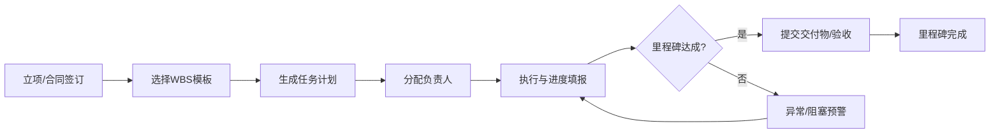

# 进度跟踪模块 - 详细设计文档

> 适用范围：非标自动化设备/线体项目（多机台、多专业、多变更）
> 目标：统一进度口径、打通缺料/变更/验收影响、形成可追溯的计划与执行闭环。

---

## 一、模块定位与边界

**模块范围**：WBS计划 → 任务分解 → 进度填报 → 里程碑验收 → 预警与异常 → 看板与报表。  
**不包含**：采购执行、成本核算、合同与回款（但提供联动接口）。

**与现有系统关系**：
- `projects`/`machines` 为进度对象的主数据来源。
- `milestones` 为里程碑骨架，进度模块补全任务与进度口径。
- `purchases`/`outsourcing`/`ecn` 为进度影响因子。

---

## 二、核心角色与职责

| 角色 | 主要职责 |
|------|----------|
| 项目经理 | 计划制定、里程碑控制、进度复核、异常升级 |
| 机械/电气/软件 | 任务执行与进度填报、交付物提交 |
| PMC | 资源协调、物料到货影响反馈 |
| 质量 | FAT/SAT验收把关、验收不通过闭环 |
| 管理层 | 进度总览、延期与风险决策 |

---

## 三、功能清单

1) WBS模板库与一键计划  
2) 任务分解、依赖关系与负责人  
3) 里程碑/阶段进度口径统一  
4) 进度填报（日报/周报）  
5) 延期/阻塞预警  
6) 里程碑验收与交付物绑定  
7) 多机台汇总与整体进度  
8) 看板与报表（甘特图、里程碑达成率、延期原因Top）

---

## 四、业务流程（概览）



---

## 五、数据模型设计（新增 + 引用）

### 5.1 引用表（已存在）
- `projects` 项目主表  
- `machines` 机台表  
- `milestones` 里程碑表  
- `purchases` 采购单  
- `outsourcing` 外协单  
- `ecn` 变更单  

### 5.2 新增表建议（进度模块）

```sql
-- WBS模板表
CREATE TABLE wbs_templates (
    id INTEGER PRIMARY KEY AUTOINCREMENT,
    template_code VARCHAR(20) UNIQUE NOT NULL,    -- WBS-T-001
    template_name VARCHAR(100) NOT NULL,          -- 单机类/线体类
    project_type VARCHAR(20),
    equipment_type VARCHAR(20),
    version_no VARCHAR(10) DEFAULT 'V1',
    is_active BOOLEAN DEFAULT TRUE,
    created_at DATETIME DEFAULT CURRENT_TIMESTAMP
);

-- WBS模板任务
CREATE TABLE wbs_template_tasks (
    id INTEGER PRIMARY KEY AUTOINCREMENT,
    template_id INTEGER NOT NULL,
    task_name VARCHAR(200),
    stage VARCHAR(20),                            -- S1-S9
    default_owner_role VARCHAR(50),               -- 机械/电气/软件
    plan_days INTEGER,
    weight DECIMAL(5,2) DEFAULT 1,                -- 权重
    depends_on_template_task_id INTEGER,
    FOREIGN KEY (template_id) REFERENCES wbs_templates(id)
);

-- 项目任务表
CREATE TABLE tasks (
    id INTEGER PRIMARY KEY AUTOINCREMENT,
    project_id INTEGER NOT NULL,
    machine_id INTEGER,
    milestone_id INTEGER,
    task_name VARCHAR(200) NOT NULL,
    stage VARCHAR(20),
    status VARCHAR(20) DEFAULT 'TODO',            -- TODO/IN_PROGRESS/BLOCKED/DONE/CANCELLED
    owner_id INTEGER,
    plan_start DATE,
    plan_end DATE,
    actual_start DATE,
    actual_end DATE,
    progress_percent INTEGER DEFAULT 0,           -- 0-100
    weight DECIMAL(5,2) DEFAULT 1,
    block_reason TEXT,
    created_at DATETIME DEFAULT CURRENT_TIMESTAMP,
    updated_at DATETIME DEFAULT CURRENT_TIMESTAMP,
    FOREIGN KEY (project_id) REFERENCES projects(id),
    FOREIGN KEY (machine_id) REFERENCES machines(id),
    FOREIGN KEY (milestone_id) REFERENCES milestones(id),
    FOREIGN KEY (owner_id) REFERENCES employees(id)
);

-- 任务依赖关系
CREATE TABLE task_dependencies (
    id INTEGER PRIMARY KEY AUTOINCREMENT,
    task_id INTEGER NOT NULL,
    depends_on_task_id INTEGER NOT NULL,
    dependency_type VARCHAR(10) DEFAULT 'FS',     -- FS/FF/SS/SF
    lag_days INTEGER DEFAULT 0,
    FOREIGN KEY (task_id) REFERENCES tasks(id),
    FOREIGN KEY (depends_on_task_id) REFERENCES tasks(id)
);

-- 进度日志
CREATE TABLE progress_logs (
    id INTEGER PRIMARY KEY AUTOINCREMENT,
    task_id INTEGER NOT NULL,
    progress_percent INTEGER,
    update_note TEXT,
    updated_by INTEGER,
    updated_at DATETIME DEFAULT CURRENT_TIMESTAMP,
    FOREIGN KEY (task_id) REFERENCES tasks(id),
    FOREIGN KEY (updated_by) REFERENCES employees(id)
);
```

---

## 六、状态与口径定义

### 6.1 任务状态
- TODO 未开始
- IN_PROGRESS 进行中
- BLOCKED 阻塞
- DONE 已完成
- CANCELLED 取消

### 6.2 里程碑状态
复用 `milestones.status`：PENDING/IN_PROGRESS/COMPLETED/BLOCKED  

### 6.3 阶段与状态映射

阶段（S1-S9）参考现有状态体系，进度模块主要在以下阶段参与：
- S2 需求澄清：需求确认、验收标准锁定
- S4 方案设计：方案评审、设计冻结
- S5 采购制造：BOM发布、关键物料到齐
- S6 装配联调：装配完成、联调完成
- S7 出厂验收：FAT通过
- S8 现场交付：SAT通过、终验收
- S9 质保结项：结项报告

---

## 七、进度计算口径

### 7.1 任务进度
- **基础口径**：手动填报 `progress_percent`（0-100）。  
- **自动规则**：首次填报 > 0 自动填 `actual_start`；填报 100 自动填 `actual_end`。  
- **禁止回退**：默认不允许进度倒退，需项目经理审批。  

### 7.2 里程碑进度

**口径A（默认）**：里程碑下属任务按权重加权  
```
milestone_progress = sum(task_progress * task_weight) / sum(task_weight)
```

**口径B（交付物驱动）**：交付物全部通过才算完成  
- 交付物全部 `APPROVED` → 里程碑 `COMPLETED`  

### 7.3 阶段进度

```
stage_progress = sum(milestone_progress * milestone_weight) / sum(milestone_weight)
```

### 7.4 项目整体进度

**单机台**：`overall_progress = stage_progress`  
**多机台**：
```
overall_progress = sum(machine_progress * machine_weight) / sum(machine_weight)
```
默认 `machine_weight = 1`，可按合同金额或机台数量调整。

### 7.5 延期与偏差

```
delay_days = actual_end - plan_end
```
若 `actual_end` 为空且 `today > plan_end`，则  
```
delay_days = today - plan_end
```

**进度偏差（SV）**：
```
SV = EV - PV
```
- EV：已完成工作量（可用任务权重累计）  
- PV：计划完成工作量  

---

## 八、计划与基线

### 8.1 基线概念
首次计划作为基线版本 V1，重大变更后可生成 V2/V3。  
基线用于对比“计划-实际”的偏差与责任归因。

### 8.2 基线记录建议表

```sql
CREATE TABLE schedule_baselines (
    id INTEGER PRIMARY KEY AUTOINCREMENT,
    project_id INTEGER NOT NULL,
    baseline_no VARCHAR(10) DEFAULT 'V1',
    created_by INTEGER,
    created_at DATETIME DEFAULT CURRENT_TIMESTAMP
);

CREATE TABLE baseline_tasks (
    id INTEGER PRIMARY KEY AUTOINCREMENT,
    baseline_id INTEGER NOT NULL,
    task_id INTEGER NOT NULL,
    plan_start DATE,
    plan_end DATE,
    weight DECIMAL(5,2),
    FOREIGN KEY (baseline_id) REFERENCES schedule_baselines(id),
    FOREIGN KEY (task_id) REFERENCES tasks(id)
);
```

---

## 九、进度填报规范

1) **频率**：默认每日填报，关键节点可强制日更。  
2) **字段**：进度百分比、今日工作、问题与阻塞、预计完成时间。  
3) **阻塞必填**：状态为 BLOCKED 必须填写原因与责任人。  
4) **复核机制**：项目经理每周复核一次并锁定周度进度。  

---

## 十、预警与异常规则

### 10.1 预警触发
- 任务/里程碑计划结束日期已过且未完成。  
- 关键物料未到货且影响装配/调试（来自采购/缺料预警）。  
- ECN 变更导致交期影响 > 阈值（如 > 3 天）。  

### 10.2 预警分级
- **提示**：延期 1-3 天  
- **注意**：延期 4-7 天  
- **严重**：延期 > 7 天  

### 10.3 健康度映射（项目）
- H1 正常：无关键延期  
- H2 有风险：关键里程碑延期或缺料预警  
- H3 阻塞：关键路径任务 BLOCKED  

---

## 十一、交付物/验收联动规则

1) 里程碑设置 `deliverable_required=true` 时，交付物未审批不得完成。  
2) 里程碑设置 `acceptance_required=true` 时，验收未通过不得完成。  
3) FAT/SAT 失败自动生成问题清单并阻塞相关里程碑。  

---

## 十二、页面与交互设计

1) **项目进度总览**：整体进度、阶段进度、延期预警  
2) **甘特图**：任务计划/实际、依赖关系  
3) **里程碑列表**：计划/实际/状态/交付物  
4) **任务看板**：按负责人、状态分列  
5) **进度填报页**：日更与阻塞原因  
6) **异常看板**：延期任务、阻塞任务、原因Top  

---

## 十三、API 端点（进度跟踪）

**任务**
- `GET /projects/{id}/tasks`
- `POST /projects/{id}/tasks`
- `PATCH /tasks/{id}`
- `POST /tasks/{id}/progress`

**依赖**
- `POST /tasks/{id}/dependencies`
- `DELETE /dependencies/{id}`

**进度日志**
- `GET /tasks/{id}/logs`

**里程碑**
- `GET /projects/{id}/milestones`
- `POST /milestones/{id}/complete`

---

## 十四、权限矩阵（简版）

| 功能 | 项目经理 | 工程师 | PMC | 质量 | 管理员 |
|------|---------|--------|-----|------|--------|
| 计划/WBS | R/W | R | R | R | R/W |
| 任务进度 | R | R/W | R | R | R/W |
| 里程碑完成 | R/W | R | R | R | R/W |
| 预警处理 | R/W | R | R/W | R | R/W |

---

## 十五、报表与KPI

- 里程碑达成率  
- 关键路径延期天数  
- 任务完成率（按部门/人员）  
- 计划偏差（SV）  
- 缺料导致的延期占比  

---

## 十六、配置项

- 预警阈值（天数）  
- 里程碑权重、机台权重  
- 默认工作日历（周一至周六）  
- 允许进度回退的审批规则  

---

## 十七、实施建议

1) 先上线 WBS模板 + 任务 + 里程碑进度。  
2) 第二阶段联动缺料/ECN预警。  
3) 第三阶段接入验收与交付物审批。  
