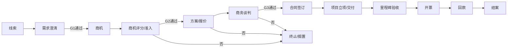
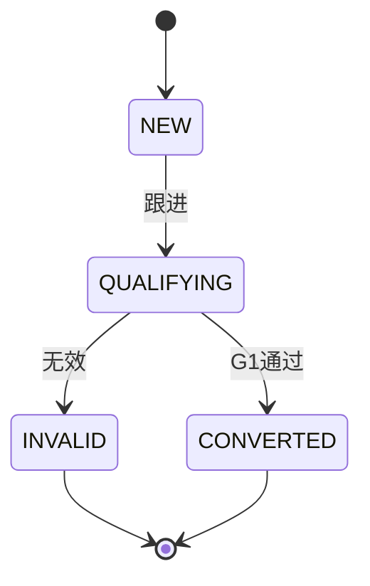
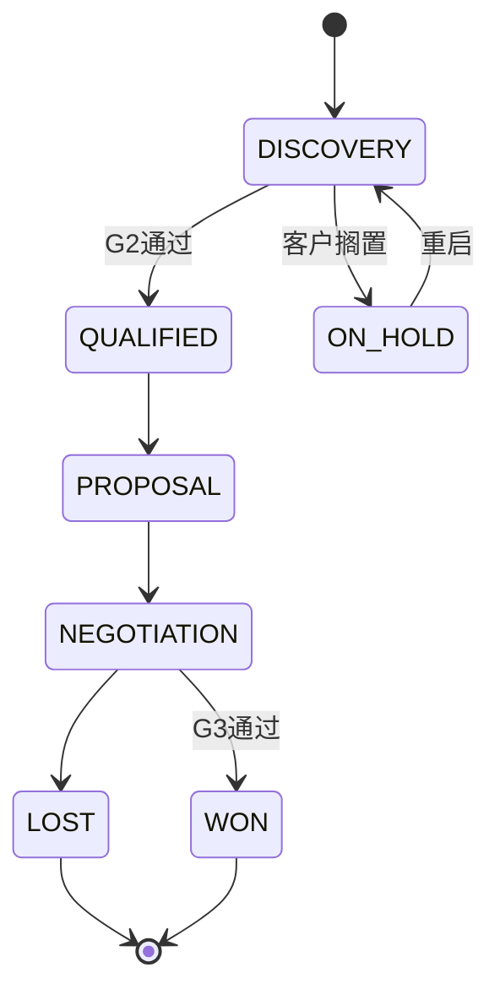
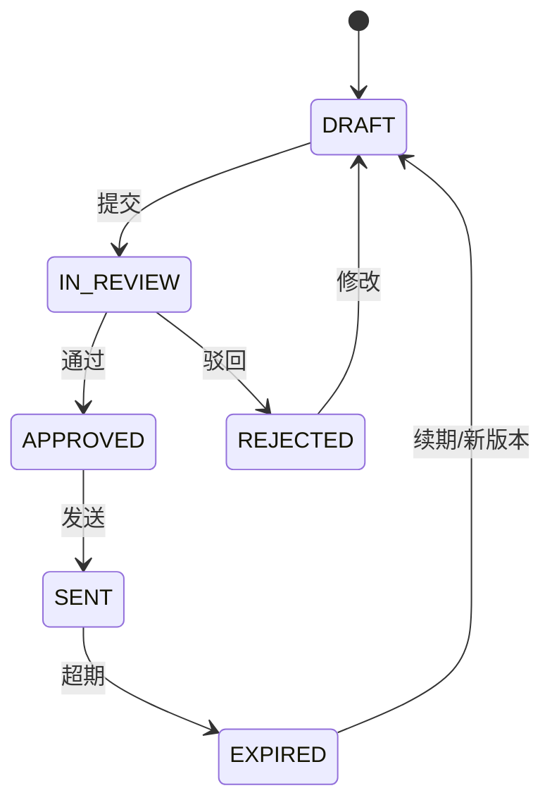
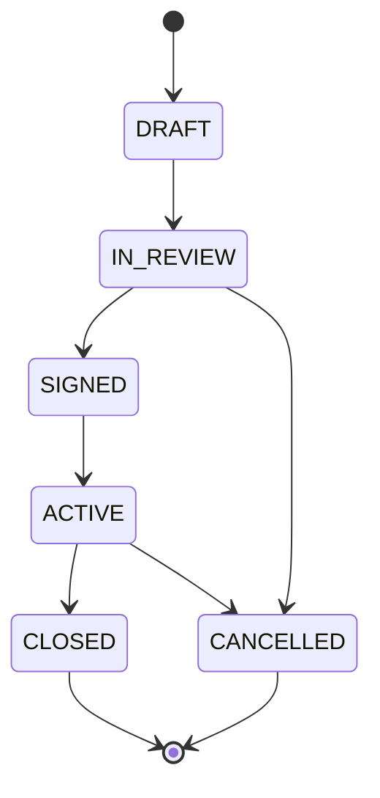

# 销售管理模块（线索到回款）设计文档

> 适用范围：非标自动化设备/线体（项目型订单）
> 目标：把“需求不清 + 变更多 + 缺料多 + 验收标准不稳 + 回款节点失控”的风险前置并结构化落地。

---

## 一、模块定位与边界

**模块范围**：线索（Lead）→ 商机（Opportunity）→ 报价（Quote/CPQ）→ 合同（Contract）→ 开票（Invoice）→ 回款（Collection）。

**与现有系统关系**：
- 现有项目交付模块继续作为“交付单一事实源”（WBS/里程碑/缺料/变更/验收）。
- 本模块在合同签订后自动生成项目（`projects`）与收款计划（`payments`），并与交付里程碑绑定。
- 关键数据贯通字段：`customer_id`、`project_id`、`contract_id`、`milestone_id`、`quote_version_id`、`invoice_id`、`payment_id`。

---

## 二、端到端流程与阶段门（Stage Gate）

```
线索 → 需求澄清 → 商机准入 → 方案/报价 → 商务谈判 → 合同签订
   → 项目立项/交付 → 里程碑验收 → 开票 → 回款 → 结案
```

### 2.1 阶段门（准入检查）

**G1：线索 → 商机**
- 需求模板必填：行业/产品对象/节拍/接口/现场约束/验收依据。
- 客户基本信息与联系人齐全。

**G2：商机 → 报价**
- 预算范围、决策链、交付窗口、验收标准明确。
- 技术可行性初评通过。

**G3：报价 → 合同**
- 成本拆解齐备，毛利率低于阈值自动预警。
- 交期校验通过（关键物料交期 + 设计/装配/调试周期）。
- 风险条款与边界条款已补充。

**G4：合同 → 项目**
- 付款节点与可交付物绑定。
- SOW/验收标准/BOM初版/里程碑基线冻结。

---

## 2.2 流程图（Mermaid）



---

## 三、状态机（建议枚举）

### 3.1 线索（Lead）
- NEW 待跟进
- QUALIFYING 资格评估中
- INVALID 无效
- CONVERTED 已转商机

### 3.2 商机（Opportunity）
- DISCOVERY 需求澄清
- QUALIFIED 商机合格
- PROPOSAL 方案/报价中
- NEGOTIATION 商务谈判
- WON 赢单
- LOST 丢单
- ON_HOLD 暂停

### 3.3 报价（Quote）
- DRAFT 草稿
- IN_REVIEW 审批中
- APPROVED 已批准
- SENT 已发送
- EXPIRED 过期
- REJECTED 被拒

### 3.4 合同（Contract）
- DRAFT 草拟中
- IN_REVIEW 审批中
- SIGNED 已签订
- ACTIVE 执行中
- CLOSED 已结案
- CANCELLED 取消

### 3.5 开票/回款
- Invoice: DRAFT/APPLIED/APPROVED/ISSUED/VOID
- Payment: 待收/已收/逾期（复用 `payments.status`）

---

## 3.6 状态机图（Mermaid）

### 3.6.1 线索（Lead）



### 3.6.2 商机（Opportunity）



### 3.6.3 报价（Quote）



### 3.6.4 合同（Contract）



---

## 四、数据模型设计（新增 + 现有表扩展）

> 说明：以下为模块核心表结构建议，字段可按实施拆分。与现有 `customers/projects/milestones/payments` 对齐。

### 4.1 新增表（CRM/CPQ/合同/开票/争议）

```sql
-- 1) 线索
CREATE TABLE leads (
    id INTEGER PRIMARY KEY AUTOINCREMENT,
    lead_code VARCHAR(20) UNIQUE NOT NULL,        -- L2507-001
    source VARCHAR(50),                           -- 展会/转介绍/老客户
    customer_name VARCHAR(100),                   -- 线索阶段可为临时客户
    industry VARCHAR(50),
    contact_name VARCHAR(50),
    contact_phone VARCHAR(20),
    demand_summary TEXT,
    owner_id INTEGER,
    status VARCHAR(20) DEFAULT 'NEW',
    next_action_at DATETIME,
    created_at DATETIME DEFAULT CURRENT_TIMESTAMP,
    updated_at DATETIME DEFAULT CURRENT_TIMESTAMP
);

-- 2) 商机
CREATE TABLE opportunities (
    id INTEGER PRIMARY KEY AUTOINCREMENT,
    opp_code VARCHAR(20) UNIQUE NOT NULL,         -- O2507-001
    lead_id INTEGER,
    customer_id INTEGER NOT NULL,
    opp_name VARCHAR(200) NOT NULL,
    project_type VARCHAR(20),                     -- 单机/线体/改造
    equipment_type VARCHAR(20),                   -- ICT/FCT/EOL
    stage VARCHAR(20) DEFAULT 'DISCOVERY',
    est_amount DECIMAL(12,2),
    est_margin DECIMAL(5,2),
    budget_range VARCHAR(50),
    decision_chain TEXT,
    delivery_window VARCHAR(50),
    acceptance_basis TEXT,
    score INTEGER DEFAULT 0,
    risk_level VARCHAR(10),
    owner_id INTEGER,
    gate_status VARCHAR(20) DEFAULT 'PENDING',    -- PENDING/PASS/REJECT
    gate_passed_at DATETIME,
    created_at DATETIME DEFAULT CURRENT_TIMESTAMP,
    updated_at DATETIME DEFAULT CURRENT_TIMESTAMP
);

-- 3) 商机需求结构化（关键字段 + 扩展）
CREATE TABLE opportunity_requirements (
    id INTEGER PRIMARY KEY AUTOINCREMENT,
    opportunity_id INTEGER NOT NULL,
    product_object VARCHAR(100),                  -- 产品对象
    ct_seconds INTEGER,                           -- 节拍
    interface_desc TEXT,                          -- 接口/通信协议
    site_constraints TEXT,                        -- 现场约束
    acceptance_criteria TEXT,                     -- 验收依据
    safety_requirement TEXT,
    attachments TEXT,                             -- 需求附件
    extra_json TEXT,                              -- 其他补充（JSON）
    created_at DATETIME DEFAULT CURRENT_TIMESTAMP,
    FOREIGN KEY (opportunity_id) REFERENCES opportunities(id)
);

-- 4) 报价主表
CREATE TABLE quotes (
    id INTEGER PRIMARY KEY AUTOINCREMENT,
    quote_code VARCHAR(20) UNIQUE NOT NULL,       -- Q2507-001
    opportunity_id INTEGER NOT NULL,
    customer_id INTEGER NOT NULL,
    status VARCHAR(20) DEFAULT 'DRAFT',
    current_version_id INTEGER,
    valid_until DATE,
    owner_id INTEGER,
    created_at DATETIME DEFAULT CURRENT_TIMESTAMP
);

-- 5) 报价版本
CREATE TABLE quote_versions (
    id INTEGER PRIMARY KEY AUTOINCREMENT,
    quote_id INTEGER NOT NULL,
    version_no VARCHAR(10) NOT NULL,              -- V1/V2
    total_price DECIMAL(12,2),
    cost_total DECIMAL(12,2),
    gross_margin DECIMAL(5,2),
    lead_time_days INTEGER,
    risk_terms TEXT,
    delivery_date DATE,
    created_by INTEGER,
    approved_by INTEGER,
    approved_at DATETIME,
    created_at DATETIME DEFAULT CURRENT_TIMESTAMP,
    FOREIGN KEY (quote_id) REFERENCES quotes(id)
);

-- 6) 报价明细
CREATE TABLE quote_items (
    id INTEGER PRIMARY KEY AUTOINCREMENT,
    quote_version_id INTEGER NOT NULL,
    item_type VARCHAR(20),                        -- 模块/工时/软件/外协
    item_name VARCHAR(200),
    qty DECIMAL(10,2),
    unit_price DECIMAL(12,2),
    cost DECIMAL(12,2),
    lead_time_days INTEGER,
    remark TEXT,
    FOREIGN KEY (quote_version_id) REFERENCES quote_versions(id)
);

-- 7) 合同主表
CREATE TABLE contracts (
    id INTEGER PRIMARY KEY AUTOINCREMENT,
    contract_code VARCHAR(20) UNIQUE NOT NULL,    -- HT2507-001
    opportunity_id INTEGER NOT NULL,
    quote_version_id INTEGER,
    customer_id INTEGER NOT NULL,
    project_id INTEGER,                           -- 合同签订后生成
    contract_amount DECIMAL(12,2),
    signed_date DATE,
    status VARCHAR(20) DEFAULT 'DRAFT',
    payment_terms_summary TEXT,
    acceptance_summary TEXT,
    owner_id INTEGER,
    created_at DATETIME DEFAULT CURRENT_TIMESTAMP
);

-- 8) 合同交付物清单
CREATE TABLE contract_deliverables (
    id INTEGER PRIMARY KEY AUTOINCREMENT,
    contract_id INTEGER NOT NULL,
    deliverable_name VARCHAR(100),                -- FAT报告/发货单/验收单
    deliverable_type VARCHAR(50),
    required_for_payment BOOLEAN DEFAULT TRUE,
    template_ref VARCHAR(100),
    created_at DATETIME DEFAULT CURRENT_TIMESTAMP,
    FOREIGN KEY (contract_id) REFERENCES contracts(id)
);

-- 9) 发票
CREATE TABLE invoices (
    id INTEGER PRIMARY KEY AUTOINCREMENT,
    invoice_code VARCHAR(30) UNIQUE NOT NULL,
    contract_id INTEGER NOT NULL,
    project_id INTEGER,
    payment_id INTEGER,                           -- 关联应收节点
    invoice_type VARCHAR(20),                     -- 专票/普票
    amount DECIMAL(12,2),
    tax_rate DECIMAL(5,2),
    status VARCHAR(20) DEFAULT 'DRAFT',
    issue_date DATE,
    buyer_name VARCHAR(100),
    buyer_tax_no VARCHAR(30),
    created_at DATETIME DEFAULT CURRENT_TIMESTAMP,
    FOREIGN KEY (contract_id) REFERENCES contracts(id)
);

-- 10) 回款争议/卡点
CREATE TABLE receivable_disputes (
    id INTEGER PRIMARY KEY AUTOINCREMENT,
    payment_id INTEGER NOT NULL,
    reason_code VARCHAR(30),                      -- 未验收/资料缺失/对账问题/性能争议
    description TEXT,
    status VARCHAR(20) DEFAULT 'OPEN',
    responsible_dept VARCHAR(50),
    responsible_id INTEGER,
    expect_resolve_date DATE,
    created_at DATETIME DEFAULT CURRENT_TIMESTAMP,
    FOREIGN KEY (payment_id) REFERENCES payments(id)
);
```

### 4.2 现有表扩展建议

```sql
-- payments 增加合同/里程碑/交付物/开票关联
ALTER TABLE payments ADD COLUMN contract_id INTEGER;
ALTER TABLE payments ADD COLUMN milestone_id INTEGER;
ALTER TABLE payments ADD COLUMN deliverable_id INTEGER;
ALTER TABLE payments ADD COLUMN invoice_id INTEGER;
ALTER TABLE payments ADD COLUMN responsible_id INTEGER;  -- 收款责任人
ALTER TABLE payments ADD COLUMN due_date DATE;           -- 到期日期（可与plan_date一致）
```

---

## 五、核心规则（系统化落地）

1) **付款节点必须绑定交付物**  
- 未绑定交付物的付款节点不得进入“可开票”状态。
- 交付物清单齐备后才允许发起验收/开票/收款申请。

2) **交期/成本自动校验**  
- 报价交期需通过关键物料交期 + 设计/装配/调试周期校验。
- 毛利率低于阈值自动触发审批升级。

3) **变更/缺料联动回款**  
- ECN/缺料影响里程碑时，自动调整对应回款计划与现金流预测。

4) **逾期分级与责任闭环**  
- T-14/T-7/T-1 到期提醒；逾期 7/15/30/60 天自动升级提醒。
- 逾期必须选择原因并生成 `receivable_disputes` 责任工单。

---

## 六、API 端点清单（建议）

### 6.1 线索/商机
- `POST /leads` 新建线索
- `GET /leads` 线索列表
- `POST /leads/{id}/convert` 线索转商机
- `POST /opportunities` 新建商机
- `PATCH /opportunities/{id}` 更新商机
- `POST /opportunities/{id}/gate` 阶段门提交/通过
- `GET /opportunities/{id}/score` 商机评分

### 6.2 报价（CPQ）
- `POST /quotes` 新建报价
- `POST /quotes/{id}/versions` 新建版本
- `POST /quotes/{id}/submit` 提交审批
- `POST /quotes/{id}/approve` 审批通过/驳回
- `GET /quotes/{id}/diff?v1=&v2=` 版本对比

### 6.3 合同/项目
- `POST /contracts` 创建合同草案
- `POST /contracts/{id}/submit` 提交审批
- `POST /contracts/{id}/sign` 合同签订
- `POST /contracts/{id}/project` 生成项目（写入 projects）
- `GET /contracts/{id}/deliverables` 交付物清单

### 6.4 开票/回款
- `POST /invoices` 发票申请
- `POST /invoices/{id}/issue` 开票
- `GET /payments` 应收台账
- `POST /payments/{id}/receive` 收款登记
- `POST /payments/{id}/dispute` 回款争议登记

---

## 七、权限矩阵（建议）

| 功能 | 销售 | 方案/技术 | 销售主管 | 项目经理 | 财务 | 法务 | 管理员 |
|------|------|----------|----------|----------|------|------|--------|
| 线索/商机创建 | R/W | R | R/W | R | R | R | R/W |
| 商机准入审批 | R | R | A | R | R | R | A |
| 报价版本维护 | R/W | R/W | R | R | R | R | R/W |
| 报价审批 | R | R | A | R | R | R | A |
| 合同草案 | R/W | R | R | R | R | R/W | R/W |
| 合同审批 | R | R | A | R | R | A | A |
| 合同签订/归档 | R | R | A | R | R | A | A |
| 开票申请 | R | R | R | R | R/W | R | R/W |
| 收款登记 | R | R | R | R | R/W | R | R/W |
| 逾期升级 | R | R | A | A | A | R | A |

说明：R=查看，W=编辑，A=审批。

---

## 八、关键报表与预警

- 商机漏斗与赢率（按行业/客户/销售）
- 报价毛利偏差（报价 vs 实际成本）
- 交付里程碑达成率（联动回款节点）
- 应收账龄（0-30/31-60/61-90/90+）
- 逾期原因Top（验收/资料/对账/性能/范围争议）
- 未来30/60/90天回款预测

---

## 九、落地建议（最小闭环）

1) 先上线“线索→商机→报价→合同→回款台账”的最小闭环。  
2) 同步对接项目里程碑与交付物清单，形成“交付物驱动回款”。  
3) 逾期与争议必须系统登记并闭环，形成长期知识库。  
