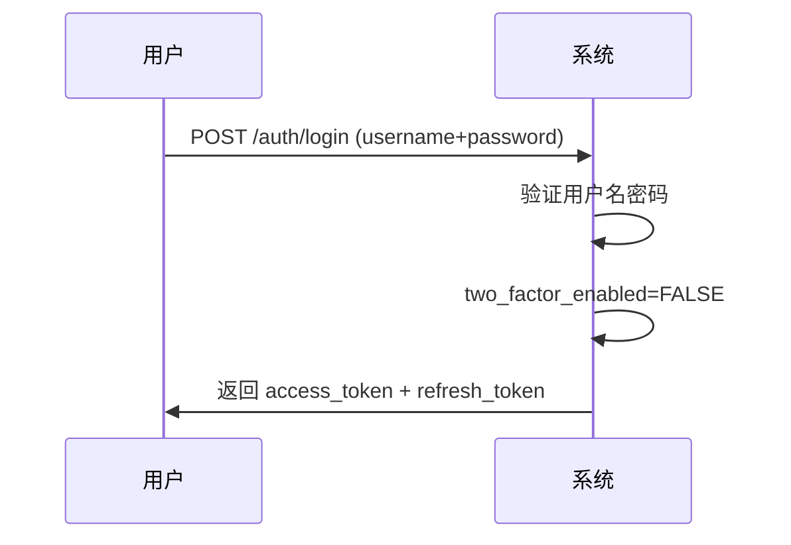
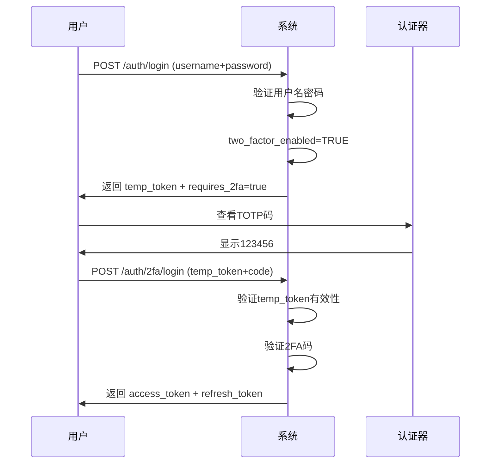

# 双因素认证（2FA）技术文档

## 📋 目录

- [系统架构](#系统架构)
- [技术栈](#技术栈)
- [数据库设计](#数据库设计)
- [API端点](#api端点)
- [安全机制](#安全机制)
- [登录流程](#登录流程)
- [开发指南](#开发指南)
- [测试说明](#测试说明)

---

## 系统架构

```
┌─────────────────────────────────────────────────────────────┐
│                        用户界面层                             │
│  ┌──────────┐  ┌──────────┐  ┌──────────┐  ┌──────────┐    │
│  │ 登录页面  │  │ 2FA设置  │  │ 备用码   │  │ 认证器    │    │
│  └──────────┘  └──────────┘  └──────────┘  └──────────┘    │
└─────────────────────────────────────────────────────────────┘
                              ↓
┌─────────────────────────────────────────────────────────────┐
│                         API层                                │
│  ┌──────────────────────────────────────────────────────┐   │
│  │ /api/v1/auth/2fa/*                                   │   │
│  │  - POST /setup        获取QR码                       │   │
│  │  - POST /enable       启用2FA                        │   │
│  │  - POST /verify       验证2FA码                      │   │
│  │  - POST /disable      禁用2FA                        │   │
│  │  - POST /login        完成2FA登录                    │   │
│  │  - GET  /backup-codes 获取备用码信息                 │   │
│  │  - POST /backup-codes/regenerate 重新生成备用码      │   │
│  └──────────────────────────────────────────────────────┘   │
└─────────────────────────────────────────────────────────────┘
                              ↓
┌─────────────────────────────────────────────────────────────┐
│                       服务层                                 │
│  ┌──────────────────────────────────────────────────────┐   │
│  │ TwoFactorService                                     │   │
│  │  - generate_totp_secret()    生成TOTP密钥           │   │
│  │  - generate_qr_code()        生成QR码                │   │
│  │  - verify_totp_code()        验证TOTP码              │   │
│  │  - encrypt_secret()          加密密钥                │   │
│  │  - decrypt_secret()          解密密钥                │   │
│  │  - _generate_backup_codes()  生成备用码              │   │
│  │  - _verify_backup_code()     验证备用码              │   │
│  └──────────────────────────────────────────────────────┘   │
└─────────────────────────────────────────────────────────────┘
                              ↓
┌─────────────────────────────────────────────────────────────┐
│                       数据层                                 │
│  ┌────────────┐  ┌──────────────────┐  ┌──────────────┐    │
│  │   users    │  │ user_2fa_secrets │  │ user_2fa_    │    │
│  │            │  │                  │  │ backup_codes │    │
│  │ - 2fa字段  │  │ - 加密的TOTP密钥 │  │ - 备用码哈希 │    │
│  └────────────┘  └──────────────────┘  └──────────────┘    │
└─────────────────────────────────────────────────────────────┘
```

---

## 技术栈

| 组件 | 技术 | 版本 | 用途 |
|------|------|------|------|
| TOTP实现 | pyotp | 2.9.0 | 生成和验证基于时间的一次性密码 |
| QR码生成 | qrcode[pil] | 7.4.2 | 生成二维码供认证器扫描 |
| 加密 | cryptography (Fernet) | - | AES加密TOTP密钥 |
| 密码哈希 | passlib (bcrypt) | 1.7.4 | 哈希存储备用码 |
| JWT | python-jose | 3.3.0 | 生成临时令牌 |

---

## 数据库设计

### 1. users表（新增字段）

```sql
ALTER TABLE users ADD COLUMN two_factor_enabled BOOLEAN DEFAULT FALSE;
ALTER TABLE users ADD COLUMN two_factor_method VARCHAR(20);  -- 'totp'
ALTER TABLE users ADD COLUMN two_factor_verified_at DATETIME;
```

| 字段 | 类型 | 说明 |
|------|------|------|
| two_factor_enabled | BOOLEAN | 是否启用2FA |
| two_factor_method | VARCHAR(20) | 2FA方式（totp） |
| two_factor_verified_at | DATETIME | 首次验证时间 |

### 2. user_2fa_secrets表

```sql
CREATE TABLE user_2fa_secrets (
    id INT PRIMARY KEY AUTO_INCREMENT,
    user_id INT NOT NULL,
    secret_encrypted TEXT NOT NULL,      -- Fernet加密的TOTP密钥
    method VARCHAR(20) DEFAULT 'totp',
    is_active BOOLEAN DEFAULT TRUE,
    created_at DATETIME DEFAULT CURRENT_TIMESTAMP,
    updated_at DATETIME DEFAULT CURRENT_TIMESTAMP ON UPDATE CURRENT_TIMESTAMP,
    UNIQUE (user_id, method),
    FOREIGN KEY (user_id) REFERENCES users(id) ON DELETE CASCADE
);
```

**安全机制：**
- 使用Fernet（AES-128-CBC）加密存储
- 加密密钥从 `SECRET_KEY` 派生（PBKDF2）
- 数据库管理员无法直接读取密钥明文

### 3. user_2fa_backup_codes表

```sql
CREATE TABLE user_2fa_backup_codes (
    id INT PRIMARY KEY AUTO_INCREMENT,
    user_id INT NOT NULL,
    code_hash VARCHAR(255) NOT NULL,     -- bcrypt哈希
    used BOOLEAN DEFAULT FALSE,
    used_at DATETIME,
    used_ip VARCHAR(50),
    created_at DATETIME DEFAULT CURRENT_TIMESTAMP,
    FOREIGN KEY (user_id) REFERENCES users(id) ON DELETE CASCADE,
    INDEX (user_id, used)
);
```

**安全机制：**
- 使用bcrypt哈希存储（不可逆）
- 一次性使用（used=TRUE后失效）
- 记录使用时间和IP（审计）

---

## API端点

### 1. POST /api/v1/auth/2fa/setup

获取2FA设置信息（二维码和密钥）

**请求：**
```http
POST /api/v1/auth/2fa/setup
Authorization: Bearer <access_token>
```

**响应：**
```json
{
  "secret": "JBSWY3DPEHPK3PXP",
  "qr_code_url": "data:image/png;base64,iVBORw0KG...",
  "message": "请使用Google Authenticator或Microsoft Authenticator扫描二维码"
}
```

### 2. POST /api/v1/auth/2fa/enable

启用2FA（验证TOTP码后启用）

**请求：**
```http
POST /api/v1/auth/2fa/enable
Authorization: Bearer <access_token>
Content-Type: application/json

{
  "totp_code": "123456"
}
```

**响应：**
```json
{
  "success": true,
  "message": "2FA已启用",
  "backup_codes": [
    "12345678",
    "23456789",
    ...
  ]
}
```

### 3. POST /api/v1/auth/2fa/login

完成2FA登录（验证2FA码后返回最终token）

**请求：**
```http
POST /api/v1/auth/2fa/login
Content-Type: application/json

{
  "temp_token": "<临时令牌>",
  "code": "123456"
}
```

**响应：**
```json
{
  "access_token": "eyJhbGc...",
  "refresh_token": "eyJhbGc...",
  "token_type": "bearer",
  "expires_in": 1800,
  "refresh_expires_in": 604800
}
```

### 4. POST /api/v1/auth/2fa/verify

验证2FA码（支持TOTP码和备用码）

**请求：**
```http
POST /api/v1/auth/2fa/verify
Authorization: Bearer <access_token>
Content-Type: application/json

{
  "code": "123456"  // 或备用码 "12345678"
}
```

**响应：**
```json
{
  "success": true,
  "message": "验证成功"  // 或 "备用码验证成功"
}
```

### 5. POST /api/v1/auth/2fa/disable

禁用2FA

**请求：**
```http
POST /api/v1/auth/2fa/disable
Authorization: Bearer <access_token>
Content-Type: application/json

{
  "password": "user_password"
}
```

**响应：**
```json
{
  "success": true,
  "message": "2FA已禁用"
}
```

### 6. GET /api/v1/auth/2fa/backup-codes

获取备用码统计信息

**请求：**
```http
GET /api/v1/auth/2fa/backup-codes
Authorization: Bearer <access_token>
```

**响应：**
```json
{
  "total": 10,
  "unused": 7,
  "used": 3
}
```

### 7. POST /api/v1/auth/2fa/backup-codes/regenerate

重新生成备用码

**请求：**
```http
POST /api/v1/auth/2fa/backup-codes/regenerate
Authorization: Bearer <access_token>
Content-Type: application/json

{
  "password": "user_password"
}
```

**响应：**
```json
{
  "success": true,
  "message": "备用码已重新生成",
  "backup_codes": [...]
}
```

---

## 安全机制

### 1. TOTP密钥加密存储

**加密流程：**

```python
# 1. 从SECRET_KEY派生加密密钥（PBKDF2-SHA256）
kdf = PBKDF2(
    algorithm=hashes.SHA256(),
    length=32,
    salt=b"2fa_secret_salt_v1",
    iterations=100000
)
key = base64.urlsafe_b64encode(kdf.derive(SECRET_KEY.encode()))

# 2. 使用Fernet加密TOTP密钥
fernet = Fernet(key)
encrypted = fernet.encrypt(secret.encode())

# 3. 存储到数据库
user_2fa_secrets.secret_encrypted = encrypted.decode()
```

**解密流程：**

```python
# 1. 从数据库读取加密密钥
encrypted = user_2fa_secrets.secret_encrypted

# 2. 使用相同派生密钥解密
fernet = Fernet(key)
secret = fernet.decrypt(encrypted.encode()).decode()
```

**安全保证：**
- AES-128-CBC加密
- 密钥从配置文件的SECRET_KEY派生（不直接存储）
- 数据库管理员无法读取明文密钥

### 2. 备用码哈希存储

**生成和存储：**

```python
# 1. 生成8位数字备用码
code = "".join([str(secrets.randbelow(10)) for _ in range(8)])

# 2. 使用bcrypt哈希（不可逆）
code_hash = get_password_hash(code)  # bcrypt

# 3. 存储哈希值
user_2fa_backup_codes.code_hash = code_hash
```

**验证流程：**

```python
# 1. 用户输入备用码
input_code = "12345678"

# 2. 遍历未使用的备用码哈希
for backup_code in unused_codes:
    if verify_password(input_code, backup_code.code_hash):
        # 验证成功，标记为已使用
        backup_code.used = True
        return True
```

**安全保证：**
- bcrypt慢哈希（防暴力破解）
- 一次性使用（used=TRUE后失效）
- 记录使用IP和时间（审计）

### 3. TOTP时间窗口

```python
# 允许前后1个时间段（±30秒）
totp.verify(code, valid_window=1)
```

**作用：**
- 容忍轻微时间偏差
- 减少因手机时间不同步导致的验证失败

### 4. 登录临时令牌

当用户输入正确的用户名密码但启用了2FA时：

```python
# 生成临时令牌（有效期5分钟）
temp_token_data = {
    "sub": str(user_id),
    "purpose": "2fa_pending"
}
temp_token = create_access_token(
    data=temp_token_data,
    expires_delta=timedelta(minutes=5)
)
```

**安全机制：**
- 临时令牌仅包含 `user_id` 和 `purpose`
- 仅可用于 `/auth/2fa/login` 端点
- 5分钟后自动过期
- 防止会话劫持（需要2FA码）

---

## 登录流程

### 未启用2FA的用户



### 已启用2FA的用户



---

## 开发指南

### 1. 本地开发环境设置

```bash
# 1. 安装依赖
pip install pyotp==2.9.0 'qrcode[pil]==7.4.2'

# 2. 执行数据库迁移
python migrations/20260214_add_2fa_support.py

# 3. 运行测试
pytest tests/test_two_factor_auth.py -v
```

### 2. 环境变量配置

```ini
# .env
SECRET_KEY=your-secret-key-here  # 用于JWT和2FA密钥加密
```

### 3. 集成到现有系统

**修改登录端点：**

```python
# app/api/v1/endpoints/auth.py

@router.post("/login")
def login(form_data: OAuth2PasswordRequestForm = Depends()):
    # 1. 验证用户名密码
    user = authenticate_user(form_data.username, form_data.password)
    
    # 2. 检查是否启用2FA
    if user.two_factor_enabled:
        temp_token = create_temp_token(user.id)
        return {
            "requires_2fa": True,
            "temp_token": temp_token
        }
    
    # 3. 未启用2FA，直接返回token
    return generate_tokens(user)
```

### 4. 前端集成示例

```javascript
// 登录流程
async function login(username, password) {
    const response = await fetch('/api/v1/auth/login', {
        method: 'POST',
        body: new URLSearchParams({ username, password })
    });
    
    const data = await response.json();
    
    if (data.requires_2fa) {
        // 需要2FA，显示验证码输入框
        const code = prompt('请输入认证器应用中的6位验证码：');
        return await complete2FALogin(data.temp_token, code);
    } else {
        // 直接登录成功
        saveTokens(data.access_token, data.refresh_token);
        return true;
    }
}

// 完成2FA登录
async function complete2FALogin(tempToken, code) {
    const response = await fetch('/api/v1/auth/2fa/login', {
        method: 'POST',
        headers: { 'Content-Type': 'application/json' },
        body: JSON.stringify({ temp_token: tempToken, code })
    });
    
    const data = await response.json();
    saveTokens(data.access_token, data.refresh_token);
    return true;
}
```

---

## 测试说明

### 运行测试

```bash
# 运行所有2FA测试
pytest tests/test_two_factor_auth.py -v

# 运行特定测试
pytest tests/test_two_factor_auth.py::TestTwoFactorService::test_enable_2fa_for_user_success -v

# 生成覆盖率报告
pytest tests/test_two_factor_auth.py --cov=app.services.two_factor_service --cov-report=html
```

### 测试覆盖范围

- ✅ TOTP密钥生成和加密（3个测试）
- ✅ QR码生成和验证（1个测试）
- ✅ TOTP验证码验证（1个测试）
- ✅ 启用2FA流程（2个测试）
- ✅ 禁用2FA流程（1个测试）
- ✅ 备用码生成和验证（3个测试）
- ✅ 备用码管理（2个测试）
- ✅ API端点测试（5个测试）
- ✅ 完整登录流程（1个测试）

**总计：19+测试用例**

---

## 性能优化

### 1. 缓存加密密钥

```python
# 单例服务，避免重复派生加密密钥
_two_factor_service = None

def get_two_factor_service() -> TwoFactorService:
    global _two_factor_service
    if _two_factor_service is None:
        _two_factor_service = TwoFactorService()
    return _two_factor_service
```

### 2. 数据库索引

```sql
-- 优化查询性能
CREATE INDEX idx_user_active ON user_2fa_secrets(user_id, is_active);
CREATE INDEX idx_user_unused ON user_2fa_backup_codes(user_id, used);
CREATE INDEX idx_code_hash ON user_2fa_backup_codes(code_hash);
```

---

## 故障排查

### 常见问题

| 问题 | 原因 | 解决方案 |
|------|------|----------|
| 验证码总是错误 | 服务器时间不同步 | 同步服务器时间：`ntpdate ntp.ubuntu.com` |
| QR码无法扫描 | PNG格式问题 | 检查Pillow库版本 |
| 备用码验证失败 | bcrypt哈希不匹配 | 检查passlib版本和配置 |
| 临时令牌过期 | 5分钟超时 | 提示用户重新登录 |

### 日志查看

```bash
# 查看2FA相关日志
tail -f server.log | grep "2FA\|two_factor"
```

---

## 安全审计

### 审计要点

- ✅ TOTP密钥使用AES加密存储
- ✅ 备用码使用bcrypt哈希存储
- ✅ 临时令牌5分钟过期
- ✅ 备用码一次性使用
- ✅ 记录备用码使用IP和时间
- ✅ 禁用2FA需要验证密码
- ✅ 时间窗口仅±30秒

### OWASP合规性

- ✅ A02:2021 - 加密失败（密钥加密存储）
- ✅ A07:2021 - 身份和认证失败（2FA防护）
- ✅ A09:2021 - 安全日志和监控失败（审计日志）

---

**最后更新时间**：2026-02-14  
**文档版本**：v1.0  
**维护者**：技术团队
