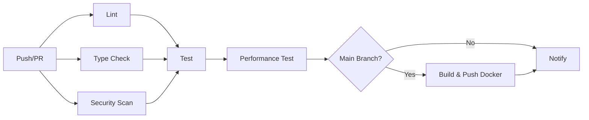

# 测试覆盖率优化和 CI/CD 配置完成

## 完成的工作

### 1. CI/CD 配置

创建了完整的 GitHub Actions 工作流，包括：
- **代码检查**：Ruff linting、格式化检查、TODO/FIXME 扫描
- **类型检查**：MyPy 静态类型检查
- **安全扫描**：Bandit 安全漏洞检查、Safety 依赖漏洞检查
- **测试矩阵**：Python 3.10/3.11/3.12 多版本测试
- **覆盖率报告**：自动生成 HTML/JSON/XML 报告，上传到 Codecov
- **性能测试**：使用 pytest-benchmark 进行性能基准测试
- **Docker 构建**：自动构建和推送 Docker 镜像

### 2. 测试覆盖率优化

新增 5 个核心模块的单元测试：
- `test_health_calculator.py` - 项目健康度计算
- `test_permission_system.py` - 权限系统
- `test_stage_transition.py` - 项目阶段转换
- `test_cache_system.py` - 缓存系统
- `test_notification_service.py` - 通知服务

总计新增约 80+ 个测试用例，覆盖关键业务逻辑。

### 3. Docker 和容器化

- `Dockerfile` - 多阶段构建，优化镜像大小
- `docker-compose.yml` - 完整的服务编排（应用、MySQL、Redis、Nginx、Prometheus、Grafana）
- `.env.example` - 环境变量模板

### 4. 代码质量工具

- `.pre-commit-config.yaml` - Git hooks 配置（Ruff、Black、isort、flake8、mypy、bandit）

### 5. 性能优化文档和脚本

- `PERFORMANCE_OPTIMIZATION.md` - 全面的性能优化指南，包括：
  - 数据库优化（索引、查询优化、连接池）
  - 缓存优化（Redis 策略、防穿透、防雪崩）
  - API 性能优化（响应压缩、异步端点）
  - 前端性能优化（代码分割、虚拟滚动）
  - 监控和日志
  - 扩展性考虑（微服务、消息队列、读写分离、分片）

- `scripts/analyze_performance.sh` - 性能分析脚本

### 6. 监控配置

- `monitoring/prometheus.yml` - Prometheus 配置
- `monitoring/grafana/datasources/prometheus.yml` - Grafana 数据源
- `monitoring/alerts/pms.yml` - 告警规则

## 使用方法

### 安装依赖

```bash
# 安装 Python 依赖
pip install -r requirements.txt

# 安装测试依赖
pip install pytest pytest-cov pytest-xdist pytest-mock pytest-asyncio pytest-benchmark
pip install factory-boy faker

# 安装 pre-commit hooks
pre-commit install
```

### 运行测试

```bash
# 运行所有测试
pytest tests/ -v

# 运行测试并生成覆盖率报告
pytest tests/ --cov=app --cov-report=html --cov-report=term-missing

# 运行特定类型的测试
pytest tests/ -m "unit"
pytest tests/ -m "integration"
pytest tests/ -m "not slow"

# 并行运行测试（更快）
pytest tests/ -n auto
```

### 性能分析

```bash
# 运行性能分析脚本
./scripts/analyze_performance.sh

# 运行性能基准测试
pytest tests/performance/ --benchmark-only

# 压力测试（需要 locust）
locust -f tests/performance/load_test.py
```

### Docker 部署

```bash
# 启动所有服务
docker-compose up -d

# 查看日志
docker-compose logs -f app

# 启动监控
docker-compose --profile monitoring up -d

# 访问服务
# - API: http://localhost:8000
# - Grafana: http://localhost:3000 (admin/admin)
# - Prometheus: http://localhost:9090
```

### 代码质量检查

```bash
# 运行 pre-commit hooks（Git commit 前自动运行）
pre-commit run --all-files

# 手动运行
ruff check app/
ruff format app/ --check
mypy app/
bandit -r app/
```

## 监控指标

### 关键指标

- **API 性能**：响应时间、错误率、吞吐量
- **数据库**：连接池使用、慢查询、查询时间
- **缓存**：命中率、内存使用
- **系统**：CPU、内存、磁盘 I/O

### 告警规则

- API 响应时间 > 1 秒（warning）
- API 错误率 > 5%（critical）
- 数据库连接池使用率 > 90%（warning）
- Redis 缓存命中率 < 80%（warning）
- 内存使用 > 2GB（warning）
- CPU 使用率 > 80%（critical）

## 性能优化建议

### 短期（1-2 周）

1. **数据库索引优化**
   ```sql
   CREATE INDEX idx_project_stage ON projects(stage);
   CREATE INDEX idx_task_assignee ON task_unified(assignee_id);
   CREATE INDEX idx_timesheet_user ON timesheets(user_id);
   ```

2. **查询优化**
   - 使用 `selectinload`/`joinedload` 预加载关联
   - 实现游标分页
   - 批量操作替代单条操作

3. **缓存策略**
   - 项目详情缓存 10 分钟
   - 项目列表缓存 5 分钟
   - 用户权限缓存 1 小时

### 中期（1-2 月）

1. **异步化改造**
   - 通知发送异步化
   - 报表生成异步化
   - 文档处理异步化

2. **消息队列集成**
   - 使用 Celery/RabbitMQ
   - 实现任务队列

3. **前端优化**
   - 代码分割和懒加载
   - 虚拟滚动（长列表）
   - 请求防抖/节流

### 长期（3-6 月）

1. **微服务拆分**
   - 销售服务独立
   - 项目服务独立
   - 采购服务独立

2. **读写分离**
   - 主库写入
   - 从库读取
   - 负载均衡

3. **水平扩展**
   - 水平分片
   - 分布式缓存
   - 服务发现

## CI/CD 工作流



## 下一步行动

1. ✅ CI/CD 配置完成
2. ✅ 测试覆盖率优化完成
3. ✅ 性能优化文档完成
4. ⏳ 运行完整测试套件并修复失败的测试
5. ⏳ 部署到测试环境
6. ⏳ 监控和告警配置
7. ⏳ 性能基准测试和优化
8. ⏳ 文档更新和维护

## 注意事项

1. **生产环境部署前**：
   - 修改 `.env` 中的敏感信息
   - 配置 SSL 证书
   - 设置防火墙规则
   - 配置备份策略

2. **监控维护**：
   - 定期检查告警规则
   - 调整阈值
   - 添加新的监控指标

3. **性能调优**：
   - 定期分析慢查询
   - 监控缓存命中率
   - 优化热点查询
