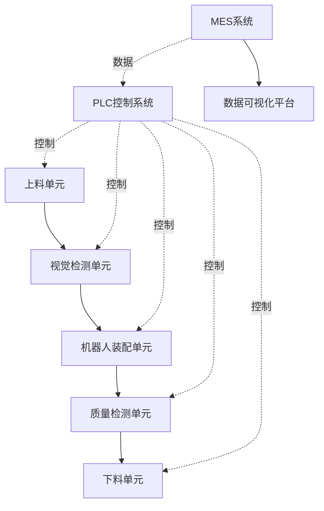

# 售前AI方案生成模块 - 用户使用手册

## 📖 目录

1. [功能概述](#功能概述)
2. [快速开始](#快速开始)
3. [核心功能详解](#核心功能详解)
4. [最佳实践](#最佳实践)
5. [常见问题](#常见问题)
6. [附录](#附录)

---

## 功能概述

### 什么是AI方案生成模块？

AI方案生成模块是售前技术支持系统的智能化核心，利用AI技术自动生成非标自动化项目的技术方案，大幅提升售前工程师的工作效率。

### 核心价值

- ⚡ **效率提升**: 方案生成时间从2-3天缩短至30秒
- 🎯 **质量保证**: 基于历史最佳实践，方案准确率>80%
- 📊 **标准化**: 统一方案格式，提升专业形象
- 💰 **成本优化**: 智能BOM清单，成本预估准确率>90%

### 主要功能

1. **智能模板匹配** - 自动匹配最相似的历史方案
2. **AI方案生成** - 一键生成完整技术方案
3. **架构图自动绘制** - 自动生成Mermaid架构图
4. **BOM智能清单** - 自动匹配设备型号和价格
5. **一键导出PDF** - 专业格式文档输出

---

## 快速开始

### 5分钟上手

#### 第一步：登录系统

1. 打开浏览器访问系统地址
2. 使用您的账号密码登录
3. 进入 "售前管理" → "AI方案生成"

#### 第二步：创建售前工单

如果您还没有售前工单，需要先创建：

1. 点击 "新建工单"
2. 填写客户信息和基本需求
3. 点击 "保存"

#### 第三步：生成方案

1. 在工单详情页，点击 "AI生成方案"
2. 填写详细需求信息：
   - 行业类型（如：汽车、电子、食品）
   - 设备类型（如：装配、检测、包装）
   - 产能需求（如：1000件/天）
   - 预算范围（如：100-150万）
3. 点击 "开始生成"
4. 等待30秒，方案生成完成！

#### 第四步：查看和编辑

1. 查看生成的方案描述、技术参数、设备清单
2. 查看系统架构图（Mermaid格式）
3. 查看BOM清单和成本预估
4. 根据需要进行手动调整

#### 第五步：导出PDF

1. 点击 "导出PDF"
2. 选择导出内容（架构图、BOM清单）
3. 下载PDF文件，发送给客户

---

## 核心功能详解

### 1. 智能模板匹配

#### 功能说明

系统会根据您输入的需求，自动从模板库中匹配最相似的历史方案，推荐TOP 3供您参考。

#### 使用步骤

1. 进入 "AI方案生成" 页面
2. 填写基本信息：
   - **行业**: 选择客户所属行业
   - **设备类型**: 选择主要设备类型
   - **关键词**: 输入需求关键词（如：机器人、视觉检测、自动装配）
3. 点击 "匹配模板"
4. 查看匹配结果：
   - 相似度评分（0-1，越高越相似）
   - 模板使用次数
   - 平均质量评分
5. 选择最合适的模板作为参考

#### 匹配算法说明

- **行业过滤**: 优先匹配同行业方案
- **设备类型过滤**: 匹配相同设备类型
- **关键词相似度**: 使用Jaccard相似度算法
- **排序规则**: 相似度 > 使用次数 > 质量评分

#### 最佳实践

✅ **关键词输入技巧**:
- 使用空格分隔多个关键词
- 包含核心设备名称（如：机器人、PLC、视觉系统）
- 包含工艺特点（如：焊接、装配、检测）
- 示例：`汽车 装配 六轴机器人 视觉定位 自动拧紧`

✅ **如何选择模板**:
- 相似度>0.7：高度相似，可直接使用
- 相似度0.5-0.7：中度相似，需适当调整
- 相似度<0.5：低相似度，仅供参考

---

### 2. AI方案生成

#### 功能说明

基于客户需求和参考模板，AI自动生成包含以下内容的完整技术方案：

- 方案总体描述
- 技术参数表
- 设备清单
- 工艺流程说明
- 关键特性
- 技术优势

#### 使用步骤

1. 点击 "生成方案" 按钮
2. 填写详细需求（JSON格式）：

```json
{
  "industry": "汽车",
  "product_type": "变速箱装配",
  "capacity": "1000件/天",
  "automation_level": "95%",
  "quality_requirements": "CPK≥1.67",
  "budget": "100万-150万",
  "special_requirements": "需要数据追溯功能"
}
```

3. 选择AI模型（推荐GPT-4）
4. 勾选可选项：
   - ☑ 生成系统架构图
   - ☑ 生成BOM清单
5. 点击 "开始生成"
6. 等待生成完成（通常15-30秒）

#### 生成内容说明

**1. 方案描述**
- 整体方案概述
- 适用场景
- 核心价值

**2. 技术参数表**
- 生产节拍
- 自动化程度
- 设备精度
- 能耗
- 占地面积

**3. 设备清单**
- 设备名称
- 型号规格
- 数量
- 功能说明

**4. 工艺流程**
- 详细工艺步骤
- 流程图说明

**5. 关键特性**
- 技术亮点
- 创新点

**6. 技术优势**
- 效率提升
- 成本节约
- 质量保证

#### 置信度评分说明

系统会自动计算方案的置信度评分（0-1）：

- **0.8-1.0**: 高置信度，方案完整可靠
- **0.6-0.8**: 中等置信度，建议人工审核
- **<0.6**: 低置信度，需要重点审核和修改

评分影响因素：
- 有无参考模板 (+0.2)
- 设备清单完整性 (+0.15)
- 技术参数完整性 (+0.1)
- 工艺流程完整性 (+0.05)

---

### 3. 系统架构图生成

#### 功能说明

自动生成三种类型的架构图（Mermaid格式）：

1. **系统架构图**: 展示整体系统结构
2. **设备拓扑图**: 展示设备连接关系
3. **信号流程图**: 展示信号流向

#### 使用步骤

1. 在方案详情页，点击 "生成架构图"
2. 选择图表类型（architecture/topology/signal_flow）
3. 点击 "生成"
4. 查看生成的Mermaid代码
5. 点击 "预览" 查看渲染效果
6. 如需修改，可手动编辑Mermaid代码

#### Mermaid代码示例



#### 如何编辑Mermaid图

基本语法：
- `A --> B`: 实线箭头
- `A -.-> B`: 虚线箭头
- `A --- B`: 无箭头连线
- `style A fill:#90EE90`: 设置颜色

在线编辑器：https://mermaid.live/

---

### 4. BOM清单生成

#### 功能说明

基于设备清单，自动生成详细的BOM表，包含：

- 设备名称和型号
- 数量和单位
- 单价和总价
- 推荐供应商
- 交付周期

#### 使用步骤

1. 确保方案中有设备清单
2. 点击 "生成BOM"
3. 选择选项：
   - ☑ 包含成本估算
   - ☑ 包含供应商推荐
4. 查看生成的BOM表
5. 导出为Excel（可选）

#### BOM表格示例

| 序号 | 项目名称 | 型号 | 数量 | 单位 | 单价(元) | 总价(元) | 供应商 | 交付周期 |
|------|---------|------|------|------|---------|---------|--------|---------|
| 1 | 六轴机器人 | KUKA KR 60-3 | 3 | 台 | 250,000 | 750,000 | KUKA官方代理 | 60天 |
| 2 | 视觉系统 | Cognex In-Sight | 2 | 套 | 80,000 | 160,000 | Cognex代理 | 30天 |
| 3 | PLC控制系统 | Siemens S7-1500 | 1 | 套 | 150,000 | 150,000 | 西门子 | 45天 |
| **总计** | | | | | | **1,060,000** | | |

#### 成本预估说明

⚠️ **注意**: 当前成本为参考价格，实际价格请以供应商报价为准。

成本包含：
- 设备采购成本
- 运输费用（预估）
- 不含：安装调试费、培训费、税费

---

### 5. PDF导出

#### 功能说明

将方案导出为专业格式的PDF文档，可直接发送给客户。

#### 使用步骤

1. 在方案详情页，点击 "导出PDF"
2. 选择导出内容：
   - ☑ 包含架构图
   - ☑ 包含BOM清单
   - ☑ 包含技术参数
3. 选择模板样式（标准/简洁/详细）
4. 点击 "导出"
5. 下载生成的PDF文件

#### PDF文档结构

1. **封面** - 项目名称、客户信息
2. **目录**
3. **方案概述**
4. **技术参数表**
5. **系统架构图**
6. **设备清单**
7. **工艺流程说明**
8. **BOM清单**
9. **技术优势**
10. **附录**

---

## 最佳实践

### 1. 高质量方案生成技巧

#### 需求描述要详细

❌ **不好的示例**:
```json
{
  "industry": "汽车"
}
```

✅ **好的示例**:
```json
{
  "industry": "汽车",
  "product_type": "发动机缸盖装配",
  "capacity": "单班1000件",
  "cycle_time": "45秒/件",
  "automation_level": "95%以上",
  "accuracy": "±0.02mm",
  "quality_requirements": "CPK≥1.67, 合格率99.5%",
  "budget": "120-150万",
  "floor_space": "不超过80平米",
  "special_requirements": [
    "需要视觉定位功能",
    "需要力矩监控",
    "需要数据追溯",
    "需要MES系统对接"
  ]
}
```

#### 充分利用模板库

1. 定期浏览模板库，了解行业最佳实践
2. 收藏常用模板
3. 对生成的优质方案，添加为新模板

#### 人工审核和优化

AI生成的方案是基础，建议：

1. **技术参数**: 核对是否符合客户实际需求
2. **设备选型**: 确认设备型号是否最优
3. **成本估算**: 校对价格是否合理
4. **工艺流程**: 补充细节说明
5. **方案描述**: 润色语言，突出卖点

---

### 2. 模板管理最佳实践

#### 创建高质量模板

优质模板应包含：

1. **清晰的行业和设备类型标签**
2. **详细的技术参数**
3. **完整的设备清单**
4. **标准的架构图**
5. **准确的成本范围**
6. **丰富的关键词**

#### 模板命名规范

建议格式: `[行业]_[设备类型]_[特征]_[版本]`

示例:
- `汽车_装配_六轴机器人_V1`
- `电子_SMT_高速贴片_V2`
- `食品_包装_多头秤_V1`

#### 模板维护

1. 定期更新：每季度review一次
2. 淘汰过时模板：停用低质量、低使用率模板
3. 优化热门模板：提升高使用率模板的质量

---

### 3. 团队协作

#### 方案审核流程

建议流程:
1. 售前工程师生成初稿 (draft)
2. 技术主管审核 (reviewing)
3. 批准通过 (approved) / 退回修改 (rejected)

#### 知识共享

1. 优质方案加入模板库
2. 团队内部分享成功案例
3. 定期培训，提升AI使用技能

---

## 常见问题

### Q1: 方案生成失败怎么办？

**可能原因**:
1. 网络问题导致AI API调用失败
2. 需求描述不完整
3. 系统负载过高

**解决方案**:
1. 检查网络连接
2. 补充详细需求信息
3. 稍后重试
4. 联系技术支持

---

### Q2: 生成的方案不符合需求怎么办？

**解决方案**:
1. **重新生成**: 补充更详细的需求信息后重新生成
2. **选择其他模板**: 尝试使用不同的参考模板
3. **手动编辑**: 在生成的方案基础上手动修改
4. **反馈问题**: 将问题反馈给管理员，帮助改进系统

---

### Q3: 如何提高方案质量评分？

**技巧**:
1. 使用高质量模板作为参考
2. 提供详细、准确的需求信息
3. 生成后进行人工审核和优化
4. 补充完整的技术参数和设备清单

---

### Q4: BOM成本预估准确吗？

**说明**:
- 成本预估基于历史数据和市场价格
- 准确率约90%，仅供参考
- 实际价格请以供应商正式报价为准
- 建议采购前进行询价确认

---

### Q5: 可以导出Word格式吗？

**当前状态**: v1.0版本仅支持PDF导出

**计划**: v1.1版本将支持Word和Excel导出

**临时方案**: 
1. 导出PDF后，使用转换工具转为Word
2. 或直接复制方案内容到Word手动编辑

---

### Q6: 如何添加自定义模板？

**步骤**:
1. 点击 "模板库" → "新建模板"
2. 填写模板信息：
   - 模板名称
   - 行业和设备类型
   - 复杂度等级
   - 方案内容（JSON格式）
   - 架构图（Mermaid代码）
   - BOM模板
   - 成本范围
   - 标签和关键词
3. 保存并启用

---

### Q7: 方案可以分享给其他同事吗？

**权限说明**:
- 方案默认创建人可见
- 管理员可见所有方案
- 可设置方案为"公开"，团队成员可见

**分享方式**:
1. 导出PDF发送
2. 复制方案链接分享
3. 设置方案为公开

---

## 附录

### A. 支持的行业列表

- 汽车制造
- 电子电器
- 食品饮料
- 医疗器械
- 新能源（光伏、锂电池）
- 3C电子
- 塑料制品
- 机械加工
- 医药制造
- 物流仓储

### B. 支持的设备类型

- 装配
- 焊接
- 检测
- 包装
- 搬运
- 清洗
- 贴片
- 分拣
- 打标
- 上下料

### C. Mermaid图表类型

- 流程图 (graph)
- 序列图 (sequenceDiagram)
- 类图 (classDiagram)
- 状态图 (stateDiagram)
- 甘特图 (gantt)

详细语法: https://mermaid.js.org/

### D. 快捷键

- `Ctrl + S`: 保存方案
- `Ctrl + E`: 编辑方案
- `Ctrl + P`: 导出PDF
- `F5`: 刷新方案

### E. 联系支持

- 技术支持邮箱: tech-support@company.com
- 客服热线: 400-XXX-XXXX
- 在线文档: https://docs.company.com/presale-ai

---

## 版本信息

- **文档版本**: v1.0.0
- **更新日期**: 2026-02-15
- **适用系统版本**: v1.0.0+

---

*本手册将持续更新，请关注最新版本*
