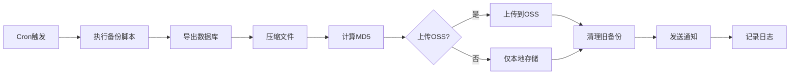
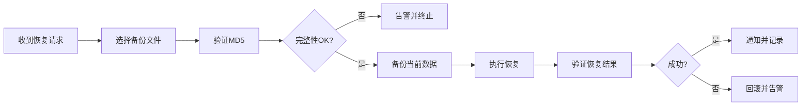

# 数据备份策略设计文档

## 📋 概述

本文档详细说明了PMS系统的数据备份策略，旨在保护数据安全，支持灾难恢复，确保业务连续性。

**版本**: 1.0  
**更新时间**: 2026-02-15  
**负责人**: 系统管理员  

---

## 🎯 备份目标

### 业务目标
- **数据保护**: 防止数据丢失或损坏
- **快速恢复**: 在灾难发生时快速恢复业务
- **合规要求**: 满足数据保留和审计要求
- **版本回溯**: 支持历史数据恢复

### 技术指标
| 指标 | 目标值 | 说明 |
|------|--------|------|
| **RTO** (恢复时间目标) | < 1小时 | 从灾难发生到系统恢复的时间 |
| **RPO** (恢复点目标) | < 24小时 | 允许丢失的最大数据量（时间范围） |
| **备份成功率** | > 99% | 备份任务的成功率 |
| **恢复成功率** | 100% | 备份文件可成功恢复 |
| **数据完整性** | 100% | 备份数据与源数据一致 |

---

## 📦 备份内容

### 1. 数据库备份
**内容**:
- MySQL数据库完整导出
- 包含所有表、存储过程、触发器、事件
- 用户权限和角色

**备份方式**:
- 使用 `mysqldump` 工具
- `--single-transaction` 确保一致性
- `gzip` 压缩减少存储空间

**估算大小**:
- 未压缩: ~500MB
- 压缩后: ~100MB

### 2. 上传文件备份
**内容**:
- `uploads/` 目录下的所有用户上传文件
- 包括附件、头像、项目文档等

**备份方式**:
- 使用 `tar` 打包压缩
- 保留文件权限和时间戳

**估算大小**: ~2GB

### 3. 配置文件备份
**内容**:
- `.env` 环境变量配置
- `docker-compose.yml`
- Nginx配置文件
- 其他系统配置

**备份方式**: `tar` 打包

**估算大小**: ~1MB

### 4. 日志备份（可选）
**内容**:
- 应用日志（最近7天）
- 访问日志
- 错误日志

**备份方式**: `tar` 打包压缩

---

## ⏰ 备份策略

### 1. 每日增量备份
**时间**: 每天凌晨 2:00  
**内容**:
- 数据库全量备份
- 新增/修改的上传文件

**保留期**: 7天

**脚本**: `scripts/backup_database.sh`

### 2. 每日文件备份
**时间**: 每天凌晨 3:00  
**内容**:
- 上传文件完整备份
- 配置文件备份

**保留期**: 7天

**脚本**: `scripts/backup_files.sh`

### 3. 每周完整备份
**时间**: 每周日凌晨 1:00  
**内容**:
- 数据库 + 文件 + 配置 完整归档

**保留期**: 4周

**脚本**: `scripts/backup_full.sh`

### 4. 每月归档备份
**时间**: 每月1日凌晨 1:00  
**内容**:
- 上月最后一天的完整备份
- 上传到长期存储（归档存储）

**保留期**: 12个月

---

## 💾 存储策略

### 本地存储（短期）
**位置**: `/var/backups/pms`

**容量规划**:
- 每日备份: ~2.1GB × 7天 = 14.7GB
- 预留缓冲: 20GB
- **总需求**: 40GB

**清理策略**:
- 每日凌晨4点自动清理超过7天的备份
- 保留至少3个最新备份

### 远程存储（长期）
**方案**: 阿里云OSS

**目录结构**:
```
oss://pms-backups/
├── database/          # 数据库备份
├── files/             # 文件备份
├── configs/           # 配置文件
├── logs/              # 日志（可选）
└── full/              # 完整归档
```

**存储类型分级**:
- **标准存储**: 最近7天的备份（高频访问）
- **低频访问**: 7-30天的备份
- **归档存储**: 30天以上的备份（极低成本）

**生命周期规则**:
```yaml
- 0-7天: 标准存储
- 7-30天: 自动转为低频访问
- 30-90天: 自动转为归档存储
- 90天以上: 自动删除
```

**成本估算** (阿里云OSS):
- 标准存储: ¥0.12/GB/月
- 低频访问: ¥0.08/GB/月
- 归档存储: ¥0.033/GB/月

| 存储类型 | 容量 | 单价 | 月成本 |
|---------|------|------|--------|
| 标准存储 (7天) | 14.7GB | ¥0.12 | ¥1.76 |
| 低频访问 (23天) | 48.3GB | ¥0.08 | ¥3.86 |
| 归档存储 (60天) | 126GB | ¥0.033 | ¥4.16 |
| **总计** | | | **¥9.78/月** |

**年成本**: ~¥117

---

## 🔐 安全措施

### 1. 数据加密
- **传输加密**: OSS上传使用HTTPS
- **存储加密**: 启用OSS服务端加密（SSE-OSS）
- **备份加密**: 可选，使用GPG加密敏感备份

### 2. 访问控制
- **RAM子账号**: 使用最小权限原则
- **临时凭证**: 使用STS临时访问凭证
- **访问日志**: 启用OSS访问日志审计

### 3. 完整性校验
- **MD5校验**: 每个备份文件生成MD5
- **备份验证**: 每日验证最新备份
- **恢复测试**: 每周执行一次恢复测试

---

## 📊 监控与告警

### 监控指标
1. **备份状态**
   - 最新备份时间
   - 备份成功/失败次数
   - 备份文件大小趋势

2. **存储状态**
   - 本地磁盘使用率
   - 远程存储用量
   - 存储成本

3. **恢复能力**
   - RTO实际值
   - 恢复成功率
   - 备份完整性

### 告警规则
| 告警项 | 触发条件 | 级别 | 通知方式 |
|--------|---------|------|---------|
| 备份失败 | 备份任务失败 | 严重 | 企业微信 + 邮件 |
| 备份过期 | 最新备份 > 26小时 | 严重 | 企业微信 |
| 磁盘空间不足 | 使用率 > 90% | 严重 | 企业微信 + 邮件 |
| 磁盘空间警告 | 使用率 > 80% | 警告 | 企业微信 |
| 备份文件过小 | 文件 < 10MB | 警告 | 企业微信 |
| 恢复测试失败 | 测试失败 | 严重 | 企业微信 + 邮件 |

### 通知渠道
- **企业微信机器人**: 实时通知
- **邮件**: 重要告警发送邮件
- **日志**: 所有事件记录到日志

---

## 🔄 备份流程

### 自动备份流程


### 恢复流程


---

## ✅ 验收标准

### 功能性
- [x] 自动备份定时执行
- [x] 支持手动触发备份
- [x] 备份文件完整性校验
- [x] 远程存储上传成功
- [x] 自动清理过期备份

### 可靠性
- [x] 备份成功率 > 99%
- [x] 恢复测试100%成功
- [x] RTO < 1小时
- [x] RPO < 24小时

### 可用性
- [x] 提供Web管理界面（API）
- [x] 备份/恢复日志可查
- [x] 告警及时准确
- [x] 操作文档完整

---

## 📚 参考资料

- [MySQL备份最佳实践](https://dev.mysql.com/doc/refman/8.0/en/backup-types.html)
- [阿里云OSS文档](https://help.aliyun.com/product/31815.html)
- [3-2-1备份规则](https://www.backblaze.com/blog/the-3-2-1-backup-strategy/)

---

## 📝 变更历史

| 版本 | 日期 | 作者 | 变更内容 |
|------|------|------|---------|
| 1.0 | 2026-02-15 | Team 6 | 初始版本 |

---

**下一步**: 阅读 [备份操作手册](./backup_operations.md)
