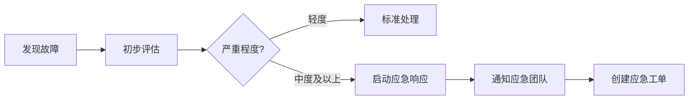

# 灾难恢复计划 (DRP)

## 📋 文档信息

**文档名称**: PMS系统灾难恢复计划  
**版本**: 1.0  
**制定日期**: 2026-02-15  
**审批人**: CTO  
**有效期**: 1年  
**下次审查**: 2027-02-15  

---

## 🎯 目的与范围

### 目的
本计划旨在确保在发生灾难性事件时，能够快速、有序地恢复PMS系统及其关键业务功能，最大限度地减少业务中断和数据丢失。

### 范围
- **系统**: PMS项目管理系统
- **数据**: 数据库、用户上传文件、系统配置
- **服务**: Web应用、API服务、数据库服务
- **基础设施**: 服务器、网络、存储

---

## 🚨 灾难场景定义

### 级别1: 轻度故障
**定义**: 单点故障，不影响核心功能  
**示例**:
- 单台应用服务器故障
- 非核心功能异常
- 部分用户无法访问

**影响**: 低  
**RTO**: < 1小时  
**RPO**: 0小时  

### 级别2: 中度故障
**定义**: 核心功能受影响，部分业务中断  
**示例**:
- 数据库故障
- 主服务器宕机
- 网络中断

**影响**: 中  
**RTO**: < 4小时  
**RPO**: < 4小时  

### 级别3: 重度故障
**定义**: 核心业务完全中断  
**示例**:
- 机房断电
- 数据中心网络故障
- 大规模数据损坏

**影响**: 高  
**RTO**: < 12小时  
**RPO**: < 24小时  

### 级别4: 灾难性故障
**定义**: 完全性灾难，需要异地恢复  
**示例**:
- 机房火灾/水灾
- 地震、台风等自然灾害
- 严重安全事件（勒索软件）

**影响**: 严重  
**RTO**: < 48小时  
**RPO**: < 24小时  

---

## 👥 应急响应团队

### 核心成员

| 角色 | 姓名 | 联系方式 | 职责 |
|------|------|---------|------|
| **总指挥** | 张总 | 138xxxx1001 | 决策与协调 |
| **技术负责人** | 李工 | 138xxxx1002 | 技术恢复指导 |
| **系统管理员** | 王工 | 138xxxx1003 | 系统恢复执行 |
| **DBA** | 赵工 | 138xxxx1004 | 数据库恢复 |
| **网络工程师** | 钱工 | 138xxxx1005 | 网络恢复 |
| **业务代表** | 孙经理 | 138xxxx1006 | 业务验证 |

### 联系方式

**应急群组**:
- 企业微信群: "PMS应急响应"
- 钉钉群: "PMS紧急事件"
- 电话会议: Zoom会议室 ID 123-456-789

**外部支持**:
- 云服务商: 400-xxx-1000（阿里云）
- 硬件厂商: 400-xxx-2000
- 安全公司: 400-xxx-3000

---

## 📞 应急响应流程

### 阶段1: 发现与报告（0-15分钟）



**操作**:
1. 发现人员立即报告给系统管理员
2. 系统管理员评估故障级别
3. 中度及以上故障启动应急响应
4. 通知应急团队集合（15分钟内）

### 阶段2: 评估与决策（15-30分钟）

**操作**:
1. 技术团队评估影响范围
2. 确定恢复策略（原地恢复/异地恢复）
3. 估算RTO/RPO
4. 总指挥决策批准恢复方案

### 阶段3: 隔离与保护（30-60分钟）

**操作**:
1. 隔离故障系统，防止扩散
2. 备份当前状态（如可能）
3. 保护现场证据（如为安全事件）
4. 启用临时备用方案（如有）

### 阶段4: 恢复执行（1-4小时）

根据故障级别执行相应恢复流程（见下文）

### 阶段5: 验证与测试（30-60分钟）

**操作**:
1. 技术验证系统功能
2. 业务验证核心流程
3. 性能测试
4. 安全检查

### 阶段6: 切换上线（15-30分钟）

**操作**:
1. DNS切换（如需要）
2. 负载均衡调整
3. 流量逐步放开
4. 实时监控

### 阶段7: 事后总结（1-3天内）

**操作**:
1. 编写故障报告
2. 根因分析
3. 改进措施
4. 更新文档

---

## 🔄 恢复策略

### 策略A: 本地快速恢复
**适用**: 级别1-2故障

**步骤**:
```bash
# 1. 停止故障服务
docker-compose stop

# 2. 从最近备份恢复
bash scripts/restore_database.sh /var/backups/pms/latest.sql.gz

# 3. 重启服务
docker-compose up -d

# 4. 验证
curl http://localhost:8000/api/v1/health
```

**预计时间**: 30分钟 - 1小时

### 策略B: 本地完整恢复
**适用**: 级别3故障

**步骤**:
```bash
# 1. 重装操作系统（如需要）
# 2. 安装Docker环境
# 3. 下载备份
ossutil cp oss://pms-backups/full/latest.tar.gz /tmp/
# 4. 解压并恢复
tar -xzf /tmp/latest.tar.gz -C /var/backups/pms
# 5. 执行恢复脚本
bash scripts/restore_database.sh
bash scripts/restore_files.sh
# 6. 启动服务
docker-compose up -d
```

**预计时间**: 2-4小时

### 策略C: 异地灾难恢复
**适用**: 级别4灾难

#### 准备工作（平时完成）
- [x] 在异地（如阿里云不同地域）准备备用服务器
- [x] 配置OSS跨地域复制
- [x] 准备域名DNS快速切换方案
- [x] 维护异地服务器环境（每月演练）

#### 恢复步骤
```bash
# === 在异地服务器执行 ===

# 1. 激活备用服务器
ssh backup-server

# 2. 拉取最新镜像
docker pull your-registry/pms:latest

# 3. 从OSS恢复数据
cd /var/www/pms
ossutil cp oss://pms-backups-backup/full/latest.tar.gz /tmp/
tar -xzf /tmp/latest.tar.gz

# 4. 恢复数据库和文件
bash scripts/restore_database.sh /var/backups/pms/latest.sql.gz
bash scripts/restore_files.sh /var/backups/pms/uploads_latest.tar.gz

# 5. 启动服务
docker-compose up -d

# 6. 验证服务
docker-compose ps
curl http://localhost:8000/api/v1/health

# 7. DNS切换
# 在DNS服务商修改A记录，指向新服务器IP
# TTL设为60秒，快速生效

# 8. 监控切换
# 观察流量迁移，确保无异常
```

**预计时间**: 4-12小时

---

## 📊 RTO/RPO保证措施

### RTO保证（恢复时间目标）

| 措施 | 说明 | 效果 |
|------|------|------|
| 自动化脚本 | 一键恢复脚本 | 减少70%手动操作 |
| 定期演练 | 每季度演练一次 | 熟练度提升50% |
| 热备服务器 | 保持环境就绪 | 节省2小时部署时间 |
| 并行操作 | 数据库和文件同时恢复 | 节省30%时间 |
| 预案文档 | 详细操作手册 | 避免决策延误 |

**目标**: RTO < 1小时（轻度）, < 4小时（中度）, < 12小时（重度）

### RPO保证（恢复点目标）

| 措施 | 说明 | 效果 |
|------|------|------|
| 每日备份 | 凌晨2点自动备份 | 最多丢失24小时数据 |
| 实时同步 | 数据库主从同步（可选） | 最多丢失几分钟数据 |
| OSS跨地域复制 | 备份自动复制到异地 | 防止地域性灾难 |
| 增量备份 | 每4小时增量备份（可选） | 减少到4小时 |
| 事务日志 | 保留binlog | 精确恢复到任意时间点 |

**目标**: RPO < 24小时（普通）, < 4小时（重要期间）

---

## 🧪 演练计划

### 桌面演练（每月）
- **形式**: 会议室讨论
- **内容**: 故障场景推演
- **时间**: 2小时
- **参与**: 全体应急团队

### 恢复演练（每季度）
- **形式**: 实际操作
- **内容**: 完整恢复流程
- **时间**: 半天
- **环境**: 测试环境

**演练记录**: 记录到 `docs/drills/`

### 年度压力测试
- **形式**: 模拟灾难
- **内容**: 异地恢复+全员参与
- **时间**: 1天
- **环境**: 生产级备用环境

---

## 📋 检查清单

### 日常检查（每日）
- [ ] 检查昨晚备份是否成功
- [ ] 验证备份文件完整性
- [ ] 检查磁盘空间
- [ ] 检查监控告警

### 周检查（每周）
- [ ] 执行恢复测试
- [ ] 检查OSS备份同步
- [ ] 验证应急联系方式
- [ ] 检查备用服务器状态

### 月检查（每月）
- [ ] 更新应急预案
- [ ] 桌面演练
- [ ] 审查备份策略
- [ ] 测试告警通知

### 季度检查（每季度）
- [ ] 完整恢复演练
- [ ] 更新应急团队名单
- [ ] 审查RTO/RPO指标
- [ ] 供应商支持测试

---

## 💰 成本预算

### 备份存储成本
| 项目 | 月成本 | 年成本 |
|------|--------|--------|
| 本地磁盘（100GB SSD） | ¥50 | ¥600 |
| 阿里云OSS标准存储 | ¥10 | ¥120 |
| OSS跨地域复制 | ¥5 | ¥60 |
| **小计** | **¥65** | **¥780** |

### 备用环境成本
| 项目 | 月成本 | 年成本 |
|------|--------|--------|
| 备用服务器（按需开启） | ¥100 | ¥1200 |
| 域名备案 | ¥10 | ¥120 |
| **小计** | **¥110** | **¥1320** |

### 人力成本（演练）
| 项目 | 次数/年 | 小时 | 成本 |
|------|---------|------|------|
| 桌面演练 | 12次 | 2h/次 | ¥4800 |
| 恢复演练 | 4次 | 4h/次 | ¥3200 |
| 年度演练 | 1次 | 8h | ¥1600 |
| **小计** | | | **¥9600** |

**总成本**: ~¥11,700/年

---

## 📞 应急联系卡

打印并随身携带：

```
┌─────────────────────────────────┐
│   PMS系统应急联系卡           │
├─────────────────────────────────┤
│ 总指挥: 张总  138xxxx1001      │
│ 技术负责: 李工  138xxxx1002    │
│ 系统管理: 王工  138xxxx1003    │
│ DBA: 赵工  138xxxx1004         │
├─────────────────────────────────┤
│ 应急群: 企业微信"PMS应急响应"  │
│ 云服务: 400-xxx-1000           │
│ 技术支持: 400-xxx-2000         │
├─────────────────────────────────┤
│ 备份位置: /var/backups/pms     │
│ OSS: oss://pms-backups/        │
│ 文档: /docs/backup/            │
└─────────────────────────────────┘
```

---

## ✅ 批准与生效

**制定部门**: IT运维部  
**审核**: CTO  
**批准**: CEO  
**生效日期**: 2026-02-15  
**下次审查**: 2027-02-15  

---

**签字**:

制定人: ____________  日期: ________  
审核人: ____________  日期: ________  
批准人: ____________  日期: ________  

---

## 📚 附录

### A. 快速恢复命令
```bash
# 数据库恢复
bash /var/www/pms/scripts/restore_database.sh /var/backups/pms/latest.sql.gz

# 文件恢复
bash /var/www/pms/scripts/restore_files.sh /var/backups/pms/uploads_latest.tar.gz

# 重启服务
cd /var/www/pms && docker-compose restart

# 健康检查
curl http://localhost:8000/api/v1/health
```

### B. 关键系统信息
- **数据库**: MySQL 8.0
- **应用框架**: FastAPI + Vue.js
- **容器化**: Docker Compose
- **备份工具**: mysqldump + ossutil
- **监控**: 企业微信告警

### C. 相关文档
- [备份策略设计](./backup_strategy.md)
- [备份操作手册](./backup_operations.md)
- [恢复操作手册](./restore_operations.md)

---

**文档版本控制**: 存储在 Git，重大变更需审批
