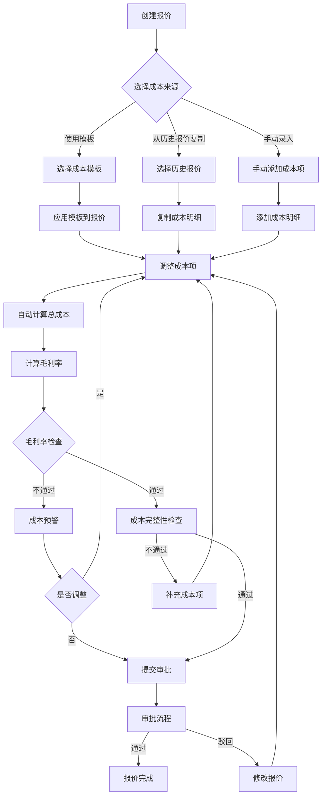
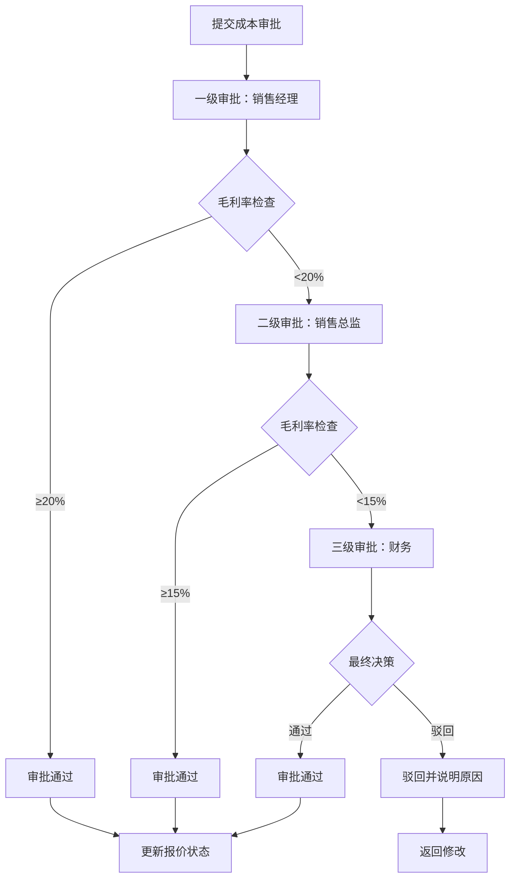
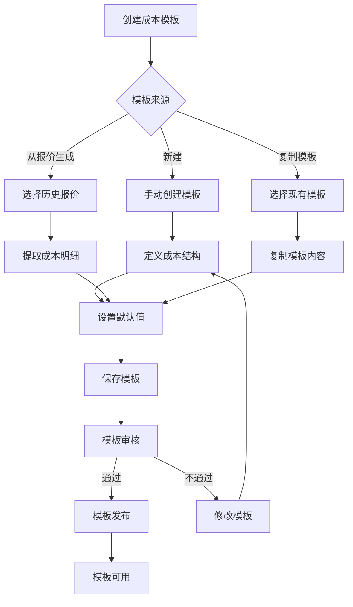

# 报价成本管理模块详细实现方案

> 文档版本：v1.0  
> 创建日期：2025-01-15  
> 适用范围：非标自动化项目管理系统

---

## 一、模块概述

### 1.1 功能定位

报价成本管理模块是销售管理模块的核心子模块，负责：
- **报价阶段的成本核算**：支持多版本报价的成本拆解、成本估算、成本对比
- **成本模板管理**：提供常用成本项模板，快速生成报价成本
- **成本审批流程**：对报价成本进行审批，确保毛利率符合要求
- **成本分析**：提供成本对比、趋势分析、利润分析等功能
- **成本预警**：自动检测毛利率低于阈值的情况并预警

### 1.2 业务价值

- ✅ **提升报价准确性**：通过成本模板和历史数据，快速准确核算成本
- ✅ **控制毛利率**：通过审批流程和预警机制，确保报价毛利率达标
- ✅ **支持决策**：通过成本对比分析，支持商务谈判和价格调整
- ✅ **沉淀经验**：成本模板沉淀历史项目经验，提升团队能力

---

## 二、数据模型设计

### 2.1 核心数据表

#### 2.1.1 报价成本模板表（quote_cost_template）

```sql
CREATE TABLE quote_cost_template (
    id INTEGER PRIMARY KEY AUTOINCREMENT,
    template_code VARCHAR(50) UNIQUE NOT NULL COMMENT '模板编码',
    template_name VARCHAR(200) NOT NULL COMMENT '模板名称',
    template_type VARCHAR(50) COMMENT '模板类型：STANDARD/CUSTOM/PROJECT',
    equipment_type VARCHAR(50) COMMENT '适用设备类型',
    industry VARCHAR(50) COMMENT '适用行业',
    
    -- 模板内容（JSON格式）
    cost_structure JSON COMMENT '成本结构（分类、明细项、默认值）',
    
    -- 统计信息
    total_cost DECIMAL(12, 2) COMMENT '模板总成本',
    cost_categories TEXT COMMENT '成本分类（逗号分隔）',
    
    -- 元数据
    description TEXT COMMENT '模板说明',
    is_active BOOLEAN DEFAULT 1 COMMENT '是否启用',
    usage_count INTEGER DEFAULT 0 COMMENT '使用次数',
    created_by INTEGER COMMENT '创建人ID',
    created_at DATETIME DEFAULT CURRENT_TIMESTAMP,
    updated_at DATETIME DEFAULT CURRENT_TIMESTAMP,
    
    INDEX idx_template_type (template_type),
    INDEX idx_equipment_type (equipment_type),
    INDEX idx_is_active (is_active)
) COMMENT '报价成本模板表';
```

**成本结构JSON格式示例**：
```json
{
  "categories": [
    {
      "category": "硬件成本",
      "items": [
        {
          "item_name": "工控机",
          "specification": "研华IPC-610H",
          "unit": "台",
          "default_qty": 1,
          "default_unit_price": 8000,
          "default_cost": 6500,
          "lead_time_days": 7
        },
        {
          "item_name": "PLC",
          "specification": "西门子S7-1200",
          "unit": "套",
          "default_qty": 1,
          "default_unit_price": 5000,
          "default_cost": 4000,
          "lead_time_days": 14
        }
      ]
    },
    {
      "category": "软件成本",
      "items": [
        {
          "item_name": "视觉软件授权",
          "specification": "Halcon标准版",
          "unit": "套",
          "default_qty": 1,
          "default_unit_price": 30000,
          "default_cost": 25000,
          "lead_time_days": 0
        }
      ]
    },
    {
      "category": "人工成本",
      "items": [
        {
          "item_name": "设计工时",
          "specification": "机械设计",
          "unit": "人天",
          "default_qty": 20,
          "default_unit_price": 800,
          "default_cost": 600,
          "lead_time_days": 0
        },
        {
          "item_name": "调试工时",
          "specification": "现场调试",
          "unit": "人天",
          "default_qty": 15,
          "default_unit_price": 1000,
          "default_cost": 800,
          "lead_time_days": 0
        }
      ]
    }
  ]
}
```

#### 2.1.2 报价成本审批表（quote_cost_approval）

```sql
CREATE TABLE quote_cost_approval (
    id INTEGER PRIMARY KEY AUTOINCREMENT,
    quote_id INTEGER NOT NULL COMMENT '报价ID',
    quote_version_id INTEGER NOT NULL COMMENT '报价版本ID',
    
    -- 审批信息
    approval_status VARCHAR(20) DEFAULT 'PENDING' COMMENT '审批状态：PENDING/APPROVED/REJECTED',
    approval_level INTEGER DEFAULT 1 COMMENT '审批层级（1=销售经理，2=销售总监，3=财务）',
    current_approver_id INTEGER COMMENT '当前审批人ID',
    
    -- 成本检查结果
    total_price DECIMAL(12, 2) COMMENT '总价',
    total_cost DECIMAL(12, 2) COMMENT '总成本',
    gross_margin DECIMAL(5, 2) COMMENT '毛利率',
    margin_threshold DECIMAL(5, 2) DEFAULT 20.00 COMMENT '毛利率阈值',
    margin_status VARCHAR(20) COMMENT '毛利率状态：PASS/WARNING/FAIL',
    
    -- 检查项
    cost_complete BOOLEAN DEFAULT 0 COMMENT '成本拆解是否完整',
    delivery_check BOOLEAN DEFAULT 0 COMMENT '交期校验是否通过',
    risk_terms_check BOOLEAN DEFAULT 0 COMMENT '风险条款是否检查',
    
    -- 审批记录
    approval_comment TEXT COMMENT '审批意见',
    approved_by INTEGER COMMENT '审批人ID',
    approved_at DATETIME COMMENT '审批时间',
    rejected_reason TEXT COMMENT '驳回原因',
    
    created_at DATETIME DEFAULT CURRENT_TIMESTAMP,
    updated_at DATETIME DEFAULT CURRENT_TIMESTAMP,
    
    FOREIGN KEY (quote_id) REFERENCES quotes(id),
    FOREIGN KEY (quote_version_id) REFERENCES quote_versions(id),
    INDEX idx_quote_id (quote_id),
    INDEX idx_approval_status (approval_status)
) COMMENT '报价成本审批表';
```

#### 2.1.3 报价成本历史记录表（quote_cost_history）

```sql
CREATE TABLE quote_cost_history (
    id INTEGER PRIMARY KEY AUTOINCREMENT,
    quote_id INTEGER NOT NULL COMMENT '报价ID',
    quote_version_id INTEGER NOT NULL COMMENT '报价版本ID',
    
    -- 成本快照
    total_price DECIMAL(12, 2) COMMENT '总价',
    total_cost DECIMAL(12, 2) COMMENT '总成本',
    gross_margin DECIMAL(5, 2) COMMENT '毛利率',
    
    -- 成本明细快照（JSON）
    cost_breakdown JSON COMMENT '成本拆解明细',
    
    -- 变更信息
    change_type VARCHAR(50) COMMENT '变更类型：CREATE/UPDATE/DELETE/APPROVE',
    change_reason TEXT COMMENT '变更原因',
    changed_by INTEGER COMMENT '变更人ID',
    
    created_at DATETIME DEFAULT CURRENT_TIMESTAMP,
    
    FOREIGN KEY (quote_id) REFERENCES quotes(id),
    FOREIGN KEY (quote_version_id) REFERENCES quote_versions(id),
    INDEX idx_quote_id (quote_id),
    INDEX idx_created_at (created_at)
) COMMENT '报价成本历史记录表';
```

### 2.2 扩展现有表

#### 2.2.1 QuoteVersion 表扩展

```sql
-- 在 quote_versions 表中添加字段
ALTER TABLE quote_versions ADD COLUMN cost_template_id INTEGER COMMENT '使用的成本模板ID';
ALTER TABLE quote_versions ADD COLUMN cost_breakdown_complete BOOLEAN DEFAULT 0 COMMENT '成本拆解是否完整';
ALTER TABLE quote_versions ADD COLUMN margin_warning BOOLEAN DEFAULT 0 COMMENT '毛利率预警标志';
```

#### 2.2.2 QuoteItem 表扩展

```sql
-- 在 quote_items 表中添加字段
ALTER TABLE quote_items ADD COLUMN cost_category VARCHAR(50) COMMENT '成本分类';
ALTER TABLE quote_items ADD COLUMN cost_source VARCHAR(50) COMMENT '成本来源：TEMPLATE/MANUAL/HISTORY';
ALTER TABLE quote_items ADD COLUMN specification TEXT COMMENT '规格型号';
ALTER TABLE quote_items ADD COLUMN unit VARCHAR(20) COMMENT '单位';
ALTER TABLE quote_items ADD COLUMN lead_time_days INTEGER COMMENT '交期(天)';
```

---

## 三、API 设计

### 3.1 成本模板管理 API

#### 3.1.1 获取成本模板列表

```http
GET /api/v1/sales/cost-templates
```

**请求参数**：
- `page`: 页码（默认1）
- `page_size`: 每页数量（默认20）
- `template_type`: 模板类型筛选
- `equipment_type`: 设备类型筛选
- `industry`: 行业筛选
- `is_active`: 是否启用（true/false）

**响应示例**：
```json
{
  "code": 200,
  "message": "success",
  "data": {
    "items": [
      {
        "id": 1,
        "template_code": "TPL-ICT-001",
        "template_name": "ICT测试设备标准模板",
        "template_type": "STANDARD",
        "equipment_type": "ICT",
        "industry": "消费电子",
        "total_cost": 150000,
        "cost_categories": "硬件成本,软件成本,人工成本",
        "usage_count": 25,
        "is_active": true,
        "created_at": "2025-01-01T10:00:00"
      }
    ],
    "total": 10,
    "page": 1,
    "page_size": 20
  }
}
```

#### 3.1.2 获取成本模板详情

```http
GET /api/v1/sales/cost-templates/{template_id}
```

**响应示例**：
```json
{
  "code": 200,
  "message": "success",
  "data": {
    "id": 1,
    "template_code": "TPL-ICT-001",
    "template_name": "ICT测试设备标准模板",
    "cost_structure": {
      "categories": [
        {
          "category": "硬件成本",
          "items": [...]
        }
      ]
    },
    "total_cost": 150000,
    "description": "适用于标准ICT测试设备报价"
  }
}
```

#### 3.1.3 创建成本模板

```http
POST /api/v1/sales/cost-templates
```

**请求体**：
```json
{
  "template_code": "TPL-ICT-002",
  "template_name": "ICT测试设备定制模板",
  "template_type": "CUSTOM",
  "equipment_type": "ICT",
  "cost_structure": {
    "categories": [...]
  },
  "description": "定制化ICT设备成本模板"
}
```

#### 3.1.4 从报价生成模板

```http
POST /api/v1/sales/quotes/{quote_id}/generate-template
```

**请求参数**：
- `template_name`: 模板名称
- `template_code`: 模板编码（可选，自动生成）
- `version_id`: 报价版本ID（可选，使用当前版本）

### 3.2 报价成本管理 API

#### 3.2.1 应用成本模板到报价

```http
POST /api/v1/sales/quotes/{quote_id}/apply-template
```

**请求体**：
```json
{
  "template_id": 1,
  "version_id": null,
  "adjustments": {
    "工控机": {
      "qty": 2,
      "unit_price": 8500
    },
    "设计工时": {
      "qty": 25
    }
  }
}
```

**功能说明**：
- 将模板中的成本项应用到报价版本
- 支持对模板项进行调整（数量、单价等）
- 自动计算总成本和毛利率

#### 3.2.2 批量更新报价成本

```http
PUT /api/v1/sales/quotes/{quote_id}/cost-items/batch
```

**请求体**：
```json
{
  "version_id": 1,
  "items": [
    {
      "id": 1,
      "cost": 6500,
      "unit_price": 8000,
      "qty": 1
    },
    {
      "item_name": "新增成本项",
      "cost_category": "硬件成本",
      "cost": 5000,
      "unit_price": 6000,
      "qty": 1
    }
  ]
}
```

#### 3.2.3 成本自动计算

```http
POST /api/v1/sales/quotes/{quote_id}/calculate-cost
```

**请求参数**：
- `version_id`: 报价版本ID
- `recalculate`: 是否重新计算（true/false）

**功能说明**：
- 根据报价明细自动计算总成本
- 根据总价和总成本计算毛利率
- 更新报价版本的成本字段

#### 3.2.4 成本完整性检查

```http
GET /api/v1/sales/quotes/{quote_id}/cost-check
```

**响应示例**：
```json
{
  "code": 200,
  "message": "success",
  "data": {
    "is_complete": false,
    "checks": [
      {
        "check_item": "成本拆解完整性",
        "status": "PASS",
        "message": "所有成本项已填写"
      },
      {
        "check_item": "毛利率检查",
        "status": "WARNING",
        "message": "毛利率15.5%，低于阈值20%",
        "current_margin": 15.5,
        "threshold": 20.0
      },
      {
        "check_item": "交期校验",
        "status": "FAIL",
        "message": "关键物料交期未填写"
      }
    ],
    "total_price": 200000,
    "total_cost": 169000,
    "gross_margin": 15.5
  }
}
```

### 3.3 成本审批 API

#### 3.3.1 提交成本审批

```http
POST /api/v1/sales/quotes/{quote_id}/cost-approval/submit
```

**请求体**：
```json
{
  "version_id": 1,
  "approval_level": 1,
  "comment": "请审批报价成本"
}
```

#### 3.3.2 审批通过/驳回

```http
POST /api/v1/sales/quotes/{quote_id}/cost-approval/{approval_id}/approve
POST /api/v1/sales/quotes/{quote_id}/cost-approval/{approval_id}/reject
```

**请求体（审批）**：
```json
{
  "comment": "审批通过，毛利率符合要求"
}
```

**请求体（驳回）**：
```json
{
  "reason": "毛利率过低，需要调整成本或价格",
  "suggestions": [
    "建议降低硬件成本10%",
    "建议提高报价5%"
  ]
}
```

#### 3.3.3 获取审批历史

```http
GET /api/v1/sales/quotes/{quote_id}/cost-approval/history
```

### 3.4 成本分析 API

#### 3.4.1 报价成本对比分析

```http
GET /api/v1/sales/quotes/{quote_id}/cost-comparison
```

**请求参数**：
- `version_ids`: 版本ID列表（对比多个版本）
- `compare_quote_id`: 对比报价ID（与其他报价对比）

**响应示例**：
```json
{
  "code": 200,
  "message": "success",
  "data": {
    "current_version": {
      "version_no": "V2",
      "total_price": 200000,
      "total_cost": 160000,
      "gross_margin": 20.0
    },
    "previous_version": {
      "version_no": "V1",
      "total_price": 190000,
      "total_cost": 158000,
      "gross_margin": 16.8
    },
    "comparison": {
      "price_change": 10000,
      "price_change_pct": 5.26,
      "cost_change": 2000,
      "cost_change_pct": 1.27,
      "margin_change": 3.2,
      "margin_change_pct": 19.05
    },
    "breakdown_comparison": [
      {
        "category": "硬件成本",
        "v1_amount": 80000,
        "v2_amount": 82000,
        "change": 2000,
        "change_pct": 2.5
      }
    ]
  }
}
```

#### 3.4.2 成本趋势分析

```http
GET /api/v1/sales/quotes/{quote_id}/cost-trend
```

**功能说明**：
- 分析报价多个版本的成本变化趋势
- 展示价格、成本、毛利率的变化曲线

#### 3.4.3 成本结构分析

```http
GET /api/v1/sales/quotes/{quote_id}/cost-structure
```

**响应示例**：
```json
{
  "code": 200,
  "message": "success",
  "data": {
    "total_cost": 160000,
    "by_category": [
      {
        "category": "硬件成本",
        "amount": 82000,
        "percentage": 51.25
      },
      {
        "category": "软件成本",
        "amount": 30000,
        "percentage": 18.75
      },
      {
        "category": "人工成本",
        "amount": 48000,
        "percentage": 30.0
      }
    ],
    "by_item_type": [
      {
        "item_type": "标准件",
        "amount": 60000,
        "percentage": 37.5
      },
      {
        "item_type": "定制件",
        "amount": 100000,
        "percentage": 62.5
      }
    ]
  }
}
```

### 3.5 成本预警 API

#### 3.5.1 获取成本预警列表

```http
GET /api/v1/sales/cost-alerts
```

**请求参数**：
- `status`: 预警状态（PENDING/RESOLVED）
- `severity`: 严重程度（WARNING/CRITICAL）
- `quote_id`: 报价ID筛选

#### 3.5.2 处理成本预警

```http
POST /api/v1/sales/cost-alerts/{alert_id}/resolve
```

**请求体**：
```json
{
  "action": "ADJUST_PRICE",
  "comment": "已调整报价，毛利率提升至22%"
}
```

---

## 四、业务流程设计

### 4.1 报价成本核算流程



### 4.2 成本审批流程



### 4.3 成本模板管理流程



---

## 五、前端界面设计

### 5.1 报价成本管理页面

**路径**：`/sales/quotes/{id}/cost`

**功能模块**：

1. **成本概览卡片**
   - 总价、总成本、毛利率
   - 毛利率状态指示（绿色/黄色/红色）
   - 成本完整性状态

2. **成本明细表格**
   - 支持按分类分组显示
   - 可编辑：数量、单价、成本
   - 自动计算小计和总计
   - 支持添加/删除成本项

3. **成本模板选择器**
   - 快速选择模板并应用
   - 模板预览功能
   - 模板调整对话框

4. **成本分析图表**
   - 成本结构饼图
   - 成本对比柱状图（多版本对比）
   - 毛利率趋势折线图

5. **成本检查面板**
   - 完整性检查结果
   - 毛利率检查结果
   - 交期检查结果
   - 风险提示

6. **审批流程面板**
   - 当前审批状态
   - 审批历史记录
   - 审批操作按钮

### 5.2 成本模板管理页面

**路径**：`/sales/cost-templates`

**功能模块**：

1. **模板列表**
   - 模板卡片展示
   - 筛选：类型、设备类型、行业
   - 搜索功能

2. **模板详情/编辑**
   - 成本结构树形展示
   - 拖拽排序
   - 批量编辑
   - 模板预览

3. **模板创建向导**
   - 步骤1：基本信息
   - 步骤2：成本分类
   - 步骤3：成本明细
   - 步骤4：默认值设置
   - 步骤5：预览确认

### 5.3 成本分析页面

**路径**：`/sales/quotes/{id}/cost-analysis`

**功能模块**：

1. **版本对比**
   - 多版本选择器
   - 对比表格
   - 差异高亮

2. **成本趋势**
   - 时间序列图表
   - 关键指标变化

3. **成本结构**
   - 分类占比饼图
   - 明细列表

---

## 六、核心功能实现

### 6.1 成本自动计算逻辑

```python
def calculate_quote_cost(quote_version_id: int, db: Session):
    """
    计算报价版本的总成本和毛利率
    """
    version = db.query(QuoteVersion).filter(QuoteVersion.id == quote_version_id).first()
    items = db.query(QuoteItem).filter(QuoteItem.quote_version_id == quote_version_id).all()
    
    total_cost = Decimal('0')
    total_price = Decimal(str(version.total_price or 0))
    
    for item in items:
        item_cost = Decimal(str(item.cost or 0)) * Decimal(str(item.qty or 0))
        total_cost += item_cost
    
    # 更新版本成本
    version.cost_total = float(total_cost)
    
    # 计算毛利率
    if total_price > 0:
        gross_margin = ((total_price - total_cost) / total_price * 100)
        version.gross_margin = float(gross_margin)
    else:
        version.gross_margin = None
    
    db.commit()
    return version
```

### 6.2 成本完整性检查

```python
def check_cost_completeness(quote_version_id: int, db: Session) -> dict:
    """
    检查报价成本完整性
    """
    version = db.query(QuoteVersion).filter(QuoteVersion.id == quote_version_id).first()
    items = db.query(QuoteItem).filter(QuoteItem.quote_version_id == quote_version_id).all()
    
    checks = []
    
    # 检查1：是否有成本明细
    if not items:
        checks.append({
            "check_item": "成本明细",
            "status": "FAIL",
            "message": "未添加任何成本明细"
        })
    else:
        checks.append({
            "check_item": "成本明细",
            "status": "PASS",
            "message": f"已添加{len(items)}项成本明细"
        })
    
    # 检查2：成本项是否完整
    incomplete_items = []
    for item in items:
        if not item.cost or item.cost == 0:
            incomplete_items.append(item.item_name)
    
    if incomplete_items:
        checks.append({
            "check_item": "成本项完整性",
            "status": "FAIL",
            "message": f"以下成本项未填写成本：{', '.join(incomplete_items)}"
        })
    else:
        checks.append({
            "check_item": "成本项完整性",
            "status": "PASS",
            "message": "所有成本项已填写"
        })
    
    # 检查3：毛利率检查
    margin_threshold = Decimal('20.0')  # 默认阈值20%
    current_margin = version.gross_margin or 0
    
    if current_margin < margin_threshold:
        checks.append({
            "check_item": "毛利率检查",
            "status": "WARNING" if current_margin >= 15 else "FAIL",
            "message": f"毛利率{current_margin}%，低于阈值{margin_threshold}%",
            "current_margin": current_margin,
            "threshold": float(margin_threshold)
        })
    else:
        checks.append({
            "check_item": "毛利率检查",
            "status": "PASS",
            "message": f"毛利率{current_margin}%，符合要求"
        })
    
    # 检查4：交期检查
    items_without_leadtime = [item.item_name for item in items 
                              if not item.lead_time_days and item.item_type in ['硬件', '外购件']]
    
    if items_without_leadtime:
        checks.append({
            "check_item": "交期校验",
            "status": "WARNING",
            "message": f"以下关键物料未填写交期：{', '.join(items_without_leadtime)}"
        })
    else:
        checks.append({
            "check_item": "交期校验",
            "status": "PASS",
            "message": "关键物料交期已填写"
        })
    
    is_complete = all(check["status"] == "PASS" for check in checks)
    
    return {
        "is_complete": is_complete,
        "checks": checks,
        "total_price": float(version.total_price or 0),
        "total_cost": float(version.cost_total or 0),
        "gross_margin": current_margin
    }
```

### 6.3 成本模板应用逻辑

```python
def apply_cost_template(quote_id: int, template_id: int, 
                       adjustments: dict, db: Session):
    """
    应用成本模板到报价
    """
    quote = db.query(Quote).filter(Quote.id == quote_id).first()
    template = db.query(QuoteCostTemplate).filter(QuoteCostTemplate.id == template_id).first()
    
    # 获取或创建报价版本
    if not quote.current_version_id:
        version = QuoteVersion(
            quote_id=quote_id,
            version_no="V1",
            created_by=current_user.id
        )
        db.add(version)
        db.flush()
        quote.current_version_id = version.id
    else:
        version = db.query(QuoteVersion).filter(QuoteVersion.id == quote.current_version_id).first()
    
    # 解析模板成本结构
    cost_structure = template.cost_structure
    
    # 清空现有成本明细（可选）
    # db.query(QuoteItem).filter(QuoteItem.quote_version_id == version.id).delete()
    
    # 应用模板成本项
    total_cost = Decimal('0')
    total_price = Decimal('0')
    
    for category in cost_structure.get('categories', []):
        for item_template in category.get('items', []):
            item_name = item_template['item_name']
            
            # 检查是否有调整
            if item_name in adjustments:
                adj = adjustments[item_name]
                qty = Decimal(str(adj.get('qty', item_template['default_qty'])))
                unit_price = Decimal(str(adj.get('unit_price', item_template['default_unit_price'])))
                cost = Decimal(str(adj.get('cost', item_template['default_cost'])))
            else:
                qty = Decimal(str(item_template['default_qty']))
                unit_price = Decimal(str(item_template['default_unit_price']))
                cost = Decimal(str(item_template['default_cost']))
            
            # 创建报价明细
            item = QuoteItem(
                quote_version_id=version.id,
                item_type=item_template.get('item_type', category['category']),
                item_name=item_name,
                specification=item_template.get('specification'),
                unit=item_template.get('unit'),
                qty=float(qty),
                unit_price=float(unit_price),
                cost=float(cost),
                cost_category=category['category'],
                cost_source='TEMPLATE',
                lead_time_days=item_template.get('lead_time_days')
            )
            db.add(item)
            
            total_cost += cost * qty
            total_price += unit_price * qty
    
    # 更新版本信息
    version.cost_template_id = template_id
    version.total_price = float(total_price)
    version.cost_total = float(total_cost)
    if total_price > 0:
        version.gross_margin = float((total_price - total_cost) / total_price * 100)
    
    # 更新模板使用次数
    template.usage_count = (template.usage_count or 0) + 1
    
    db.commit()
    
    return version
```

---

## 七、实施计划

### 7.1 开发阶段

**第一阶段：基础功能（2周）**
- ✅ 数据模型设计和迁移
- ✅ 成本模板管理API
- ✅ 报价成本拆解API增强
- ✅ 成本自动计算功能

**第二阶段：审批流程（1周）**
- ✅ 成本审批表设计
- ✅ 审批流程API
- ✅ 审批状态管理

**第三阶段：成本分析（1周）**
- ✅ 成本对比分析API
- ✅ 成本趋势分析API
- ✅ 成本结构分析API

**第四阶段：前端界面（2周）**
- ✅ 报价成本管理页面
- ✅ 成本模板管理页面
- ✅ 成本分析页面
- ✅ 成本审批流程界面

**第五阶段：优化和测试（1周）**
- ✅ 性能优化
- ✅ 功能测试
- ✅ 用户体验优化

### 7.2 优先级

| 功能 | 优先级 | 说明 |
|------|--------|------|
| 成本模板管理 | P0 | 核心功能，提升报价效率 |
| 成本自动计算 | P0 | 基础功能，必须实现 |
| 成本完整性检查 | P0 | 确保报价质量 |
| 成本审批流程 | P1 | 控制毛利率 |
| 成本对比分析 | P1 | 支持决策 |
| 成本趋势分析 | P2 | 辅助分析 |
| 成本预警 | P1 | 风险控制 |

---

## 八、测试用例

### 8.1 成本模板管理测试

1. **创建模板**
   - 输入：模板名称、成本结构
   - 预期：模板创建成功，返回模板ID

2. **应用模板**
   - 输入：报价ID、模板ID
   - 预期：报价版本生成成本明细，总成本自动计算

3. **模板调整**
   - 输入：调整项（数量、单价）
   - 预期：成本明细更新，总成本重新计算

### 8.2 成本计算测试

1. **自动计算**
   - 输入：报价明细
   - 预期：总成本 = Σ(成本 × 数量)，毛利率 = (总价 - 总成本) / 总价 × 100%

2. **边界情况**
   - 总价为0：毛利率为None
   - 成本为0：毛利率为100%
   - 成本大于总价：毛利率为负数

### 8.3 成本检查测试

1. **完整性检查**
   - 无成本明细：检查失败
   - 成本项未填写：检查失败
   - 所有项完整：检查通过

2. **毛利率检查**
   - 毛利率 ≥ 20%：通过
   - 15% ≤ 毛利率 < 20%：警告
   - 毛利率 < 15%：失败

---

## 九、后续优化方向

1. **智能成本估算**
   - 基于历史数据机器学习
   - 自动推荐成本项和价格

2. **成本基准库**
   - 建立行业成本基准
   - 支持成本对标分析

3. **成本优化建议**
   - 自动分析成本结构
   - 提供优化建议

4. **成本预测**
   - 基于项目进度预测成本
   - 成本超支预警

---

## 十、附录

### 10.1 相关文档
- [销售管理模块设计文档](./销售管理模块_线索到回款_设计文档.md)
- [项目成本管理API文档](./PROJECT_COST_API_SUMMARY.md)

### 10.2 技术栈
- 后端：FastAPI + SQLAlchemy
- 前端：React + shadcn/ui
- 数据库：SQLite（开发）/ MySQL（生产）

---

**文档结束**


