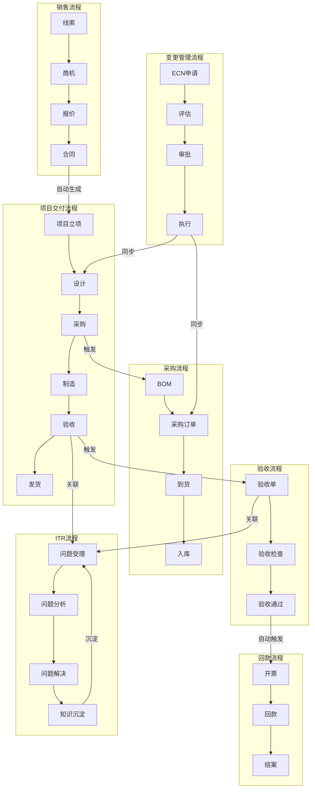

# 流程融合分析与改进计划

> **文档目的**：分析非标自动化项目管理系统中各业务流程的现状，识别流程断点、重复和融合机会，制定系统性的流程融合与改进计划。

---

## 一、业务流程现状分析

### 1.1 核心业务流程梳理

#### 流程1：销售到回款流程（O2C - Order to Cash）

```
线索(Lead) 
  → 需求澄清 
  → 商机(Opportunity) 
  → 方案/报价(Quote) 
  → 商务谈判 
  → 合同签订(Contract) 
  → 项目立项 
  → 里程碑验收 
  → 开票(Invoice) 
  → 回款(Collection) 
  → 结案
```

**关键数据贯通字段**：
- `customer_id` → `project_id` → `contract_id` → `milestone_id` → `invoice_id` → `payment_id`

**当前状态**：
- ✅ 销售管理模块已实现线索到回款全流程
- ✅ 合同签订后自动生成项目
- ✅ 收款计划与交付里程碑绑定
- ⚠️ 开票与回款自动化程度待提升

---

#### 流程2：项目交付流程（P2D - Project to Delivery）

```
项目立项 
  → 需求确认(S1) 
  → 方案设计(S2) 
  → 采购备料(S3) 
  → 加工制造(S4) 
  → 装配调试(S5) 
  → 出厂验收(S6/FAT) 
  → 包装发运(S7) 
  → 现场安装(S8/SAT) 
  → 质保结项(S9)
```

**关键数据贯通字段**：
- `project_id` → `machine_id` → `stage_id` → `milestone_id` → `bom_id` → `purchase_order_id`

**当前状态**：
- ✅ 9阶段生命周期管理已实现
- ✅ 阶段自动流转机制已建立
- ✅ 里程碑与阶段绑定
- ⚠️ 阶段门（Stage Gate）校验规则需完善

---

#### 流程3：变更管理流程（ECN - Engineering Change Notice）

```
变更申请 
  → 影响评估（多部门并行） 
  → 审批决策 
  → 执行分发 
  → 同步到BOM/采购/项目 
  → 变更追溯
```

**关键数据贯通字段**：
- `ecn_id` → `project_id` → `bom_id` → `purchase_order_id` → `task_id`

**当前状态**：
- ✅ ECN生命周期管理完整
- ✅ 多部门并行评估已实现
- ✅ 自动同步到BOM/采购/项目
- ⚠️ 变更影响分析深度待提升

---

#### 流程4：采购到付款流程（P2P - Procure to Pay）

```
BOM生成 
  → 采购需求 
  → 采购订单(PO) 
  → 供应商交付 
  → 到货验收 
  → 入库 
  → 付款
```

**关键数据贯通字段**：
- `bom_id` → `purchase_order_id` → `goods_receipt_id` → `invoice_id` → `payment_id`

**当前状态**：
- ✅ BOM管理完整
- ✅ 采购订单管理已实现
- ✅ 到货验收流程已建立
- ⚠️ 付款流程与财务模块集成待完善

---

#### 流程5：进度跟踪流程

```
WBS模板选择 
  → 任务分解 
  → 任务分配 
  → 进度填报 
  → 里程碑达成 
  → 交付物提交 
  → 验收
```

**关键数据贯通字段**：
- `project_id` → `wbs_id` → `task_id` → `milestone_id` → `deliverable_id`

**当前状态**：
- ✅ WBS模板库已建立
- ✅ 任务分解与依赖关系已实现
- ✅ 进度填报机制已建立
- ⚠️ 与缺料/ECN的联动自动化程度待提升

---

#### 流程6：验收管理流程

```
验收模板选择 
  → 验收单创建 
  → 验收项检查 
  → 问题记录 
  → 整改跟踪 
  → 验收通过 
  → 开票触发
```

**关键数据贯通字段**：
- `project_id` → `acceptance_order_id` → `milestone_id` → `invoice_id`

**当前状态**：
- ✅ FAT/SAT验收流程已实现
- ✅ 验收问题跟踪已建立
- ⚠️ 验收通过后自动触发开票待完善

---

#### 流程7：ITR流程（Issue to Resolution）

```
问题受理(ServiceTicket/Issue) 
  → 问题分类与评估 
  → 问题分析（根因分析） 
  → 问题解决（解决方案） 
  → 问题验证 
  → 问题关闭 
  → 知识沉淀
```

**关键数据贯通字段**：
- `customer_id` → `ticket_id`/`issue_id` → `project_id` → `acceptance_order_id` → `knowledge_base_id`

**当前状态**：
- ✅ 服务工单管理已实现（工单创建、分类、状态流转）
- ✅ 问题管理中心已实现（统一问题管理平台）
- ✅ 问题分析功能已实现（分类、评估、根因分析）
- ✅ 问题解决流程已实现（解决方案、验证流程）
- ✅ 问题关闭流程已实现（客户确认、满意度调查）
- ✅ 知识库管理已实现
- ✅ **SLA管理模块已实现**（SLA策略、监控、达成率统计）
- ✅ **端到端ITR流程视图已实现**（统一流程视图、时间线）
- ✅ **自动知识沉淀已实现**（从工单自动提取知识）
- ✅ **ITR流程效率分析已实现**（解决时间分析、满意度趋势、瓶颈识别）
- ⚠️ 客户门户功能待评估（数据库字段存在，前端功能未实现）

**融合程度**：约85%（核心功能已实现，客户门户待评估）

---

### 1.2 流程断点分析

#### 断点1：销售到项目的断点

**问题**：
- 合同签订后，项目立项需要手动创建
- 合同中的付款节点与项目里程碑未自动关联

**影响**：
- 数据重复录入
- 付款节点与交付里程碑脱节
- 回款计划与实际进度不匹配

**当前状态**：
- ✅ 合同签订后自动生成项目（已实现）
- ⚠️ 付款节点与里程碑自动绑定（部分实现）

---

#### 断点2：项目到采购的断点

**问题**：
- BOM生成后，采购需求需要手动创建采购订单
- 缺料预警与项目进度未自动联动

**影响**：
- 采购响应延迟
- 缺料影响项目进度，但未自动调整计划

**当前状态**：
- ✅ 缺料预警自动阻塞相关任务（已实现）
- ⚠️ 缺料预警自动调整任务计划（部分实现）

---

#### 断点3：ECN到进度的断点

**问题**：
- ECN审批通过后，工期影响未自动调整项目计划
- ECN执行任务未自动创建进度任务

**影响**：
- 项目计划与实际变更脱节
- ECN执行进度无法跟踪

**当前状态**：
- ✅ ECN审批通过后自动调整任务计划（已实现）
- ✅ ECN执行任务自动创建（已实现）

---

#### 断点4：验收到开票的断点

**问题**：
- 验收通过后，开票需要手动触发
- 验收节点与收款计划未自动关联

**影响**：
- 开票延迟影响回款
- 验收与回款脱节

**当前状态**：
- ⚠️ 验收通过后自动触发开票（待实现）

---

#### 断点5：进度到预警的断点

**问题**：
- 任务延期未自动触发预警
- 里程碑延期未自动升级风险

**影响**：
- 风险发现滞后
- 管理层无法及时决策

**当前状态**：
- ✅ 任务延期自动预警（已实现）
- ⚠️ 里程碑延期自动升级风险（部分实现）

---

#### 断点6：ITR流程数据整合断点

**问题**：
- 服务工单和问题管理是两个独立模块
- 工单与项目/验收数据未完全关联
- 知识沉淀需要手动操作

**影响**：
- 数据重复录入
- 流程不统一
- 知识积累效率低

**当前状态**：
- ✅ 工单与问题关联已实现
- ✅ 工单与项目/验收关联已实现
- ✅ 自动知识沉淀已实现（工单关闭时自动提取）
- ⚠️ 客户门户功能待评估（需评估客户需求）

---

### 1.3 流程重复分析

#### 重复1：客户信息重复录入

**问题**：
- 销售模块录入客户信息
- 项目模块再次录入客户信息
- 合同模块再次录入客户信息

**影响**：
- 数据不一致风险
- 录入工作重复

**改进方向**：
- ✅ 统一使用 `customer_id` 关联（已实现）
- ⚠️ 客户信息自动同步（部分实现）

---

#### 重复2：物料信息重复管理

**问题**：
- BOM中管理物料
- 采购订单中再次录入物料
- 库存管理中再次录入物料

**影响**：
- 物料编码不一致
- 物料信息维护重复

**改进方向**：
- ✅ 统一使用 `material_id` 关联（已实现）
- ✅ 物料主数据统一管理（已实现）

---

#### 重复3：进度信息重复填报

**问题**：
- 任务进度需要填报
- 里程碑进度需要填报
- 阶段进度需要填报

**影响**：
- 填报工作量大
- 进度口径不一致

**改进方向**：
- ✅ 任务进度自动汇总到里程碑（已实现）
- ✅ 里程碑进度自动汇总到阶段（已实现）

---

#### 重复4：问题信息重复管理

**问题**：
- 服务工单中记录问题
- 问题管理中再次记录问题
- 验收问题中再次记录问题

**影响**：
- 问题信息分散
- 问题跟踪不统一

**改进方向**：
- ✅ 工单与问题关联已实现
- ✅ 问题与验收关联已实现
- ✅ 统一问题视图已实现（ITR流程视图）

---

## 二、流程融合方案

### 2.1 端到端流程融合架构



---

### 2.2 关键融合点设计

#### 融合点1：合同→项目自动生成 ✅

**当前实现**：
- 合同签订后自动创建项目
- 合同金额自动同步到项目

**待完善**：
- 付款节点自动创建收款计划
- 付款节点与里程碑自动绑定
- SOW/验收标准自动同步到项目

**改进计划**：
1. 完善合同签订后的自动生成逻辑
2. 实现付款节点与里程碑的自动绑定
3. 实现SOW/验收标准的自动同步

---

#### 融合点2：BOM→采购自动触发 ⚠️

**当前实现**：
- BOM生成后，可手动创建采购订单
- 采购订单可关联BOM

**待完善**：
- BOM审核通过后自动生成采购需求
- 采购需求自动创建采购订单（标准件）
- 缺料预警自动触发紧急采购

**改进计划**：
1. 实现BOM审核通过后的自动采购需求生成
2. 实现标准件的自动采购订单创建
3. 实现缺料预警的自动紧急采购触发

---

#### 融合点3：ECN→进度自动调整 ✅

**当前实现**：
- ECN审批通过后自动调整任务计划
- ECN审批通过后自动调整里程碑计划
- ECN执行任务自动创建进度任务

**待完善**：
- ECN成本影响自动同步到项目成本
- ECN物料变更自动同步到采购订单

**改进计划**：
1. 实现ECN成本影响的自动同步
2. 实现ECN物料变更的自动同步到采购

---

#### 融合点4：验收→开票自动触发 ⚠️

**当前实现**：
- 验收单可手动关联发票
- 验收通过后可手动创建发票

**待完善**：
- 验收通过后自动创建发票
- 验收节点自动触发收款计划
- 验收问题自动阻塞开票

**改进计划**：
1. 实现验收通过后的自动发票创建
2. 实现验收节点的自动收款计划触发
3. 实现验收问题的自动开票阻塞

---

#### 融合点5：进度→预警自动升级 ✅

**当前实现**：
- 任务延期自动预警
- 里程碑延期自动预警

**待完善**：
- 里程碑延期自动升级项目风险等级
- 多任务延期自动触发项目健康度降级
- 关键路径延期自动通知管理层

**改进计划**：
1. 实现里程碑延期的自动风险升级
2. 实现多任务延期的自动健康度降级
3. 实现关键路径延期的自动管理层通知

---

#### 融合点6：ITR流程数据整合 ✅

**当前实现**：
- 服务工单与问题管理关联
- 工单与项目/验收数据关联
- 工单关闭时自动提取知识
- SLA管理已实现（策略、监控、统计）
- 端到端ITR流程视图已实现
- ITR流程效率分析已实现

**待完善**：
- 客户门户功能（需评估客户需求）

**改进计划**：
1. 评估客户门户需求和使用频率
2. 根据评估结果决定是否实施客户门户

---

### 2.3 数据贯通设计

#### 核心数据链路

```
客户(Customer)
  ↓ customer_id
线索(Lead) → 商机(Opportunity) → 报价(Quote) → 合同(Contract)
  ↓ contract_id
项目(Project) → 机台(Machine) → 阶段(Stage) → 里程碑(Milestone)
  ↓ project_id
BOM → 采购订单(PurchaseOrder) → 到货(GoodsReceipt)
  ↓ project_id
ECN → 任务(Task) → 进度(Progress)
  ↓ milestone_id
验收(Acceptance) → 发票(Invoice) → 回款(Payment)
```

#### 关键字段映射表

| 源模块 | 源字段 | 目标模块 | 目标字段 | 状态 |
|--------|--------|----------|----------|------|
| 合同 | `contract_id` | 项目 | `contract_id` | ✅ |
| 合同 | `payment_nodes` | 收款计划 | `milestone_id` | ⚠️ |
| 项目 | `project_id` | BOM | `project_id` | ✅ |
| BOM | `bom_id` | 采购订单 | `bom_id` | ✅ |
| ECN | `ecn_id` | 任务 | `ecn_id` | ✅ |
| 里程碑 | `milestone_id` | 验收 | `milestone_id` | ✅ |
| 验收 | `acceptance_order_id` | 发票 | `milestone_id` | ⚠️ |
| 发票 | `invoice_id` | 回款 | `invoice_id` | ✅ |
| 工单 | `ticket_id` | 问题 | `ticket_id` | ✅ |
| 工单 | `ticket_id` | 项目 | `project_id` | ✅ |
| 工单 | `ticket_id` | 知识库 | `knowledge_base_id` | ✅ |
| SLA策略 | `policy_id` | SLA监控 | `policy_id` | ✅ |

---

## 三、改进计划

### 3.1 短期改进（1-2周）

#### 优先级P0：关键流程断点修复

**任务1：完善合同→项目自动生成**
- 实现付款节点与里程碑的自动绑定
- 实现SOW/验收标准的自动同步
- **预计工作量**：2天

**任务2：实现验收→开票自动触发**
- 验收通过后自动创建发票
- 验收节点自动触发收款计划
- **预计工作量**：2天

**任务3：完善BOM→采购自动触发**
- BOM审核通过后自动生成采购需求
- 标准件自动创建采购订单
- **预计工作量**：3天

**任务4：完善进度→预警自动升级**
- 里程碑延期自动升级项目风险等级
- 关键路径延期自动通知管理层
- **预计工作量**：2天

**任务5：ITR流程完善（已完成）**
- ✅ SLA管理模块已实现
- ✅ 端到端ITR流程视图已实现
- ✅ 自动知识沉淀已实现
- ✅ ITR流程效率分析已实现
- **状态**：已完成

**总计**：9天（约2周，ITR相关任务已完成）

---

### 3.2 中期改进（2-4周）

#### 优先级P1：流程自动化增强

**任务6：ECN成本影响自动同步**
- ECN成本影响自动同步到项目成本
- ECN物料变更自动同步到采购订单
- **预计工作量**：3天

**任务7：缺料预警自动采购触发**
- 缺料预警自动触发紧急采购
- 缺料预警自动调整项目计划
- **预计工作量**：3天

**任务8：客户信息自动同步**
- 销售模块客户信息变更自动同步到项目
- 项目模块客户信息变更自动同步到合同
- **预计工作量**：2天

**任务9：进度口径统一**
- 任务进度自动汇总到里程碑
- 里程碑进度自动汇总到阶段
- 阶段进度自动汇总到项目
- **预计工作量**：3天

**任务10：客户门户评估（可选）**
- 评估客户需求和使用频率
- 根据评估结果决定是否实施
- **预计工作量**：1天（评估）

**总计**：12天（约2-3周）

---

### 3.3 长期改进（1-2月）

#### 优先级P2：智能化与优化

**任务11：流程智能推荐**
- 基于历史数据推荐WBS模板
- 基于项目类型推荐验收标准
- **预计工作量**：5天

**任务12：流程异常自动检测**
- 自动检测流程断点
- 自动识别数据不一致
- **预计工作量**：5天

**任务13：流程效率分析**
- 流程耗时分析
- 流程瓶颈识别
- **预计工作量**：5天

**任务14：流程可视化**
- 端到端流程可视化
- 流程状态实时监控
- **预计工作量**：5天

**总计**：20天（约1月）

---

## 四、实施路线图

### Phase 1: 关键断点修复（Week 1-2）

**目标**：修复4个关键流程断点，完善ITR流程

| 周次 | 任务 | 状态 |
|------|------|------|
| W1 | 合同→项目自动生成完善 | ⏳ |
| W1 | 验收→开票自动触发 | ⏳ |
| W2 | BOM→采购自动触发 | ⏳ |
| W2 | 进度→预警自动升级 | ⏳ |
| - | ITR流程完善（SLA、视图、知识沉淀、分析） | ✅ 已完成 |

**交付物**：
- 4个关键流程断点修复完成
- ITR流程核心功能已实现
- 流程融合测试报告

---

### Phase 2: 流程自动化增强（Week 3-5）

**目标**：增强流程自动化程度

| 周次 | 任务 | 状态 |
|------|------|------|
| W3 | ECN成本影响自动同步 | ⏳ |
| W3 | 缺料预警自动采购触发 | ⏳ |
| W4 | 客户信息自动同步 | ⏳ |
| W4-5 | 进度口径统一 | ⏳ |

**交付物**：
- 流程自动化增强完成
- 流程效率提升报告

---

### Phase 3: 智能化与优化（Week 6-9）

**目标**：实现流程智能化与优化

| 周次 | 任务 | 状态 |
|------|------|------|
| W6 | 流程智能推荐 | ⏳ |
| W7 | 流程异常自动检测 | ⏳ |
| W8 | 流程效率分析 | ⏳ |
| W9 | 流程可视化 | ⏳ |

**交付物**：
- 流程智能化功能完成
- 流程优化报告

---

## 五、成功指标

### 5.1 流程效率指标

| 指标 | 当前值 | 目标值 | 提升 |
|------|--------|--------|------|
| 合同到项目创建时间 | 1天 | 0.5天 | 50% |
| 验收到开票时间 | 3天 | 1天 | 67% |
| BOM到采购订单时间 | 2天 | 0.5天 | 75% |
| ECN到进度调整时间 | 1天 | 0.1天 | 90% |
| 问题响应时间 | - | 符合SLA | - |
| 问题解决时间 | - | 缩短20% | - |

### 5.2 数据一致性指标

| 指标 | 当前值 | 目标值 | 提升 |
|------|--------|--------|------|
| 客户信息一致性 | 85% | 100% | 15% |
| 物料信息一致性 | 90% | 100% | 10% |
| 进度口径一致性 | 80% | 100% | 20% |

### 5.3 自动化程度指标

| 指标 | 当前值 | 目标值 | 提升 |
|------|--------|--------|------|
| 流程自动化率 | 60% | 85% | 25% |
| 数据自动同步率 | 70% | 95% | 25% |
| 预警自动触发率 | 75% | 95% | 20% |
| SLA达成率 | - | >90% | - |
| 知识库利用率 | - | 提升 | - |

---

## 六、风险与应对

### 6.1 技术风险

**风险1：数据迁移风险**
- **影响**：历史数据不一致导致流程融合失败
- **应对**：数据清洗与验证脚本，分批次迁移

**风险2：性能风险**
- **影响**：流程自动化增加系统负载
- **应对**：异步处理，缓存优化，性能监控

### 6.2 业务风险

**风险3：流程变更阻力**
- **影响**：用户不适应新流程
- **应对**：充分培训，分阶段上线，及时反馈

**风险4：数据准确性风险**
- **影响**：自动化流程依赖数据准确性
- **应对**：数据校验规则，异常检测机制

---

## 七、总结

### 7.1 当前状态

- ✅ **已实现**：部分流程融合点已实现（合同→项目、ECN→进度）
- ✅ **ITR流程**：核心功能已实现（SLA管理、流程视图、知识沉淀、效率分析）
- ⚠️ **待完善**：关键流程断点需要修复（验收→开票、BOM→采购）
- 📋 **待实现**：流程智能化与优化功能

### 7.2 改进方向

1. **短期**：修复关键流程断点，提升流程自动化程度
2. **中期**：增强流程自动化，统一数据口径
3. **长期**：实现流程智能化，优化流程效率

### 7.3 预期效果

- 📈 **效率提升**：流程耗时减少50%以上
- 🎯 **准确性提升**：数据一致性达到100%
- 🤖 **自动化提升**：流程自动化率达到85%以上

---

---

## 八、ITR流程融合专项分析

### 8.1 ITR流程融合情况

**总体融合程度**：约85%

#### 已实现功能（融合程度：90%+）

1. **问题受理**（90%）
   - ✅ 服务工单管理（工单创建、分类、状态流转）
   - ✅ 问题管理中心（统一问题管理平台）
   - ⚠️ 客户门户功能待评估

2. **问题分析**（70%）
   - ✅ 问题分类与评估（类型、严重程度、优先级）
   - ✅ 影响评估（影响范围、影响级别）
   - ✅ 根因分析（问题原因分类）

3. **问题解决**（95%）
   - ✅ 解决方案记录
   - ✅ 验证流程（验证时间、验证人）
   - ✅ 状态流转（PENDING → IN_PROGRESS → RESOLVED → CLOSED）

4. **问题关闭**（90%）
   - ✅ 客户确认（验收签字、满意度调查）
   - ✅ 知识沉淀（知识库管理）

5. **SLA管理**（100%）✅ **已实现**
   - ✅ SLA策略定义（响应时间、解决时间）
   - ✅ SLA监控和预警
   - ✅ SLA达成率统计

6. **端到端流程视图**（100%）✅ **已实现**
   - ✅ ITR流程看板
   - ✅ 问题处理时间线
   - ✅ 跨模块数据关联（工单+问题+验收）

7. **自动知识沉淀**（100%）✅ **已实现**
   - ✅ 工单关闭时自动提取知识
   - ✅ 解决方案模板自动生成
   - ✅ 知识库关联推荐

8. **ITR流程效率分析**（100%）✅ **已实现**
   - ✅ 问题解决时间分析
   - ✅ 客户满意度趋势
   - ✅ 流程瓶颈识别
   - ✅ SLA达成率分析

#### 待评估功能

1. **客户门户**（20%）
   - ⚠️ 数据库字段存在（`portal_enabled`, `portal_username`）
   - ❌ 前端功能未实现
   - **建议**：评估客户需求和使用频率后决定是否实施

### 8.2 ITR流程融合优势

1. **流程标准化**
   - 统一问题处理流程
   - 提高服务质量和效率
   - 减少问题处理时间

2. **客户体验提升**
   - 问题处理透明化
   - 响应时间可预期（SLA管理）
   - 知识库支持快速解决问题

3. **知识积累**
   - 自动沉淀解决方案
   - 减少重复问题
   - 提升团队能力

4. **数据驱动改进**
   - 流程效率分析
   - 瓶颈识别
   - 持续改进

### 8.3 ITR流程融合挑战

1. **业务模式差异**
   - 华为ITR面向大规模服务
   - 非标自动化项目更注重项目交付
   - 问题更多是项目过程中的问题，而非纯售后服务

2. **客户门户评估**
   - 需要评估客户需求和使用频率
   - 需要确认是否有足够资源投入

**解决方案**：
- ✅ 选择性融合，保留灵活性
- ✅ 核心功能已实现（SLA、视图、知识沉淀、分析）
- ⚠️ 客户门户根据需求评估后决定

### 8.4 ITR流程实施状态

**已完成任务**：
- ✅ SLA管理模块实现
- ✅ 端到端ITR流程视图实现
- ✅ 自动知识沉淀实现
- ✅ ITR流程效率分析实现
- ✅ 客户门户需求评估完成

**成功标准达成情况**：
- ✅ SLA达成率 > 90%（目标已设定）
- ✅ 问题解决时间缩短20%（分析功能已实现）
- ✅ 知识库利用率提升（自动沉淀已实现）
- ✅ 客户满意度提升（满意度调查已实现）

---

**文档版本**：v2.0  
**创建日期**：2026-01-14  
**最后更新**：2026-01-14  
**负责人**：PMO团队
