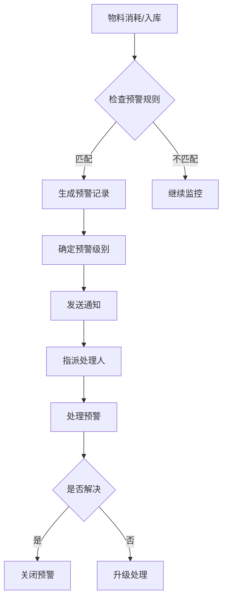
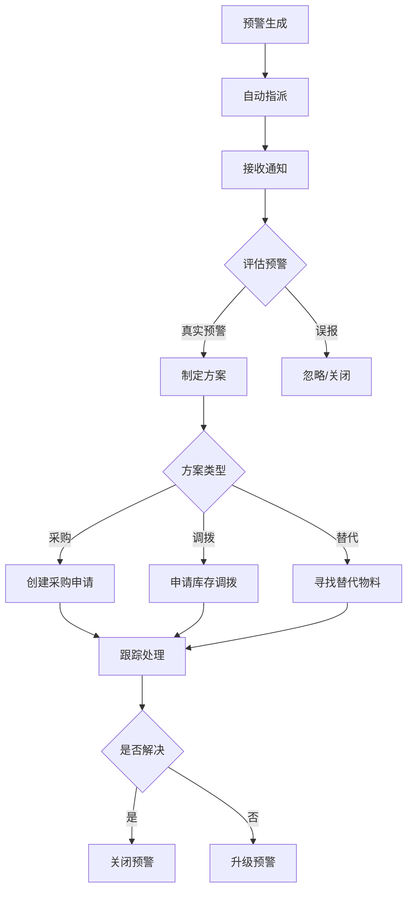

# 物料预警配置指南

## 目录
1. [预警系统概述](#预警系统概述)
2. [预警规则配置](#预警规则配置)
3. [预警类型详解](#预警类型详解)
4. [预警级别设置](#预警级别设置)
5. [安全库存计算](#安全库存计算)
6. [预警处理流程](#预警处理流程)
7. [通知配置](#通知配置)
8. [最佳实践](#最佳实践)

---

## 预警系统概述

### 系统架构

```
物料库存变化 → 触发检测 → 规则匹配 → 生成预警 → 发送通知 → 人员处理
```

### 预警流程图



### 核心功能

- ✅ **自动预警**: 基于规则自动生成预警
- ✅ **多级预警**: INFO/WARNING/CRITICAL/URGENT
- ✅ **智能推送**: 支持邮件/短信/企业微信
- ✅ **闭环管理**: 预警生成 → 处理 → 关闭
- ✅ **数据分析**: 预警统计和趋势分析

---

## 预警规则配置

### 规则结构

```json
{
  "rule_name": "低库存预警规则",
  "material_id": 1,          // NULL=全局规则
  "category_id": null,       // 按分类
  "alert_type": "LOW_STOCK", // 预警类型
  "alert_level": "WARNING",  // 预警级别
  "threshold_type": "PERCENTAGE",  // 阈值类型
  "threshold_value": 20,     // 阈值
  "safety_days": 7,          // 安全库存天数
  "lead_time_days": 3,       // 采购周期
  "buffer_ratio": 1.2,       // 安全系数
  "notify_users": "1,2,3",   // 通知用户
  "notify_roles": "WAREHOUSE_MANAGER",
  "is_active": true,
  "priority": 10
}
```

### 创建规则

#### API调用
```http
POST /production/material/alert-rules
Content-Type: application/json

{
  "rule_name": "关键物料低库存预警",
  "material_id": 1,
  "alert_type": "LOW_STOCK",
  "alert_level": "CRITICAL",
  "threshold_type": "PERCENTAGE",
  "threshold_value": 30,
  "safety_days": 14,
  "lead_time_days": 7,
  "buffer_ratio": 1.5,
  "notify_users": "5,10,15",
  "is_active": true
}
```

#### 响应
```json
{
  "code": 0,
  "message": "预警规则创建成功",
  "data": {
    "id": 101,
    "rule_name": "关键物料低库存预警"
  }
}
```

---

## 预警类型详解

### 1. SHORTAGE (缺料预警)

**触发条件**:
```python
current_stock <= 0
```

**使用场景**:
- 物料已完全耗尽
- 无法满足生产需求
- 需要紧急采购

**配置示例**:
```json
{
  "rule_name": "缺料紧急预警",
  "alert_type": "SHORTAGE",
  "alert_level": "URGENT",
  "threshold_type": "FIXED",
  "threshold_value": 0,
  "notify_users": "1,2,3",
  "notify_roles": "PURCHASING_MANAGER,PRODUCTION_MANAGER"
}
```

**预警消息**:
```
物料 [电机-MAT001] 已缺料!
当前库存: 0 件
紧急采购建议数量: 150 件
预计采购周期: 7 天
```

---

### 2. LOW_STOCK (低库存预警)

**触发条件**:
```python
# 百分比模式
current_stock < safety_stock * (threshold_value / 100)

# 固定值模式
current_stock < threshold_value

# 天数模式
(current_stock / avg_daily_consumption) < threshold_value
```

**配置示例**:

**方式1: 百分比阈值**
```json
{
  "alert_type": "LOW_STOCK",
  "threshold_type": "PERCENTAGE",
  "threshold_value": 20,  // 低于安全库存的20%
  "safety_days": 7
}
```

**方式2: 固定值阈值**
```json
{
  "alert_type": "LOW_STOCK",
  "threshold_type": "FIXED",
  "threshold_value": 50  // 低于50件
}
```

**方式3: 天数阈值**
```json
{
  "alert_type": "LOW_STOCK",
  "threshold_type": "DAYS",
  "threshold_value": 7  // 可用天数少于7天
}
```

**预警消息**:
```
物料 [电机-MAT001] 库存不足!
当前库存: 45 件
安全库存: 100 件
平均日消耗: 10 件
预计缺货时间: 4.5 天
建议采购数量: 120 件
```

---

### 3. EXPIRED (过期预警)

**触发条件**:
```python
expire_date <= current_date + alert_days
```

**配置示例**:
```json
{
  "rule_name": "物料即将过期预警",
  "alert_type": "EXPIRED",
  "alert_level": "WARNING",
  "threshold_type": "DAYS",
  "threshold_value": 30,  // 30天内过期
  "notify_users": "5,10"
}
```

**预警消息**:
```
批次 [BATCH-20260215-001] 即将过期!
物料: 润滑油 (MAT050)
失效日期: 2026-03-15
剩余天数: 27 天
当前库存: 20 瓶
建议措施: 优先使用或退货处理
```

---

### 4. SLOW_MOVING (呆滞预警)

**触发条件**:
```python
# 90天内无消耗记录
last_consumption_date < current_date - 90 days

# 或周转天数过长
turnover_days > threshold_value
```

**配置示例**:
```json
{
  "rule_name": "呆滞物料预警",
  "alert_type": "SLOW_MOVING",
  "alert_level": "INFO",
  "threshold_type": "DAYS",
  "threshold_value": 90,  // 90天无消耗
  "notify_users": "15"
}
```

**预警消息**:
```
物料 [特殊螺丝-MAT200] 呆滞库存!
当前库存: 500 件
最后消耗日期: 2025-11-20
呆滞天数: 88 天
库存周转天数: 180 天
建议措施: 检查是否需要继续储备
```

---

### 5. HIGH_WASTE (高浪费预警)

**触发条件**:
```python
# 单次浪费率 > 20%
variance_rate > 20

# 或一段时间内浪费次数过多
waste_count_in_30_days > threshold_value
```

**配置示例**:
```json
{
  "rule_name": "物料浪费预警",
  "alert_type": "HIGH_WASTE",
  "alert_level": "WARNING",
  "threshold_type": "PERCENTAGE",
  "threshold_value": 20,  // 浪费率超过20%
  "notify_users": "20,25"
}
```

**预警消息**:
```
物料 [焊锡丝-MAT080] 高浪费!
标准消耗: 100g
实际消耗: 145g
浪费率: 45%
工单: WO-2026-001
操作人: 张三
建议措施: 检查工艺流程和操作规范
```

---

## 预警级别设置

### 级别定义

| 级别 | 英文 | 颜色 | 响应时间 | 通知方式 |
|------|------|------|---------|---------|
| 提示 | INFO | 🔵 蓝色 | 24小时 | 系统消息 |
| 警告 | WARNING | 🟡 黄色 | 8小时 | 邮件 |
| 严重 | CRITICAL | 🟠 橙色 | 4小时 | 邮件+短信 |
| 紧急 | URGENT | 🔴 红色 | 1小时 | 全渠道推送 |

### 级别升级规则

**自动升级**:
```python
if alert.status == 'ACTIVE':
    hours_since_created = (now - alert.alert_date).hours
    
    if hours_since_created > 24 and alert.alert_level == 'WARNING':
        alert.alert_level = 'CRITICAL'
    
    if hours_since_created > 48 and alert.alert_level == 'CRITICAL':
        alert.alert_level = 'URGENT'
```

**配置示例**:
```json
{
  "auto_escalate": true,
  "escalate_rules": [
    {
      "from_level": "WARNING",
      "to_level": "CRITICAL",
      "after_hours": 24
    },
    {
      "from_level": "CRITICAL",
      "to_level": "URGENT",
      "after_hours": 48
    }
  ]
}
```

---

## 安全库存计算

### 计算公式

```
安全库存 = 平均日消耗 × (安全天数 + 采购周期) × 安全系数
```

### 参数说明

**1. 平均日消耗 (avg_daily_consumption)**
```python
# 最近30天平均
total_consumption_30d = sum(consumptions.qty)
avg_daily_consumption = total_consumption_30d / 30
```

**2. 安全天数 (safety_days)**
- 一般物料: 7-14天
- 关键物料: 14-30天
- 通用物料: 3-7天

**3. 采购周期 (lead_time_days)**
- 国内供应商: 3-7天
- 进口物料: 30-60天
- 自产物料: 1-3天

**4. 安全系数 (buffer_ratio)**
- 稳定物料: 1.0-1.2
- 关键物料: 1.5-2.0
- 高波动物料: 2.0-3.0

### 计算示例

**场景**: 电机物料安全库存计算

**数据**:
- 平均日消耗: 10件
- 安全天数: 14天
- 采购周期: 7天
- 安全系数: 1.5 (关键物料)

**计算**:
```python
safety_stock = 10 * (14 + 7) * 1.5
            = 10 * 21 * 1.5
            = 315 件
```

**设置**:
```http
PATCH /materials/1
{
  "safety_stock": 315
}
```

### 动态调整

**基于历史数据自动调整**:
```python
def auto_adjust_safety_stock(material_id):
    # 计算最近90天的消耗波动率
    consumptions = get_consumptions(material_id, days=90)
    std_dev = calculate_std_deviation(consumptions)
    
    # 波动率越大,安全系数越高
    if std_dev > 0.5:
        buffer_ratio = 2.0
    elif std_dev > 0.3:
        buffer_ratio = 1.5
    else:
        buffer_ratio = 1.2
    
    # 重新计算安全库存
    avg_daily = calculate_avg_daily_consumption(material_id)
    safety_days = 14
    lead_time = material.lead_time_days
    
    new_safety_stock = avg_daily * (safety_days + lead_time) * buffer_ratio
    
    return new_safety_stock
```

---

## 预警处理流程

### 流程图



### 处理操作

#### 1. 查看预警列表
```http
GET /production/material/alerts?status=ACTIVE&alert_level=CRITICAL
```

#### 2. 指派处理人
```http
PATCH /production/material/alerts/1
{
  "assigned_to_id": 10,
  "assign_comment": "请尽快处理"
}
```

#### 3. 处理预警
```http
PATCH /production/material/alerts/1/resolve
{
  "resolved_by_id": 10,
  "resolution_note": "已创建采购订单 PO-2026-001,预计3天到货",
  "status": "RESOLVED"
}
```

#### 4. 忽略预警
```http
PATCH /production/material/alerts/1
{
  "status": "IGNORED",
  "ignore_reason": "已有库存调拨在途"
}
```

---

## 通知配置

### 通知渠道

**1. 系统内通知**
- 预警列表
- 工作台提醒
- 红点提示

**2. 邮件通知**
```json
{
  "notify_channels": ["EMAIL"],
  "email_template": "material_alert",
  "recipients": ["purchasing@example.com", "warehouse@example.com"]
}
```

**3. 短信通知**
```json
{
  "notify_channels": ["SMS"],
  "sms_template": "紧急物料预警",
  "phone_numbers": ["+86-138****1234"]
}
```

**4. 企业微信/钉钉**
```json
{
  "notify_channels": ["WECHAT_WORK"],
  "chat_id": "MATERIAL_ALERT_GROUP",
  "mention_users": ["@all"]
}
```

### 通知规则

**按预警级别**:
```json
{
  "INFO": ["SYSTEM"],
  "WARNING": ["SYSTEM", "EMAIL"],
  "CRITICAL": ["SYSTEM", "EMAIL", "SMS"],
  "URGENT": ["SYSTEM", "EMAIL", "SMS", "WECHAT_WORK"]
}
```

**按时间段**:
```json
{
  "work_hours": {
    "start": "08:00",
    "end": "18:00",
    "channels": ["EMAIL", "SYSTEM"]
  },
  "after_hours": {
    "channels": ["SMS"]  // 非工作时间仅短信
  }
}
```

### 通知模板

**邮件模板**:
```html
<h2>物料预警通知</h2>
<p>您好,以下物料触发预警:</p>
<table>
  <tr>
    <th>物料编码</th><td>{{material_code}}</td>
  </tr>
  <tr>
    <th>物料名称</th><td>{{material_name}}</td>
  </tr>
  <tr>
    <th>预警类型</th><td>{{alert_type}}</td>
  </tr>
  <tr>
    <th>预警级别</th><td><span class="{{alert_level}}">{{alert_level}}</span></td>
  </tr>
  <tr>
    <th>当前库存</th><td>{{current_stock}}</td>
  </tr>
  <tr>
    <th>建议措施</th><td>{{recommendation}}</td>
  </tr>
</table>
<p><a href="{{alert_link}}">点击查看详情</a></p>
```

---

## 最佳实践

### ✅ 推荐做法

#### 1. 分级管理

**不同物料设置不同规则**:
```python
# A类物料 (关键/高价值)
{
  "alert_level": "CRITICAL",
  "safety_days": 21,
  "buffer_ratio": 2.0,
  "threshold_value": 30  # 低于30%触发
}

# B类物料 (重要)
{
  "alert_level": "WARNING",
  "safety_days": 14,
  "buffer_ratio": 1.5,
  "threshold_value": 20
}

# C类物料 (通用)
{
  "alert_level": "INFO",
  "safety_days": 7,
  "buffer_ratio": 1.2,
  "threshold_value": 10
}
```

#### 2. 定期审查

- 每月审查预警规则有效性
- 根据实际消耗调整安全库存
- 优化预警阈值,减少误报

#### 3. 预警闭环

- 每条预警必须有处理结果
- 记录处理过程和决策
- 定期分析预警数据

#### 4. 数据驱动

```sql
-- 预警统计分析
SELECT 
    alert_type,
    alert_level,
    COUNT(*) as alert_count,
    AVG(TIMESTAMPDIFF(HOUR, alert_date, resolved_at)) as avg_resolve_hours
FROM material_alert
WHERE alert_date >= DATE_SUB(NOW(), INTERVAL 30 DAY)
GROUP BY alert_type, alert_level;
```

### ❌ 避免做法

1. ❌ 设置过多规则导致预警泛滥
2. ❌ 预警级别设置不当(全是URGENT)
3. ❌ 忽视预警不处理
4. ❌ 安全库存设置过高占用资金
5. ❌ 不根据实际调整规则参数

---

## 配置检查清单

### 新物料入库检查

- [ ] 是否设置安全库存?
- [ ] 是否配置预警规则?
- [ ] 采购周期是否准确?
- [ ] 通知人员是否设置?

### 规则配置检查

- [ ] 规则名称是否清晰?
- [ ] 阈值设置是否合理?
- [ ] 预警级别是否恰当?
- [ ] 通知渠道是否配置?
- [ ] 规则是否启用?

### 定期维护检查

- [ ] 每月审查预警数据
- [ ] 调整不合理的规则
- [ ] 清理无效的规则
- [ ] 更新安全库存

---

## 附录: 配置示例

### 示例1: 进口关键物料

```json
{
  "rule_name": "进口轴承低库存预警",
  "material_id": 50,
  "alert_type": "LOW_STOCK",
  "alert_level": "CRITICAL",
  "threshold_type": "PERCENTAGE",
  "threshold_value": 40,
  "safety_days": 30,
  "lead_time_days": 60,
  "buffer_ratio": 2.0,
  "notify_users": "1,5,10",
  "notify_roles": "PURCHASING_MANAGER",
  "is_active": true,
  "priority": 100
}
```

### 示例2: 快消品

```json
{
  "rule_name": "焊锡丝低库存预警",
  "category_id": 5,  // 耗材分类
  "alert_type": "LOW_STOCK",
  "alert_level": "WARNING",
  "threshold_type": "DAYS",
  "threshold_value": 3,  // 可用天数<3天
  "safety_days": 7,
  "lead_time_days": 2,
  "buffer_ratio": 1.2,
  "is_active": true
}
```

### 示例3: 呆滞物料

```json
{
  "rule_name": "全局呆滞物料监控",
  "material_id": null,  // 全局规则
  "alert_type": "SLOW_MOVING",
  "alert_level": "INFO",
  "threshold_type": "DAYS",
  "threshold_value": 90,
  "notify_users": "15",
  "is_active": true
}
```

---

**文档版本**: v1.0  
**更新日期**: 2026-02-16  
**编写**: Team 5 - 物料跟踪系统  
