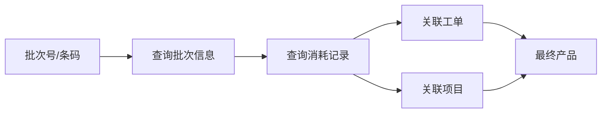
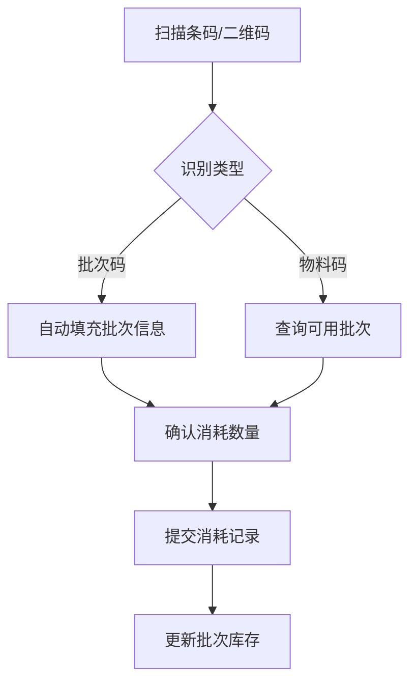

# 物料跟踪系统设计文档

## 一、系统概述

### 1.1 系统目标
物料跟踪系统是非标自动化项目管理系统的重要组成部分,旨在实现物料全流程追溯,包括:
- 实时库存查询
- 物料消耗分析
- 缺料预警
- 物料浪费追溯
- 批次全流程追踪

### 1.2 系统特性
- ✅ 批次级库存管理
- ✅ 实时库存监控
- ✅ 智能预警算法
- ✅ 浪费自动识别
- ✅ 正向/反向批次追溯
- ✅ 条码/二维码支持
- ✅ 多维度成本分析

## 二、数据模型设计

### 2.1 MaterialBatch (物料批次表)

**用途**: 记录每个批次的详细信息,支持批次级别的追溯

| 字段名 | 类型 | 说明 |
|-------|------|------|
| id | Integer | 主键 |
| batch_no | String(100) | 批次号(唯一) |
| material_id | Integer | 物料ID |
| production_date | Date | 生产日期 |
| expire_date | Date | 失效日期 |
| supplier_id | Integer | 供应商ID |
| supplier_batch_no | String(100) | 供应商批次号 |
| initial_qty | Numeric(14,4) | 初始数量 |
| current_qty | Numeric(14,4) | 当前库存数量 |
| consumed_qty | Numeric(14,4) | 已消耗数量 |
| reserved_qty | Numeric(14,4) | 预留数量 |
| quality_status | String(20) | 质检状态 |
| quality_report_no | String(100) | 质检报告编号 |
| warehouse_location | String(100) | 仓库位置 |
| status | String(20) | 状态 |
| barcode | String(200) | 条形码(唯一) |
| qrcode | String(500) | 二维码数据 |

**状态枚举**:
- `ACTIVE`: 使用中
- `DEPLETED`: 已耗尽
- `EXPIRED`: 已过期
- `LOCKED`: 已锁定

**索引设计**:
```sql
INDEX idx_mat_batch_no ON material_batch(batch_no);
INDEX idx_mat_batch_material ON material_batch(material_id);
INDEX idx_mat_batch_status ON material_batch(status);
INDEX idx_mat_batch_date ON material_batch(production_date);
```

### 2.2 MaterialConsumption (物料消耗记录表)

**用途**: 记录每一笔物料消耗,支持浪费识别和成本核算

| 字段名 | 类型 | 说明 |
|-------|------|------|
| id | Integer | 主键 |
| consumption_no | String(100) | 消耗单号(唯一) |
| material_id | Integer | 物料ID |
| batch_id | Integer | 批次ID(可选) |
| material_code | String(50) | 物料编码(冗余) |
| material_name | String(200) | 物料名称(冗余) |
| consumption_date | DateTime | 消耗时间 |
| consumption_qty | Numeric(14,4) | 消耗数量 |
| unit | String(20) | 单位 |
| work_order_id | Integer | 工单ID |
| project_id | Integer | 项目ID |
| requisition_id | Integer | 领料单ID |
| consumption_type | String(20) | 消耗类型 |
| standard_qty | Numeric(14,4) | 标准消耗数量 |
| variance_qty | Numeric(14,4) | 差异数量 |
| variance_rate | Numeric(5,2) | 差异比例(%) |
| is_waste | Boolean | 是否异常浪费 |
| operator_id | Integer | 操作人ID |
| workshop_id | Integer | 车间ID |
| unit_price | Numeric(12,4) | 单价 |
| total_cost | Numeric(14,2) | 总成本 |

**消耗类型枚举**:
- `PRODUCTION`: 生产消耗
- `TESTING`: 测试消耗
- `WASTE`: 报废
- `REWORK`: 返工
- `OTHER`: 其他

**浪费识别规则**:
```python
variance_qty = actual_qty - standard_qty
variance_rate = (variance_qty / standard_qty) * 100
is_waste = abs(variance_rate) > 10  # 差异超过10%视为浪费
```

### 2.3 MaterialAlert (物料预警记录表)

**用途**: 记录所有物料预警信息,支持预警跟踪和处理

| 字段名 | 类型 | 说明 |
|-------|------|------|
| id | Integer | 主键 |
| alert_no | String(100) | 预警单号(唯一) |
| material_id | Integer | 物料ID |
| alert_date | DateTime | 预警时间 |
| alert_type | String(30) | 预警类型 |
| alert_level | String(20) | 预警级别 |
| current_stock | Numeric(14,4) | 当前库存 |
| safety_stock | Numeric(14,4) | 安全库存 |
| required_qty | Numeric(14,4) | 需求数量 |
| shortage_qty | Numeric(14,4) | 短缺数量 |
| in_transit_qty | Numeric(14,4) | 在途数量 |
| expected_arrival_date | Date | 预计到货日期 |
| avg_daily_consumption | Numeric(14,4) | 平均日消耗 |
| days_to_stockout | Integer | 预计缺货天数 |
| alert_message | Text | 预警消息 |
| recommendation | Text | 建议措施 |
| status | String(20) | 状态 |
| assigned_to_id | Integer | 指派人ID |
| resolved_by_id | Integer | 解决人ID |
| resolved_at | DateTime | 解决时间 |

**预警类型**:
- `SHORTAGE`: 缺料
- `LOW_STOCK`: 低库存
- `EXPIRED`: 过期
- `SLOW_MOVING`: 呆滞
- `HIGH_WASTE`: 高浪费

**预警级别**:
- `INFO`: 提示
- `WARNING`: 警告
- `CRITICAL`: 严重
- `URGENT`: 紧急

### 2.4 MaterialAlertRule (预警规则配置表)

**用途**: 配置预警规则,支持全局规则和物料级规则

| 字段名 | 类型 | 说明 |
|-------|------|------|
| id | Integer | 主键 |
| rule_name | String(200) | 规则名称 |
| material_id | Integer | 物料ID(NULL为全局) |
| category_id | Integer | 物料分类ID |
| alert_type | String(30) | 预警类型 |
| alert_level | String(20) | 预警级别 |
| threshold_type | String(20) | 阈值类型 |
| threshold_value | Numeric(14,4) | 阈值 |
| safety_days | Integer | 安全库存天数 |
| lead_time_days | Integer | 采购周期天数 |
| buffer_ratio | Numeric(5,2) | 安全系数 |
| notify_users | Text | 通知用户ID列表 |
| notify_roles | Text | 通知角色列表 |
| is_active | Boolean | 是否启用 |
| priority | Integer | 优先级 |

**阈值类型**:
- `PERCENTAGE`: 百分比 (例: 低于安全库存的20%)
- `FIXED`: 固定值 (例: 低于100件)
- `DAYS`: 天数 (例: 可用天数少于7天)

## 三、核心算法

### 3.1 安全库存计算算法

**公式**:
```
安全库存 = 平均日消耗 × (安全天数 + 采购周期) × 安全系数
```

**示例**:
```python
avg_daily_consumption = 10  # 平均每天消耗10件
safety_days = 7             # 安全库存保障7天
lead_time_days = 3          # 采购周期3天
buffer_ratio = 1.2          # 安全系数1.2

safety_stock = avg_daily_consumption * (safety_days + lead_time_days) * buffer_ratio
# safety_stock = 10 * (7 + 3) * 1.2 = 120 件
```

**平均日消耗计算**:
```python
def calculate_avg_daily_consumption(material_id, days=30):
    """计算最近N天的平均日消耗"""
    end_date = datetime.now()
    start_date = end_date - timedelta(days=days)
    
    consumptions = db.query(MaterialConsumption).filter(
        MaterialConsumption.material_id == material_id,
        MaterialConsumption.consumption_date >= start_date,
        MaterialConsumption.consumption_date <= end_date
    ).all()
    
    total_consumption = sum([c.consumption_qty for c in consumptions])
    
    return total_consumption / days
```

### 3.2 缺料预警算法

**预警触发条件**:
```python
def check_shortage_alert(material):
    """检查是否需要触发缺料预警"""
    current_stock = material.current_stock
    safety_stock = material.safety_stock
    in_transit_qty = get_in_transit_qty(material.id)  # 在途物料
    
    # 可用库存 = 当前库存 + 在途物料
    available_stock = current_stock + in_transit_qty
    
    # 预测需求 (考虑采购周期)
    avg_daily_consumption = calculate_avg_daily_consumption(material.id)
    lead_time_days = material.lead_time_days or 7
    predicted_consumption = avg_daily_consumption * lead_time_days
    
    # 缺货量
    shortage_qty = (safety_stock + predicted_consumption) - available_stock
    
    if shortage_qty > 0:
        # 计算预计缺货天数
        if avg_daily_consumption > 0:
            days_to_stockout = int(current_stock / avg_daily_consumption)
        else:
            days_to_stockout = 999
        
        # 确定预警级别
        if days_to_stockout <= 3:
            alert_level = "URGENT"
        elif days_to_stockout <= 7:
            alert_level = "CRITICAL"
        elif days_to_stockout <= 14:
            alert_level = "WARNING"
        else:
            alert_level = "INFO"
        
        create_alert(
            material=material,
            alert_type="SHORTAGE",
            alert_level=alert_level,
            shortage_qty=shortage_qty,
            days_to_stockout=days_to_stockout
        )
```

### 3.3 物料浪费识别算法

**识别逻辑**:
```python
def identify_waste(consumption):
    """识别物料浪费"""
    actual_qty = consumption.consumption_qty
    standard_qty = consumption.standard_qty
    
    if not standard_qty or standard_qty <= 0:
        return False
    
    # 计算差异
    variance_qty = actual_qty - standard_qty
    variance_rate = (variance_qty / standard_qty) * 100
    
    # 差异超过10%视为浪费
    is_waste = abs(variance_rate) > 10
    
    consumption.variance_qty = variance_qty
    consumption.variance_rate = variance_rate
    consumption.is_waste = is_waste
    
    # 如果是浪费,可以触发高浪费预警
    if is_waste and variance_rate > 20:
        create_high_waste_alert(consumption)
    
    return is_waste
```

**浪费分类**:
- **正常损耗**: 0-10%
- **轻度浪费**: 10-20%
- **中度浪费**: 20-50%
- **严重浪费**: >50%

### 3.4 库存周转率算法

**公式**:
```
周转率 = 期间消耗数量 / 平均库存
周转天数 = 统计天数 / 周转率
```

**实现**:
```python
def calculate_turnover_rate(material_id, days=30):
    """计算库存周转率"""
    end_date = datetime.now()
    start_date = end_date - timedelta(days=days)
    
    # 期间消耗
    consumptions = db.query(MaterialConsumption).filter(
        MaterialConsumption.material_id == material_id,
        MaterialConsumption.consumption_date >= start_date,
        MaterialConsumption.consumption_date <= end_date
    ).all()
    
    total_consumption = sum([c.consumption_qty for c in consumptions])
    
    # 平均库存 (简化: 使用当前库存)
    material = db.query(Material).get(material_id)
    avg_stock = material.current_stock
    
    # 周转率
    turnover_rate = total_consumption / avg_stock if avg_stock > 0 else 0
    
    # 周转天数
    turnover_days = days / turnover_rate if turnover_rate > 0 else 0
    
    return {
        "turnover_rate": turnover_rate,
        "turnover_days": turnover_days,
        "consumption": total_consumption,
        "avg_stock": avg_stock
    }
```

## 四、API接口设计

### 4.1 接口列表

| 序号 | 方法 | 路径 | 功能 |
|------|------|------|------|
| 1 | GET | /production/material/realtime-stock | 实时库存查询 |
| 2 | POST | /production/material/consumption | 记录物料消耗 |
| 3 | GET | /production/material/consumption-analysis | 消耗分析 |
| 4 | GET | /production/material/alerts | 缺料预警列表 |
| 5 | POST | /production/material/alert-rules | 配置预警规则 |
| 6 | GET | /production/material/waste-tracing | 物料浪费追溯 |
| 7 | GET | /production/material/batch-tracing | 批次追溯 |
| 8 | GET | /production/material/cost-analysis | 物料成本分析 |
| 9 | GET | /production/material/inventory-turnover | 库存周转率 |

### 4.2 接口详细说明

#### 4.2.1 实时库存查询

**请求**:
```http
GET /production/material/realtime-stock?material_code=MAT001&low_stock_only=true
```

**响应**:
```json
{
  "code": 0,
  "message": "success",
  "data": {
    "items": [
      {
        "material_id": 1,
        "material_code": "MAT001",
        "material_name": "电机",
        "current_stock": 50,
        "safety_stock": 100,
        "available_stock": 45,
        "reserved_stock": 5,
        "is_low_stock": true,
        "batch_count": 3,
        "batches": [
          {
            "batch_no": "BATCH-20260215-001",
            "current_qty": 30,
            "available_qty": 25,
            "warehouse_location": "A-01-01",
            "quality_status": "QUALIFIED"
          }
        ]
      }
    ],
    "total": 1,
    "page": 1,
    "page_size": 20
  }
}
```

#### 4.2.2 记录物料消耗

**请求**:
```http
POST /production/material/consumption
Content-Type: application/json

{
  "material_id": 1,
  "batch_id": 10,
  "consumption_qty": 50,
  "consumption_type": "PRODUCTION",
  "standard_qty": 45,
  "work_order_id": 100,
  "barcode": "SCAN123456"
}
```

**响应**:
```json
{
  "code": 0,
  "message": "物料消耗记录成功",
  "data": {
    "id": 1001,
    "consumption_no": "CONS-20260216121530-MAT001",
    "material_code": "MAT001",
    "material_name": "电机",
    "consumption_qty": 50,
    "is_waste": true,
    "variance_rate": 11.11
  }
}
```

## 五、批次追溯流程

### 5.1 正向追溯 (批次 → 消耗 → 产品)



**查询示例**:
```http
GET /production/material/batch-tracing?batch_no=BATCH-20260215-001&trace_direction=forward
```

### 5.2 反向追溯 (产品 → 消耗 → 批次)


**查询示例**:
```http
GET /production/material/batch-tracing?project_id=100&trace_direction=backward
```

## 六、条码/二维码集成

### 6.1 条码格式

**物料批次条码**:
```
格式: MATERIAL-BATCH-{material_code}-{batch_no}-{date}
示例: MAT-BAT-MAT001-BATCH001-20260216
```

**二维码数据结构**:
```json
{
  "type": "material_batch",
  "batch_no": "BATCH-20260215-001",
  "material_code": "MAT001",
  "material_name": "电机",
  "qty": 1000,
  "production_date": "2026-02-15",
  "expire_date": "2027-02-15"
}
```

### 6.2 扫码录入流程



## 七、性能优化

### 7.1 索引策略
- 批次号、物料ID、日期字段建立索引
- 复合索引: (material_id, consumption_date)
- 唯一索引: batch_no, barcode, consumption_no

### 7.2 查询优化
- 实时库存查询使用缓存 (Redis, 5分钟TTL)
- 批次追溯使用批量查询
- 统计分析使用异步任务

### 7.3 数据归档
- 消耗记录超过2年自动归档
- 预警记录已解决超过1年归档
- 批次状态为DEPLETED超过1年归档

## 八、安全与权限

### 8.1 权限控制
- 库存查询: `material:read`
- 消耗记录: `material:consume`
- 预警管理: `material:alert`
- 规则配置: `material:admin`

### 8.2 数据审计
- 所有消耗记录不可删除,仅可标记作废
- 库存变动记录操作人和时间
- 预警处理记录完整流程

## 九、系统集成

### 9.1 与现有系统集成
- **领料单系统**: MaterialRequisition → MaterialConsumption
- **工单系统**: WorkOrder → MaterialConsumption
- **采购系统**: PurchaseOrder → MaterialBatch (入库)

### 9.2 外部系统接口
- ERP系统库存同步
- WMS仓库管理系统
- 条码打印系统

## 十、未来扩展

### 10.1 近期规划
- [ ] 移动端扫码录入
- [ ] 实时预警推送 (邮件/短信/企业微信)
- [ ] 批次质量追溯分析
- [ ] 物料ABC分类管理

### 10.2 长期规划
- [ ] AI预测消耗趋势
- [ ] 智能采购建议
- [ ] 供应商绩效评估
- [ ] IoT设备集成 (自动称重/RFID)

---

**文档版本**: v1.0  
**创建日期**: 2026-02-16  
**作者**: Team 5 - 物料跟踪系统  
**审核**: 待审核  
