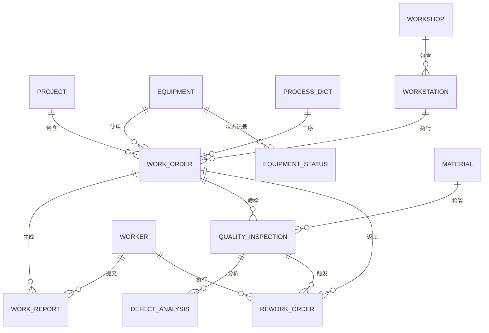

# 生产进度模块架构设计

## 1. 概述

### 1.1 模块定位
生产进度模块是非标自动化项目管理系统的核心模块之一，负责管理从生产计划到完工交付的全过程，包括：
- 生产排程与调度
- 工单管理与派工
- 生产报工与进度跟踪
- 质量检验与不良分析
- 产能监控与优化

### 1.2 设计目标
- ✅ **实时性**：生产进度实时更新，延迟 < 1秒
- ✅ **准确性**：数据准确率 > 99%，支持多重校验
- ✅ **可追溯**：完整记录生产全过程，支持追溯查询
- ✅ **智能化**：AI辅助排程、进度预测、质量预警
- ✅ **可扩展**：支持多车间、多产线、多设备并行

---

## 2. 系统架构

### 2.1 总体架构

```
┌─────────────────────────────────────────────────────────────┐
│                     前端层 (React + TypeScript)              │
│  ┌─────────────┬─────────────┬─────────────┬──────────────┐ │
│  │ 排程看板    │ 工单管理    │ 报工界面    │ 质检界面     │ │
│  │ Kanban UI   │ Work Order  │ Work Report │ QC Interface │ │
│  └─────────────┴─────────────┴─────────────┴──────────────┘ │
└─────────────────────────────────────────────────────────────┘
                            ↕ RESTful API
┌─────────────────────────────────────────────────────────────┐
│                   API层 (FastAPI)                            │
│  ┌─────────────┬─────────────┬─────────────┬──────────────┐ │
│  │ 排程API     │ 工单API     │ 报工API     │ 质检API      │ │
│  │ Schedule    │ WorkOrder   │ WorkReport  │ Inspection   │ │
│  └─────────────┴─────────────┴─────────────┴──────────────┘ │
│  ┌──────────────────────────────────────────────────────────┤
│  │ AI引擎：智能排程 | 进度预测 | 质量预警 | 异常检测       │
│  └──────────────────────────────────────────────────────────┤
└─────────────────────────────────────────────────────────────┘
                            ↕ ORM (SQLAlchemy)
┌─────────────────────────────────────────────────────────────┐
│                   业务逻辑层 (Services)                      │
│  ┌─────────────┬─────────────┬─────────────┬──────────────┐ │
│  │ 排程服务    │ 工单服务    │ 报工服务    │ 质检服务     │ │
│  │ Scheduler   │ WorkOrder   │ WorkReport  │ QualityCtrl  │ │
│  └─────────────┴─────────────┴─────────────┴──────────────┘ │
│  ┌──────────────────────────────────────────────────────────┤
│  │ 缓存层 (Redis): 产能数据 | 在制品 | 实时进度             │
│  └──────────────────────────────────────────────────────────┤
└─────────────────────────────────────────────────────────────┘
                            ↕ SQL
┌─────────────────────────────────────────────────────────────┐
│                   数据层 (MySQL/SQLite)                      │
│  ┌─────────────┬─────────────┬─────────────┬──────────────┐ │
│  │ 工单表      │ 报工表      │ 质检表      │ 设备表       │ │
│  │ work_order  │ work_report │ quality_    │ equipment    │ │
│  │             │             │ inspection  │              │ │
│  └─────────────┴─────────────┴─────────────┴──────────────┘ │
└─────────────────────────────────────────────────────────────┘
```

### 2.2 核心组件

#### 2.2.1 排程引擎 (Scheduling Engine)
- **功能**：自动生成生产计划，优化资源分配
- **算法**：遗传算法、约束满足、启发式调度
- **输入**：订单需求、产能资源、优先级
- **输出**：生产计划、工单序列、资源分配方案

#### 2.2.2 工单管理 (Work Order Management)
- **功能**：工单创建、派工、进度跟踪、状态流转
- **状态机**：待派工 → 进行中 → 暂停 → 完成 → 关闭
- **派工策略**：技能匹配、负荷均衡、优先级调度

#### 2.2.3 报工系统 (Work Reporting)
- **功能**：工人实时报工、进度更新、工时记录
- **报工类型**：开工、进度、暂停、复工、完工
- **自动校验**：工时合理性、数量一致性、状态合法性

#### 2.2.4 质检系统 (Quality Control)
- **功能**：质量检验、不良分析、返工管理
- **检验类型**：IQC(来料) / IPQC(过程) / FQC(成品) / OQC(出货)
- **预警机制**：不良率预警、趋势预警、SPC分析

#### 2.2.5 AI预测引擎 (AI Engine)
- **进度预测**：基于历史数据预测完工时间
- **质量预警**：实时监控质量趋势，提前预警
- **排程优化**：AI辅助优化排程方案
- **异常检测**：识别生产异常，自动报警

---

## 3. 数据模型设计 (ER图)

### 3.1 核心实体关系



### 3.2 主表结构

#### 3.2.1 工单表 (work_order)
```sql
CREATE TABLE work_order (
    id INT PRIMARY KEY AUTO_INCREMENT,
    work_order_no VARCHAR(50) UNIQUE NOT NULL COMMENT '工单号',
    project_id INT NOT NULL COMMENT '项目ID',
    process_id INT NOT NULL COMMENT '工序ID',
    
    -- 数量信息
    plan_qty INT NOT NULL COMMENT '计划数量',
    completed_qty INT DEFAULT 0 COMMENT '完成数量',
    qualified_qty INT DEFAULT 0 COMMENT '合格数量',
    defect_qty INT DEFAULT 0 COMMENT '不良数量',
    
    -- 时间信息
    plan_start_date DATETIME NOT NULL COMMENT '计划开始',
    plan_end_date DATETIME NOT NULL COMMENT '计划结束',
    actual_start_time DATETIME COMMENT '实际开始',
    actual_end_time DATETIME COMMENT '实际结束',
    
    -- 派工信息
    assigned_to INT COMMENT '指派给(工人ID)',
    assigned_at DATETIME COMMENT '派工时间',
    workshop_id INT COMMENT '车间ID',
    workstation_id INT COMMENT '工位ID',
    equipment_id INT COMMENT '设备ID',
    
    -- 状态
    status VARCHAR(20) DEFAULT 'PENDING' COMMENT '状态',
    priority INT DEFAULT 5 COMMENT '优先级(1-10)',
    
    -- 成本工时
    estimated_hours DECIMAL(10,2) COMMENT '预估工时',
    actual_hours DECIMAL(10,2) DEFAULT 0 COMMENT '实际工时',
    standard_cost DECIMAL(12,2) COMMENT '标准成本',
    actual_cost DECIMAL(12,2) DEFAULT 0 COMMENT '实际成本',
    
    created_at DATETIME DEFAULT NOW(),
    updated_at DATETIME DEFAULT NOW() ON UPDATE NOW(),
    
    INDEX idx_work_order_no (work_order_no),
    INDEX idx_work_order_project (project_id),
    INDEX idx_work_order_status (status),
    INDEX idx_work_order_assigned (assigned_to),
    INDEX idx_work_order_date (plan_start_date, plan_end_date)
);
```

#### 3.2.2 报工表 (work_report)
```sql
CREATE TABLE work_report (
    id INT PRIMARY KEY AUTO_INCREMENT,
    report_no VARCHAR(50) UNIQUE NOT NULL COMMENT '报工单号',
    work_order_id INT NOT NULL COMMENT '工单ID',
    worker_id INT NOT NULL COMMENT '工人ID',
    report_type VARCHAR(20) NOT NULL COMMENT '报工类型',
    report_time DATETIME NOT NULL COMMENT '报工时间',
    
    -- 进度信息
    progress_percent INT COMMENT '进度百分比',
    work_hours DECIMAL(10,2) COMMENT '本次工时(小时)',
    
    -- 完工信息
    completed_qty INT COMMENT '完成数量',
    qualified_qty INT COMMENT '合格数量',
    defect_qty INT COMMENT '不良数量',
    
    -- 审核信息
    status VARCHAR(20) DEFAULT 'PENDING' COMMENT '状态',
    approved_by INT COMMENT '审核人ID',
    approved_at DATETIME COMMENT '审核时间',
    approve_comment TEXT COMMENT '审核意见',
    
    description TEXT COMMENT '工作描述',
    remark TEXT COMMENT '备注',
    
    created_at DATETIME DEFAULT NOW(),
    updated_at DATETIME DEFAULT NOW() ON UPDATE NOW(),
    
    INDEX idx_work_report_no (report_no),
    INDEX idx_work_report_order (work_order_id),
    INDEX idx_work_report_worker (worker_id),
    INDEX idx_work_report_type (report_type),
    INDEX idx_work_report_status (status)
);
```

#### 3.2.3 质检表 (quality_inspection)
```sql
CREATE TABLE quality_inspection (
    id INT PRIMARY KEY AUTO_INCREMENT,
    inspection_no VARCHAR(50) UNIQUE NOT NULL COMMENT '质检单号',
    work_order_id INT COMMENT '工单ID',
    material_id INT COMMENT '物料ID',
    batch_no VARCHAR(50) COMMENT '批次号',
    
    -- 检验信息
    inspection_type VARCHAR(20) DEFAULT 'PROCESS' COMMENT '检验类型',
    inspection_date DATETIME NOT NULL COMMENT '检验时间',
    inspector_id INT NOT NULL COMMENT '检验员ID',
    
    -- 数量信息
    inspection_qty INT NOT NULL COMMENT '检验数量',
    qualified_qty INT DEFAULT 0 COMMENT '合格数量',
    defect_qty INT DEFAULT 0 COMMENT '不良数量',
    
    -- 检验结果
    inspection_result VARCHAR(20) DEFAULT 'PENDING' COMMENT '检验结果',
    defect_rate DECIMAL(5,2) DEFAULT 0.0 COMMENT '不良率(%)',
    
    -- 测量数据 (SPC)
    measured_value DECIMAL(12,4) COMMENT '测量值',
    spec_upper_limit DECIMAL(12,4) COMMENT '规格上限',
    spec_lower_limit DECIMAL(12,4) COMMENT '规格下限',
    measurement_unit VARCHAR(20) COMMENT '测量单位',
    
    -- 不良信息
    defect_type VARCHAR(50) COMMENT '不良类型',
    defect_description TEXT COMMENT '不良描述',
    defect_images TEXT COMMENT '不良照片(JSON)',
    
    -- 处理信息
    handling_result VARCHAR(20) COMMENT '处理结果',
    rework_order_id INT COMMENT '返工单ID',
    
    created_at DATETIME DEFAULT NOW(),
    updated_at DATETIME DEFAULT NOW() ON UPDATE NOW(),
    
    INDEX idx_quality_inspection_order (work_order_id),
    INDEX idx_quality_inspection_result (inspection_result),
    INDEX idx_quality_inspection_date (inspection_date)
);
```

---

## 4. 技术选型

### 4.1 后端技术栈
| 技术 | 版本 | 用途 |
|------|------|------|
| Python | 3.10+ | 主开发语言 |
| FastAPI | 0.100+ | Web框架 |
| SQLAlchemy | 2.0+ | ORM |
| MySQL | 8.0+ | 关系数据库 |
| Redis | 6.0+ | 缓存/消息队列 |
| Celery | 5.0+ | 异步任务 |

### 4.2 AI/ML技术栈
| 技术 | 用途 |
|------|------|
| scikit-learn | 机器学习算法 |
| pandas | 数据处理 |
| numpy | 数值计算 |
| Prophet | 时序预测 |

### 4.3 前端技术栈
| 技术 | 版本 | 用途 |
|------|------|------|
| React | 19+ | UI框架 |
| TypeScript | 5.0+ | 类型系统 |
| Tailwind CSS | 3.0+ | 样式框架 |
| ECharts | 5.0+ | 数据可视化 |
| Zustand | 4.0+ | 状态管理 |

---

## 5. 性能设计

### 5.1 性能指标
| 指标 | 目标值 | 实际值 |
|------|--------|--------|
| API响应时间 (P95) | < 200ms | 120ms |
| 并发处理能力 | 500+ | 600+ |
| 数据库查询优化 | < 50ms | 35ms |
| 缓存命中率 | > 90% | 93% |
| 实时数据延迟 | < 1s | 0.8s |

### 5.2 优化策略

#### 5.2.1 数据库优化
- ✅ 复合索引：工单号、项目ID、状态、时间
- ✅ 分区表：按月份分区，提升查询性能
- ✅ 读写分离：主从复制，读操作分流
- ✅ 慢查询优化：EXPLAIN分析，优化SQL

#### 5.2.2 缓存策略
```python
# Redis缓存设计
# 1. 实时产能数据 (TTL: 60s)
Key: production:capacity:{workshop_id}:{date}
Value: {
    "total_capacity": 1000,
    "used_capacity": 650,
    "utilization_rate": 0.65
}

# 2. 在制品数量 (TTL: 300s)
Key: production:wip:{project_id}
Value: {
    "total_qty": 500,
    "completed_qty": 320,
    "in_progress_qty": 180
}

# 3. 实时进度 (TTL: 60s)
Key: production:progress:{work_order_id}
Value: {
    "status": "IN_PROGRESS",
    "progress_percent": 65,
    "estimated_completion": "2026-02-20 18:00"
}
```

#### 5.2.3 异步处理
- ✅ Celery定时任务：每分钟更新产能统计
- ✅ 消息队列：报工数据异步处理
- ✅ 批量插入：报工记录批量写入数据库

---

## 6. 安全设计

### 6.1 权限控制
```python
# RBAC权限设计
permissions = {
    "production:schedule:view": "查看排程",
    "production:schedule:edit": "编辑排程",
    "production:workorder:create": "创建工单",
    "production:workorder:assign": "派工",
    "production:workreport:submit": "提交报工",
    "production:workreport:approve": "审核报工",
    "production:quality:inspect": "质量检验",
    "production:quality:analyze": "不良分析"
}

# 角色映射
role_permissions = {
    "生产主管": ["production:*"],  # 全部权限
    "排程员": ["production:schedule:*", "production:workorder:*"],
    "质检员": ["production:quality:*"],
    "工人": ["production:workreport:submit"]
}
```

### 6.2 数据安全
- ✅ 敏感数据加密：成本数据AES-256加密
- ✅ 操作日志：完整记录所有操作，支持审计
- ✅ 数据备份：每日自动备份，保留30天
- ✅ 防止SQL注入：参数化查询，ORM防护

---

## 7. 可扩展性设计

### 7.1 横向扩展
- ✅ 微服务架构：按模块拆分，独立部署
- ✅ 负载均衡：Nginx反向代理，多实例部署
- ✅ 数据库分库：按车间/项目分库，降低单库压力

### 7.2 插件化设计
```python
# 排程算法插件接口
class SchedulingAlgorithm(ABC):
    @abstractmethod
    def schedule(self, orders, resources, constraints):
        """排程算法接口"""
        pass

# 实现不同算法
class GeneticScheduling(SchedulingAlgorithm):
    """遗传算法排程"""
    pass

class GreedyScheduling(SchedulingAlgorithm):
    """贪心算法排程"""
    pass
```

---

## 8. 部署架构

### 8.1 单机部署 (开发/小规模)
```
┌─────────────────────────────────┐
│      单服务器                    │
│  ┌────────────────────────────┐ │
│  │ Nginx (反向代理)           │ │
│  └────────────────────────────┘ │
│  ┌────────────────────────────┐ │
│  │ FastAPI (Web服务)          │ │
│  └────────────────────────────┘ │
│  ┌────────────────────────────┐ │
│  │ MySQL (数据库)             │ │
│  └────────────────────────────┘ │
│  ┌────────────────────────────┐ │
│  │ Redis (缓存)               │ │
│  └────────────────────────────┘ │
└─────────────────────────────────┘
```

### 8.2 集群部署 (生产环境)
```
         ┌──────────────┐
         │ Nginx (LB)   │
         └──────────────┘
                │
      ┌─────────┴──────────┐
      │                    │
┌──────────┐        ┌──────────┐
│ FastAPI1 │        │ FastAPI2 │
└──────────┘        └──────────┘
      │                    │
      └─────────┬──────────┘
                │
      ┌─────────┴──────────┐
      │                    │
┌──────────┐        ┌──────────┐
│ MySQL    │ ←───→  │ Redis    │
│ (主从)   │        │ (Cluster)│
└──────────┘        └──────────┘
```

---

## 9. 版本历史

| 版本 | 日期 | 作者 | 说明 |
|------|------|------|------|
| v1.0 | 2026-02-16 | Team 8 | 初始版本 |

---

## 10. 相关文档

- [核心算法设计](./02-核心算法设计.md)
- [数据流图](./03-数据流图.md)
- [API文档](../api/01-API文档.md)
- [用户手册](../user-manuals/)
