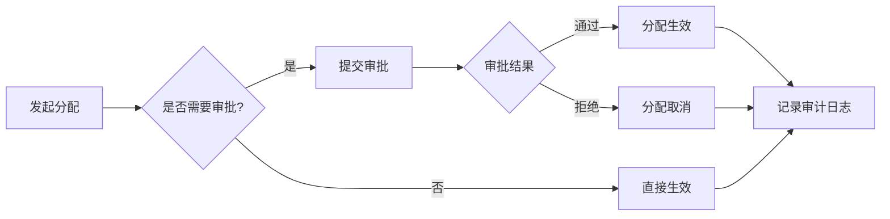

# 角色管理模块 - 详细设计文档

> 适用范围：非标自动化项目管理系统（Web + 企微）
> 目标：实现角色全生命周期管理、预设模板与自定义角色、层级继承、分配审批、与组织架构联动。

---

## 一、模块定位与边界

**模块范围**：角色定义、角色模板、角色层级、角色分配、角色审批、角色审计。

**不包含**：具体权限点定义与校验（由权限管理模块负责）。

**与现有系统关系**：
- 角色管理为权限管理的上游模块，负责角色的创建与维护。
- 权限管理模块负责将权限点绑定到角色，并执行权限校验。
- 角色与 `employees`（人员）、`departments`（部门）、`projects`（项目）关联。

---

## 二、核心概念定义

### 2.1 角色类型

| 类型 | 说明 | 示例 |
|------|------|------|
| **系统角色** | 系统预置，不可删除，可调整权限 | 系统管理员、总经理 |
| **业务角色** | 按职能预置，可修改 | 项目经理、机械工程师、采购 |
| **项目角色** | 项目内临时角色，项目结束后失效 | 项目负责人、项目成员 |
| **自定义角色** | 用户自行创建 | 外协管理员、区域销售主管 |

### 2.2 角色作用域

| 作用域 | 说明 |
|--------|------|
| **全局** | 在整个系统内生效 |
| **部门** | 仅在指定部门内生效 |
| **项目** | 仅在指定项目内生效 |

### 2.3 数据权限范围（复用权限模块定义）

| 范围 | 说明 |
|------|------|
| ALL | 全部数据可见 |
| DEPT | 同部门数据可见 |
| PROJECT | 参与项目数据可见 |
| OWN | 仅本人数据可见 |
| CUSTOMER | 客户门户仅看自身项目 |

---

## 三、角色生命周期

### 3.1 状态定义

```
┌─────────┐    创建    ┌─────────┐    启用    ┌─────────┐
│  DRAFT  │ ─────────► │ INACTIVE │ ─────────► │  ACTIVE │
│  草稿   │            │  未启用  │            │  已启用  │
└─────────┘            └─────────┘            └────┬────┘
                            ▲                      │
                            │        停用          │
                            └──────────────────────┘
                                                   │
                                        归档       ▼
                                              ┌─────────┐
                                              │ ARCHIVED│
                                              │  已归档  │
                                              └─────────┘
```

### 3.2 状态说明

| 状态 | 说明 | 允许操作 |
|------|------|----------|
| DRAFT | 草稿，创建中未完成 | 编辑、删除、提交启用 |
| INACTIVE | 未启用，配置完成待启用 | 编辑、启用、删除 |
| ACTIVE | 已启用，可分配给用户 | 编辑权限、停用 |
| ARCHIVED | 已归档，不可分配，历史保留 | 查看、恢复 |

### 3.3 状态流转规则

```python
# 状态流转规则
ROLE_STATUS_TRANSITIONS = {
    "DRAFT": ["INACTIVE", "DELETED"],
    "INACTIVE": ["ACTIVE", "DRAFT", "DELETED"],
    "ACTIVE": ["INACTIVE", "ARCHIVED"],
    "ARCHIVED": ["INACTIVE"],  # 可恢复
}
```

### 3.4 生命周期事件

| 事件 | 触发条件 | 系统行为 |
|------|----------|----------|
| 创建 | 管理员新建角色 | 生成角色编码，状态=DRAFT |
| 启用 | 配置完成提交 | 状态=ACTIVE，可被分配 |
| 停用 | 管理员停用 | 状态=INACTIVE，已分配用户保留但无法新增 |
| 归档 | 角色不再使用 | 状态=ARCHIVED，解除所有用户绑定 |
| 恢复 | 归档角色重新启用 | 状态=INACTIVE，需重新配置权限 |

---

## 四、预设角色模板

### 4.1 系统预设角色

| 角色编码 | 角色名称 | 类型 | 数据范围 | 核心权限 |
|----------|----------|------|----------|----------|
| ADMIN | 系统管理员 | 系统 | ALL | 全部权限 |
| GM | 总经理 | 系统 | ALL | 全局只读、关键审批 |
| PM | 项目经理 | 业务 | PROJECT | 项目全权、进度/变更/验收 |
| PMC | 计划管理 | 业务 | DEPT | 计划、物料、进度更新 |
| ME | 机械工程师 | 业务 | PROJECT | 任务执行、交付物提交 |
| EE | 电气工程师 | 业务 | PROJECT | 任务执行、交付物提交 |
| SW | 软件工程师 | 业务 | PROJECT | 任务执行、交付物提交 |
| QA | 质量工程师 | 业务 | PROJECT | 验收审批、问题闭环 |
| PU | 采购专员 | 业务 | DEPT | 采购、外协、供应商 |
| FI | 财务专员 | 业务 | ALL | 开票、收款、成本 |
| SA | 销售专员 | 业务 | OWN | 商机、合同、回款跟进 |
| CUSTOMER | 客户 | 系统 | CUSTOMER | 项目进度查看、验收签字 |

### 4.2 角色模板表

用于快速创建标准角色，预置权限集合：

```sql
-- 角色模板表
CREATE TABLE role_templates (
    id INTEGER PRIMARY KEY AUTOINCREMENT,
    template_code VARCHAR(30) UNIQUE NOT NULL,    -- TPL_PM
    template_name VARCHAR(50) NOT NULL,           -- 项目经理模板
    role_type VARCHAR(20) NOT NULL,               -- SYSTEM/BUSINESS/PROJECT/CUSTOM
    scope_type VARCHAR(20) DEFAULT 'GLOBAL',      -- GLOBAL/DEPT/PROJECT
    data_scope VARCHAR(20) DEFAULT 'PROJECT',     -- ALL/DEPT/PROJECT/OWN
    description TEXT,
    permission_snapshot TEXT,                      -- 权限快照JSON
    is_active BOOLEAN DEFAULT TRUE,
    created_at DATETIME DEFAULT CURRENT_TIMESTAMP,
    updated_at DATETIME DEFAULT CURRENT_TIMESTAMP
);

-- 模板权限关联（预置）
CREATE TABLE role_template_permissions (
    id INTEGER PRIMARY KEY AUTOINCREMENT,
    template_id INTEGER NOT NULL,
    permission_id INTEGER NOT NULL,
    created_at DATETIME DEFAULT CURRENT_TIMESTAMP,
    FOREIGN KEY (template_id) REFERENCES role_templates(id),
    FOREIGN KEY (permission_id) REFERENCES permissions(id)
);
```

### 4.3 从模板创建角色

```
选择模板 → 复制模板配置 → 调整权限（可选） → 保存为新角色
```

---

## 五、角色层级与继承

### 5.1 层级结构

```
                    ┌─────────────┐
                    │ 系统管理员  │  Level 0（最高）
                    │   ADMIN     │
                    └──────┬──────┘
                           │
           ┌───────────────┼───────────────┐
           ▼               ▼               ▼
    ┌───────────┐   ┌───────────┐   ┌───────────┐
    │  总经理   │   │ 部门经理  │   │  财务总监  │  Level 1
    │    GM     │   │  DEPT_MGR │   │    CFO    │
    └─────┬─────┘   └─────┬─────┘   └─────┬─────┘
          │               │               │
          ▼               ▼               ▼
    ┌───────────┐   ┌───────────┐   ┌───────────┐
    │ 项目经理  │   │ 工程师    │   │ 财务专员  │  Level 2
    │    PM     │   │  ME/EE/SW │   │    FI     │
    └───────────┘   └───────────┘   └───────────┘
```

### 5.2 继承规则

| 规则 | 说明 |
|------|------|
| **权限继承** | 子角色可继承父角色的权限（可配置） |
| **数据范围继承** | 子角色数据范围不能超过父角色 |
| **分配约束** | 只能分配比自己层级低或相等的角色 |
| **覆盖机制** | 子角色可覆盖继承的权限（显式拒绝） |

### 5.3 继承数据模型

```sql
-- 角色表扩展（增加层级与继承）
ALTER TABLE roles ADD COLUMN role_type VARCHAR(20) DEFAULT 'BUSINESS';
ALTER TABLE roles ADD COLUMN scope_type VARCHAR(20) DEFAULT 'GLOBAL';
ALTER TABLE roles ADD COLUMN parent_role_id INTEGER;
ALTER TABLE roles ADD COLUMN level INTEGER DEFAULT 2;
ALTER TABLE roles ADD COLUMN inherit_permissions BOOLEAN DEFAULT FALSE;
ALTER TABLE roles ADD COLUMN status VARCHAR(20) DEFAULT 'ACTIVE';
ALTER TABLE roles ADD COLUMN description TEXT;
ALTER TABLE roles ADD COLUMN updated_at DATETIME;

-- 角色层级索引
CREATE INDEX idx_roles_parent ON roles(parent_role_id);
CREATE INDEX idx_roles_level ON roles(level);
CREATE INDEX idx_roles_status ON roles(status);
```

### 5.4 权限合并逻辑

```python
def get_effective_permissions(role_id):
    """获取角色的有效权限（含继承）"""
    role = get_role(role_id)
    permissions = set(get_role_permissions(role_id))

    # 如果启用继承且有父角色
    if role.inherit_permissions and role.parent_role_id:
        parent_permissions = get_effective_permissions(role.parent_role_id)
        permissions = permissions.union(parent_permissions)

    # 移除显式拒绝的权限
    denied = get_denied_permissions(role_id)
    permissions = permissions - denied

    return permissions
```

---

## 六、角色分配与审批

### 6.1 分配场景

| 场景 | 说明 | 审批要求 |
|------|------|----------|
| **入职分配** | 新员工入职时分配默认角色 | 无需审批（HR操作） |
| **项目加入** | 加入项目时分配项目角色 | 项目经理审批 |
| **角色变更** | 调整用户角色 | 根据角色等级决定 |
| **临时授权** | 临时分配高级角色 | 需上级审批+设置有效期 |
| **角色回收** | 离职/项目结束 | 系统自动或管理员操作 |

### 6.2 分配审批规则

```
┌─────────────────────────────────────────────────────────────────┐
│                        角色分配审批矩阵                          │
├─────────────────┬───────────────┬───────────────────────────────┤
│ 目标角色等级    │ 操作者角色    │ 审批要求                       │
├─────────────────┼───────────────┼───────────────────────────────┤
│ Level 2（普通） │ Level 1+      │ 无需审批                       │
│ Level 1（主管） │ Level 0       │ 无需审批                       │
│ Level 1（主管） │ Level 1       │ 需同级或上级审批               │
│ Level 0（管理） │ Level 0       │ 需超级管理员审批               │
│ 跨部门分配      │ 任意          │ 需目标部门负责人审批           │
│ 临时授权        │ 任意          │ 需上级审批 + 设置有效期        │
└─────────────────┴───────────────┴───────────────────────────────┘
```

### 6.3 分配流程



### 6.4 角色分配数据模型

```sql
-- 用户角色分配表（扩展）
CREATE TABLE user_role_assignments (
    id INTEGER PRIMARY KEY AUTOINCREMENT,
    user_id INTEGER NOT NULL,
    role_id INTEGER NOT NULL,
    scope_type VARCHAR(20) DEFAULT 'GLOBAL',      -- GLOBAL/DEPT/PROJECT
    scope_id INTEGER,                              -- 部门ID或项目ID
    assigned_by INTEGER NOT NULL,                  -- 分配人
    approved_by INTEGER,                           -- 审批人
    status VARCHAR(20) DEFAULT 'PENDING',          -- PENDING/ACTIVE/EXPIRED/REVOKED
    effective_from DATETIME,                       -- 生效时间
    effective_until DATETIME,                      -- 失效时间（临时授权）
    assignment_reason TEXT,                        -- 分配原因
    revoke_reason TEXT,                            -- 回收原因
    created_at DATETIME DEFAULT CURRENT_TIMESTAMP,
    updated_at DATETIME DEFAULT CURRENT_TIMESTAMP,

    FOREIGN KEY (user_id) REFERENCES users(id),
    FOREIGN KEY (role_id) REFERENCES roles(id),
    FOREIGN KEY (assigned_by) REFERENCES users(id),
    FOREIGN KEY (approved_by) REFERENCES users(id)
);

-- 角色分配审批记录
CREATE TABLE role_assignment_approvals (
    id INTEGER PRIMARY KEY AUTOINCREMENT,
    assignment_id INTEGER NOT NULL,
    approver_id INTEGER NOT NULL,
    decision VARCHAR(20) NOT NULL,                 -- APPROVED/REJECTED
    comment TEXT,
    decided_at DATETIME DEFAULT CURRENT_TIMESTAMP,

    FOREIGN KEY (assignment_id) REFERENCES user_role_assignments(id),
    FOREIGN KEY (approver_id) REFERENCES users(id)
);

-- 索引
CREATE INDEX idx_assignments_user ON user_role_assignments(user_id);
CREATE INDEX idx_assignments_role ON user_role_assignments(role_id);
CREATE INDEX idx_assignments_status ON user_role_assignments(status);
CREATE INDEX idx_assignments_scope ON user_role_assignments(scope_type, scope_id);
CREATE UNIQUE INDEX idx_assignments_unique ON user_role_assignments(user_id, role_id, scope_type, scope_id)
    WHERE status = 'ACTIVE';
```

---

## 七、角色与组织架构联动

### 7.1 部门默认角色

每个部门可配置默认角色，新员工加入部门时自动分配：

```sql
-- 部门默认角色配置
CREATE TABLE department_default_roles (
    id INTEGER PRIMARY KEY AUTOINCREMENT,
    department_id INTEGER NOT NULL,
    role_id INTEGER NOT NULL,
    is_primary BOOLEAN DEFAULT FALSE,              -- 是否主要角色
    created_at DATETIME DEFAULT CURRENT_TIMESTAMP,

    FOREIGN KEY (department_id) REFERENCES departments(id),
    FOREIGN KEY (role_id) REFERENCES roles(id)
);
```

### 7.2 部门角色管理员

指定部门内的角色管理员，可管理本部门角色分配：

```sql
-- 部门角色管理员
CREATE TABLE department_role_admins (
    id INTEGER PRIMARY KEY AUTOINCREMENT,
    department_id INTEGER NOT NULL,
    user_id INTEGER NOT NULL,
    can_assign_roles TEXT,                         -- 可分配的角色ID列表（JSON）
    created_at DATETIME DEFAULT CURRENT_TIMESTAMP,

    FOREIGN KEY (department_id) REFERENCES departments(id),
    FOREIGN KEY (user_id) REFERENCES users(id)
);
```

### 7.3 组织架构同步规则

| 事件 | 系统行为 |
|------|----------|
| 员工入职 | 分配部门默认角色 |
| 员工调岗 | 回收原部门角色，分配新部门角色 |
| 员工离职 | 回收所有角色，状态设为REVOKED |
| 部门撤销 | 部门相关角色分配失效 |

---

## 八、角色冲突检测

### 8.1 互斥角色规则

某些角色不能同时分配给同一用户：

```sql
-- 互斥角色配置
CREATE TABLE role_exclusions (
    id INTEGER PRIMARY KEY AUTOINCREMENT,
    role_id_a INTEGER NOT NULL,
    role_id_b INTEGER NOT NULL,
    exclusion_type VARCHAR(20) DEFAULT 'MUTUAL',   -- MUTUAL/ONE_WAY
    reason TEXT,
    created_at DATETIME DEFAULT CURRENT_TIMESTAMP,

    FOREIGN KEY (role_id_a) REFERENCES roles(id),
    FOREIGN KEY (role_id_b) REFERENCES roles(id)
);
```

### 8.2 预设互斥规则

| 角色A | 角色B | 互斥原因 |
|-------|-------|----------|
| 采购专员 | 财务专员 | 职责分离，防止舞弊 |
| 质量工程师 | 项目经理（同项目） | 验收独立性 |
| 审批人 | 申请人（同流程） | 审批回避 |

### 8.3 冲突检测逻辑

```python
def check_role_conflict(user_id, new_role_id, scope_type, scope_id):
    """检测角色冲突"""
    # 获取用户当前有效角色
    current_roles = get_user_active_roles(user_id, scope_type, scope_id)

    # 获取互斥规则
    exclusions = get_role_exclusions(new_role_id)

    conflicts = []
    for role in current_roles:
        if role.id in exclusions:
            conflicts.append({
                "existing_role": role,
                "new_role": new_role_id,
                "reason": exclusions[role.id]
            })

    return conflicts
```

---

## 九、API 接口设计

### 9.1 角色管理

```
# 角色CRUD
GET    /roles                      # 角色列表（支持筛选）
POST   /roles                      # 创建角色
GET    /roles/{id}                 # 角色详情
PATCH  /roles/{id}                 # 更新角色
DELETE /roles/{id}                 # 删除角色（仅DRAFT状态）

# 角色状态
POST   /roles/{id}/activate        # 启用角色
POST   /roles/{id}/deactivate      # 停用角色
POST   /roles/{id}/archive         # 归档角色
POST   /roles/{id}/restore         # 恢复角色

# 角色权限
GET    /roles/{id}/permissions     # 获取角色权限
POST   /roles/{id}/permissions     # 批量设置权限
DELETE /roles/{id}/permissions/{perm_id}  # 移除权限

# 角色继承
GET    /roles/{id}/inherited-permissions  # 获取继承的权限
POST   /roles/{id}/parent          # 设置父角色
```

### 9.2 角色模板

```
GET    /role-templates             # 模板列表
POST   /role-templates             # 创建模板
POST   /role-templates/{id}/create-role  # 从模板创建角色
```

### 9.3 角色分配

```
# 用户角色
GET    /users/{id}/roles           # 用户角色列表
POST   /users/{id}/roles           # 分配角色
DELETE /users/{id}/roles/{role_id} # 移除角色

# 角色分配（批量）
POST   /role-assignments           # 批量分配
GET    /role-assignments           # 分配记录列表
GET    /role-assignments/{id}      # 分配详情
POST   /role-assignments/{id}/approve  # 审批分配
POST   /role-assignments/{id}/revoke   # 回收角色

# 临时授权
POST   /role-assignments/temporary # 临时授权（需审批+有效期）
```

### 9.4 冲突检测

```
POST   /roles/check-conflict       # 检测角色冲突
GET    /role-exclusions            # 互斥规则列表
POST   /role-exclusions            # 创建互斥规则
```

---

## 十、接口请求/响应示例

### 10.1 创建角色

**POST /roles**

请求：
```json
{
  "role_code": "REGION_SALES_MGR",
  "role_name": "区域销售主管",
  "role_type": "CUSTOM",
  "scope_type": "DEPT",
  "data_scope": "DEPT",
  "parent_role_id": 5,
  "inherit_permissions": true,
  "description": "负责区域销售团队管理"
}
```

响应：
```json
{
  "code": "OK",
  "data": {
    "id": 15,
    "role_code": "REGION_SALES_MGR",
    "role_name": "区域销售主管",
    "status": "DRAFT",
    "level": 2,
    "created_at": "2025-07-12T10:00:00Z"
  }
}
```

### 10.2 分配角色

**POST /users/{id}/roles**

请求：
```json
{
  "role_id": 3,
  "scope_type": "PROJECT",
  "scope_id": 101,
  "effective_from": "2025-07-12T00:00:00Z",
  "effective_until": null,
  "assignment_reason": "加入项目PJ250712001"
}
```

响应：
```json
{
  "code": "OK",
  "data": {
    "assignment_id": 256,
    "status": "PENDING",
    "requires_approval": true,
    "approver_id": 8
  }
}
```

### 10.3 检测冲突

**POST /roles/check-conflict**

请求：
```json
{
  "user_id": 25,
  "role_id": 7,
  "scope_type": "GLOBAL",
  "scope_id": null
}
```

响应（有冲突）：
```json
{
  "code": "CONFLICT",
  "message": "角色冲突",
  "data": {
    "conflicts": [
      {
        "existing_role": {
          "id": 6,
          "role_name": "采购专员"
        },
        "new_role": {
          "id": 7,
          "role_name": "财务专员"
        },
        "reason": "职责分离，防止舞弊"
      }
    ]
  }
}
```

---

## 十一、管理页面设计

### 11.1 页面清单

| 页面 | 功能 | 访问角色 |
|------|------|----------|
| 角色列表 | 查看/筛选/搜索角色 | 管理员 |
| 角色详情 | 查看角色信息与权限 | 管理员 |
| 角色编辑 | 创建/编辑角色 | 管理员 |
| 角色模板 | 管理预设模板 | 超级管理员 |
| 用户角色 | 查看/分配用户角色 | 管理员/部门管理员 |
| 分配审批 | 审批角色分配申请 | 审批人 |
| 审计日志 | 查看角色变更记录 | 管理员 |

### 11.2 角色列表页

```
┌─────────────────────────────────────────────────────────────────────────┐
│  角色管理                                              [+ 新建角色]      │
├─────────────────────────────────────────────────────────────────────────┤
│  类型: [全部 ▼]  状态: [全部 ▼]  作用域: [全部 ▼]  [搜索角色...]       │
├─────────────────────────────────────────────────────────────────────────┤
│  角色编码    角色名称        类型     状态    数据范围   用户数   操作   │
├─────────────────────────────────────────────────────────────────────────┤
│  ADMIN      系统管理员      系统     启用    ALL        2       [详情]  │
│  PM         项目经理        业务     启用    PROJECT    15      [详情]  │
│  ME         机械工程师      业务     启用    PROJECT    28      [详情]  │
│  CUSTOM_01  外协管理员      自定义   草稿    DEPT       0       [编辑]  │
└─────────────────────────────────────────────────────────────────────────┘
                                                    [< 1 2 3 ... 5 >]
```

### 11.3 角色编辑页

```
┌─────────────────────────────────────────────────────────────────────────┐
│  编辑角色: 项目经理                              [保存] [启用] [取消]    │
├─────────────────────────────────────────────────────────────────────────┤
│                                                                         │
│  基本信息                                                               │
│  ┌─────────────────────────────────────────────────────────────────┐   │
│  │ 角色编码: [PM          ]    角色名称: [项目经理        ]        │   │
│  │ 角色类型: [业务角色 ▼]      作用域:   [全局 ▼]                  │   │
│  │ 数据范围: [项目级 ▼]        父角色:   [无 ▼]                    │   │
│  │ □ 继承父角色权限                                                │   │
│  │ 描述:     [负责项目全生命周期管理...                     ]      │   │
│  └─────────────────────────────────────────────────────────────────┘   │
│                                                                         │
│  权限配置                                          [从模板导入]         │
│  ┌─────────────────────────────────────────────────────────────────┐   │
│  │ 模块          权限项                              选中              │
│  │ ─────────────────────────────────────────────────────────────── │   │
│  │ ▼ 项目管理                                                      │   │
│  │   ├─ project:read                项目查看         [✓]           │   │
│  │   ├─ project:create              项目创建         [✓]           │   │
│  │   ├─ project:update              项目更新         [✓]           │   │
│  │   └─ project:delete              项目删除         [ ]           │   │
│  │ ▼ 任务管理                                                      │   │
│  │   ├─ task:read                   任务查看         [✓]           │   │
│  │   ├─ task:create                 任务创建         [✓]           │   │
│  │   └─ task:assign                 任务分配         [✓]           │   │
│  │ ▶ 变更管理                                                      │   │
│  │ ▶ 验收管理                                                      │   │
│  └─────────────────────────────────────────────────────────────────┘   │
│                                                                         │
└─────────────────────────────────────────────────────────────────────────┘
```

### 11.4 用户角色分配页

```
┌─────────────────────────────────────────────────────────────────────────┐
│  用户角色管理: 张三 (机械部)                           [+ 分配角色]      │
├─────────────────────────────────────────────────────────────────────────┤
│                                                                         │
│  当前角色                                                               │
│  ┌─────────────────────────────────────────────────────────────────┐   │
│  │ 角色         作用域              生效时间        状态    操作    │   │
│  │ ───────────────────────────────────────────────────────────────  │   │
│  │ 机械工程师   全局               2024-03-01      有效    [移除]  │   │
│  │ 项目经理     项目:PJ250712001   2025-07-12      有效    [移除]  │   │
│  │ 临时审批员   全局               2025-07-10      3天后过期 [延期] │   │
│  └─────────────────────────────────────────────────────────────────┘   │
│                                                                         │
│  分配历史                                                               │
│  ┌─────────────────────────────────────────────────────────────────┐   │
│  │ 时间              角色         操作    操作人    原因            │   │
│  │ ───────────────────────────────────────────────────────────────  │   │
│  │ 2025-07-12 10:00  项目经理     分配    李四     加入项目负责     │   │
│  │ 2025-07-10 09:00  临时审批员   分配    王五     代理审批         │   │
│  │ 2024-03-01 08:00  机械工程师   分配    HR系统   入职分配         │   │
│  └─────────────────────────────────────────────────────────────────┘   │
│                                                                         │
└─────────────────────────────────────────────────────────────────────────┘
```

---

## 十二、权限矩阵

| 功能 | 超级管理员 | 管理员 | 部门管理员 | 普通用户 |
|------|-----------|--------|-----------|----------|
| 系统角色管理 | R/W | R | R | - |
| 业务角色管理 | R/W | R/W | R | - |
| 自定义角色创建 | R/W | R/W | R/W | - |
| 角色模板管理 | R/W | R | - | - |
| 全局角色分配 | R/W | R/W | - | - |
| 部门角色分配 | R/W | R/W | R/W | - |
| 项目角色分配 | R/W | R/W | R/W | R（PM） |
| 互斥规则管理 | R/W | R | - | - |
| 审计日志查看 | R | R | R（本部门） | - |

---

## 十三、审计日志

### 13.1 审计事件

| 事件类型 | 说明 |
|----------|------|
| ROLE_CREATED | 角色创建 |
| ROLE_UPDATED | 角色更新 |
| ROLE_ACTIVATED | 角色启用 |
| ROLE_DEACTIVATED | 角色停用 |
| ROLE_ARCHIVED | 角色归档 |
| ROLE_PERMISSION_CHANGED | 角色权限变更 |
| USER_ROLE_ASSIGNED | 用户角色分配 |
| USER_ROLE_REVOKED | 用户角色回收 |
| ASSIGNMENT_APPROVED | 分配审批通过 |
| ASSIGNMENT_REJECTED | 分配审批拒绝 |

### 13.2 审计日志表

```sql
-- 角色审计日志（扩展现有 permission_audits）
CREATE TABLE role_audits (
    id INTEGER PRIMARY KEY AUTOINCREMENT,
    event_type VARCHAR(50) NOT NULL,
    operator_id INTEGER NOT NULL,
    target_type VARCHAR(20) NOT NULL,              -- ROLE/USER_ROLE/TEMPLATE
    target_id INTEGER NOT NULL,
    old_value TEXT,                                 -- 变更前（JSON）
    new_value TEXT,                                 -- 变更后（JSON）
    ip_address VARCHAR(50),
    user_agent TEXT,
    created_at DATETIME DEFAULT CURRENT_TIMESTAMP,

    FOREIGN KEY (operator_id) REFERENCES users(id)
);

CREATE INDEX idx_role_audits_event ON role_audits(event_type);
CREATE INDEX idx_role_audits_target ON role_audits(target_type, target_id);
CREATE INDEX idx_role_audits_operator ON role_audits(operator_id);
CREATE INDEX idx_role_audits_time ON role_audits(created_at);
```

---

## 十四、与权限模块的集成

### 14.1 职责分工

| 模块 | 职责 |
|------|------|
| **角色管理** | 角色定义、层级、分配、审批、审计 |
| **权限管理** | 权限点定义、角色权限绑定、权限校验 |

### 14.2 数据流向

```
角色管理                          权限管理
┌──────────┐                    ┌──────────┐
│ 创建角色 │ ──────────────────►│ 绑定权限 │
└──────────┘                    └──────────┘
     │                               │
     ▼                               ▼
┌──────────┐                    ┌──────────┐
│ 分配角色 │                    │ 权限校验 │
│ 给用户   │ ──────────────────►│ 中间件   │
└──────────┘                    └──────────┘
```

### 14.3 共享表

- `roles`：角色主表（角色管理维护，权限管理读取）
- `role_permissions`：角色权限关联（权限管理维护）
- `user_roles` / `user_role_assignments`：用户角色（角色管理维护，权限管理读取）

---

## 十五、实施建议

### 15.1 分阶段实施

**阶段一：基础角色管理**
- 角色CRUD
- 预设角色初始化
- 用户角色分配（简单模式）

**阶段二：高级功能**
- 角色层级与继承
- 分配审批流程
- 冲突检测

**阶段三：组织联动**
- 部门默认角色
- 组织架构同步
- 完整审计日志

### 15.2 数据迁移

从现有 `user_roles` 迁移到 `user_role_assignments`：

```sql
INSERT INTO user_role_assignments (user_id, role_id, scope_type, assigned_by, status, effective_from)
SELECT user_id, role_id, 'GLOBAL', 1, 'ACTIVE', created_at
FROM user_roles;
```

---

## 十六、附录：预设角色初始化脚本

```sql
-- 预设角色
INSERT INTO roles (role_code, role_name, role_type, scope_type, data_scope, level, is_system, status) VALUES
('ADMIN', '系统管理员', 'SYSTEM', 'GLOBAL', 'ALL', 0, TRUE, 'ACTIVE'),
('GM', '总经理', 'SYSTEM', 'GLOBAL', 'ALL', 1, TRUE, 'ACTIVE'),
('PM', '项目经理', 'BUSINESS', 'GLOBAL', 'PROJECT', 2, FALSE, 'ACTIVE'),
('PMC', '计划管理', 'BUSINESS', 'GLOBAL', 'DEPT', 2, FALSE, 'ACTIVE'),
('ME', '机械工程师', 'BUSINESS', 'GLOBAL', 'PROJECT', 3, FALSE, 'ACTIVE'),
('EE', '电气工程师', 'BUSINESS', 'GLOBAL', 'PROJECT', 3, FALSE, 'ACTIVE'),
('SW', '软件工程师', 'BUSINESS', 'GLOBAL', 'PROJECT', 3, FALSE, 'ACTIVE'),
('QA', '质量工程师', 'BUSINESS', 'GLOBAL', 'PROJECT', 2, FALSE, 'ACTIVE'),
('PU', '采购专员', 'BUSINESS', 'GLOBAL', 'DEPT', 3, FALSE, 'ACTIVE'),
('FI', '财务专员', 'BUSINESS', 'GLOBAL', 'ALL', 2, FALSE, 'ACTIVE'),
('SA', '销售专员', 'BUSINESS', 'GLOBAL', 'OWN', 3, FALSE, 'ACTIVE'),
('CUSTOMER', '客户', 'SYSTEM', 'GLOBAL', 'CUSTOMER', 4, TRUE, 'ACTIVE');

-- 互斥规则
INSERT INTO role_exclusions (role_id_a, role_id_b, exclusion_type, reason) VALUES
(9, 10, 'MUTUAL', '职责分离：采购与财务不得兼任'),
(8, 3, 'MUTUAL', '验收独立性：同项目质量与项目经理不得兼任');
```

---

*本文档与权限管理模块配套使用，共同构成完整的权限体系。*
